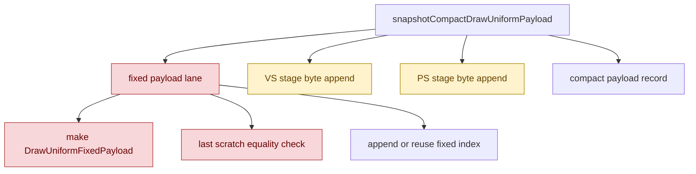

# Encode Phase 158 - Compact uniform snapshot breakdown

> **Outdated — the knob or code path this experiment measured no longer exists in `src/`.** It cannot be re-run. Kept as history; do not cite it as current evidence.

## Question

After H157 fixed-payload reuse, where does the remaining compact producer
snapshot time go: fixed-payload construction/equality, VS stage copy, or PS
stage copy?

## Verdict

The compact producer branch is still dominated by fixed-payload work and timer
overhead, not by raw VS/PS stage-byte copying. This run is diagnostic-only:
the added nested timers make the opt-in compact path slower, so do not read
H158 as a performance candidate.

The key attribution from the no-gputrace run is:

- compact snapshot total: `0.442ms/present`;
- fixed-payload construction/equality/append lane: `0.207ms/present`;
- VS stage copy: `0.071ms/present`;
- PS stage copy: `0.042ms/present`.

That means the current next compact-uniform design should not focus only on
arena sizing or stage-byte copy. The bigger local child is the fixed lane:
each draw still builds a `DrawUniformFixedPayload` and checks byte equality
against the previous scratch entry even when the fixed hash repeats.

## Instrumentation

H158 adds four counters:

- `d3d9_snapshot_uniform_compact_cpu_ms`;
- `d3d9_snapshot_uniform_compact_fixed_cpu_ms`;
- `d3d9_snapshot_uniform_compact_vertex_stage_cpu_ms`;
- `d3d9_snapshot_uniform_compact_pixel_stage_cpu_ms`.

They are nested inside the existing compact producer branch, which is still
guarded by `DXMT9_ENABLE_COMPACT_UNIFORM_SUBMISSIONS=1`.



## Gates

Focused native tests pass:

```sh
meson test -C build-arm64-nowine \
  dxmt9-core-device-com-spec \
  dxmt9-dod-replay-observer-spec \
  dxmt9-state-draw-transform-spec
```

Runtime command:

```sh
DXMT9_ENABLE_COMPACT_UNIFORM_SUBMISSIONS=1 \
bash scripts/tools/run_3dmark05_perf_probe.sh \
  --suffix h168-compact-breakdown-r1 \
  --no-gputrace \
  --timeout 120 \
  --frame-sampling
```

Output:

`experiments/output/app-d3d9-3dmark05-h168-compact-breakdown-r1`

The run is `status=pass`, timeout-finalized, and the broad screenshot is in the
normal `v0.0.3` visual-safe class: bloom, sparks, geometry, and HUD are present.
This remains a broad smoke, not a same-frame pixel diff.

## Metrics

| Metric | H167 fixed reuse | H158 breakdown | Note |
|---|---:|---:|---|
| `d3d9_snapshot_uniform_copy_cpu_ms / present` | `0.257ms` | `0.501ms` | nested timer overhead makes H158 slower |
| `d3d9_snapshot_uniform_compact_cpu_ms / present` | n/a | `0.442ms` | compact branch parent |
| `d3d9_snapshot_uniform_compact_fixed_cpu_ms / present` | n/a | `0.207ms` | largest measured child |
| `d3d9_snapshot_uniform_compact_vertex_stage_cpu_ms / present` | n/a | `0.071ms` | VS stage bytes |
| `d3d9_snapshot_uniform_compact_pixel_stage_cpu_ms / present` | n/a | `0.042ms` | PS stage bytes |
| `d3d9_snapshot_draw_submission_cpu_ms / present` | `3.216ms` | `3.539ms` | diagnostic overhead |
| `commit_chunk_queue_draw_submission_cpu_ms / present` | `3.982ms` | `4.305ms` | diagnostic overhead |
| `commit_chunk_replay_cpu_ms / present` | `8.307ms` | `8.717ms` | diagnostic overhead |
| `sampled_avg_fps` | `16.377` | `16.077` | diagnostic overhead/noise |

Fixed-payload reuse remains real:

| Counter | H158 |
|---|---:|
| `d3d9_snapshot_uniform_compact_fixed_payload_appends` | `94,296` |
| `d3d9_snapshot_uniform_compact_fixed_payload_reuses` | `758,603` |
| `d3d9_snapshot_uniform_compact_fixed_payload_reuse_saved_bytes` | `1.511GB` |

## Interpretation

H157 proved that repeated fixed payloads are common enough to reuse, but H158
shows the current reuse implementation still pays a significant per-draw fixed
lane cost. The main remaining compact-producer candidates are:

1. avoid building and byte-comparing `DrawUniformFixedPayload` on adjacent
   fixed-hash reuse, if a stronger non-collision proof or debug-guarded
   equality audit can make this safe;
2. build a compact snapshot directly from the uniform builder so the full
   cached payload and fixed compact projection are not both produced;
3. shrink the `DrawRunSubmission` carrier so the compact path does not still
   carry the large optional full-payload footprint.

Arena pre-sizing may still help, but H158 ranks it behind the fixed lane and
direct compact construction.
