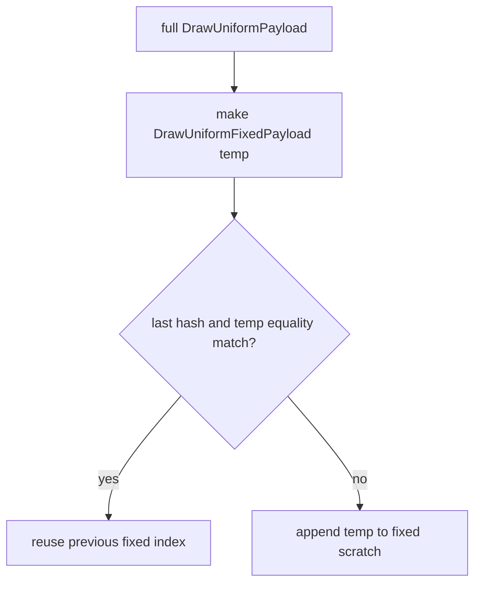
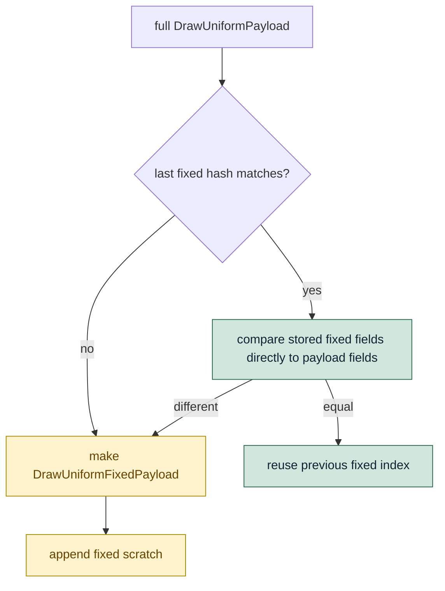

# Encode Phase 159 - Compact fixed payload direct compare

> **Outdated — the knob or code path this experiment measured no longer exists in `src/`.** It cannot be re-run. Kept as history; do not cite it as current evidence.

## Question

H158 showed that the opt-in compact producer path spends more time in the fixed
payload lane than in VS/PS stage-byte copies. Can the common fixed-payload reuse
case skip constructing a temporary `DrawUniformFixedPayload` while preserving
collision safety?

## Verdict

Yes, as a bounded CPU cleanup. The reuse path now checks the previous scratch
fixed-payload hash and then directly compares the stored fixed payload against
the current full `DrawUniformPayload` fields. The append path still constructs
and stores a `DrawUniformFixedPayload`, so hash collisions and fixed-field
changes remain protected by real field equality.

The H169 no-gputrace opt-in run reduces the measured fixed compact lane versus
H168:

- `d3d9_snapshot_uniform_compact_fixed_cpu_ms`: `0.207 -> 0.189ms/present`;
- compact parent: `0.442 -> 0.422ms/present`;
- queue draw submission: `4.305 -> 4.255ms/present`;
- replay: `8.717 -> 8.667ms/present`.

This confirms the local H158 diagnosis, but it does not promote compact uniform
submissions to default. H169 still trails the `v0.0.3` visual-safe baseline and
only slightly improves over the diagnostic H168 run. Keep
`DXMT9_ENABLE_COMPACT_UNIFORM_SUBMISSIONS=1` opt-in.

## Change

The old fixed lane did this on every compact snapshot:



H169 changes only the common hit path:



This removes one large fixed-payload projection copy from the `759k` adjacent
reuse cases in the measured GT1 run.

## Gates

Focused native tests pass:

```sh
meson compile -C build-arm64-nowine
meson test -C build-arm64-nowine \
  dxmt9-core-device-com-spec \
  dxmt9-dod-replay-observer-spec \
  dxmt9-state-draw-transform-spec
```

`dxmt9-core-device-com-spec` now covers both sides of the fixed lane:

- changing only shader constants reuses the fixed payload;
- changing the world transform appends a new fixed payload.

Runtime command:

```sh
DXMT9_ENABLE_COMPACT_UNIFORM_SUBMISSIONS=1 \
bash scripts/tools/run_3dmark05_perf_probe.sh \
  --suffix h169-compact-fixed-direct-compare-r1 \
  --no-gputrace \
  --timeout 120 \
  --frame-sampling
```

Output:

`experiments/output/app-d3d9-3dmark05-h169-compact-fixed-direct-compare-r1`

The run is `status=pass`. The broad screenshot has normal high-effect GT1
content, including muzzle/bloom/spark effects, with no obvious black-vertex or
transparent-weapon corruption. This is still a broad smoke, not a same-frame
pixel diff against `v0.0.3`.

## Metrics

| Metric | H167 fixed reuse | H168 breakdown | H169 direct compare | Note |
|---|---:|---:|---:|---|
| `d3d9_snapshot_uniform_copy_cpu_ms / present` | `0.257ms` | `0.501ms` | `0.481ms` | H168/H169 include nested compact timers |
| `d3d9_snapshot_uniform_compact_cpu_ms / present` | n/a | `0.442ms` | `0.422ms` | compact parent |
| `d3d9_snapshot_uniform_compact_fixed_cpu_ms / present` | n/a | `0.207ms` | `0.189ms` | target child reduced |
| `d3d9_snapshot_uniform_compact_vertex_stage_cpu_ms / present` | n/a | `0.071ms` | `0.071ms` | unchanged |
| `d3d9_snapshot_uniform_compact_pixel_stage_cpu_ms / present` | n/a | `0.042ms` | `0.043ms` | unchanged/noise |
| `d3d9_snapshot_draw_submission_cpu_ms / present` | `3.216ms` | `3.539ms` | `3.489ms` | still above H167 |
| `commit_chunk_queue_draw_submission_cpu_ms / present` | `3.982ms` | `4.305ms` | `4.255ms` | small recovery |
| `commit_chunk_replay_cpu_ms / present` | `8.307ms` | `8.717ms` | `8.667ms` | small recovery |
| `sampled_avg_fps` | `16.377` | `16.077` | `16.123` | not an FPS promotion |

Fixed-payload reuse remains the same shape:

| Counter | H169 |
|---|---:|
| `d3d9_snapshot_uniform_compact_fixed_payload_appends` | `94,412` |
| `d3d9_snapshot_uniform_compact_fixed_payload_reuses` | `759,095` |
| `d3d9_snapshot_uniform_compact_fixed_payload_reuse_saved_bytes` | `1.512GB` |

## Interpretation

H169 validates the specific H158 local hypothesis: fixed-lane temp construction
was part of the compact producer overhead. It does not change the larger
frontier. The remaining compact path still constructs the full cached
`DrawUniformPayload` first, still carries the large optional submission storage
shape, and still fails to beat the `v0.0.3` visual-safe baseline on normalized
replay/submission CPU.

Next useful compact-uniform work should be one of:

1. direct compact build from uniform builder output, avoiding full-payload plus
   fixed projection duplication;
2. smaller `DrawRunSubmission` carrier shape for compact-only submissions;
3. remove or gate diagnostic nested timing after attribution is no longer
   needed, then repeat the opt-in runtime gate.
