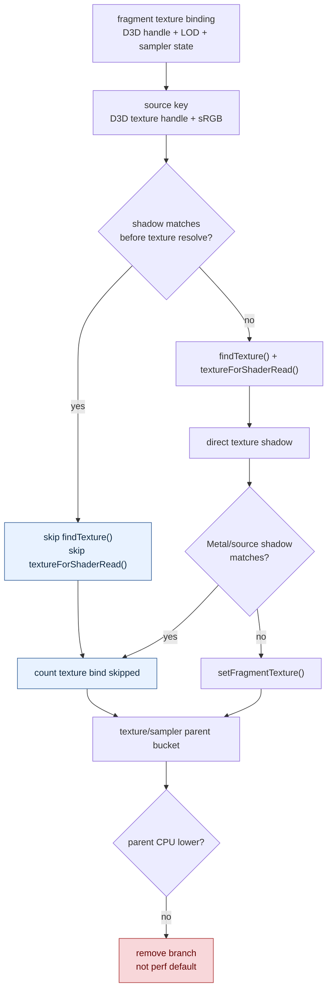

# Texture Pre-Resolve Skip

**Question / hypothesis.** [[state-churn-encode-encode-phase.15]] closed the
sampler-side direct-lane hash tax. The next plausible texture-side bet was to
skip `ctx.pool.findTexture()` and `textureForShaderRead()` before materializing
the Metal texture handle when the D3D texture handle + sRGB flag already match
the direct-bind shadow. Does that reduce the remaining fragment texture
resolve/direct cost enough to accept as a default perf-profile optimization?

**Implementation tested.** The fragment texture resolve path compared
`textureHandle.value` plus `SAMP_SRGB_TEXTURE` against
`TextureSamplerBindShadow::fragmentTextures[stage]` before calling
`findTexture()` / `textureForShaderRead()`. On a match, it counted
`encode_draw_texture_sampler_fragment_resolve_texture_skipped_prehandle` and
recorded the bind as skipped without resolving the texture record. The direct
texture bind shadow used the same source identity so the pre-resolve match and
post-resolve shadow key stayed consistent.

After measurement, the path was not retained in the hot draw path. A temporary
default-off gate proved the pre-resolve counter stayed at `0` when disabled, but
the default smoke still showed texture/sampler parent instability. Because the
experiment was already rejected as a default win, the source-identity branch,
extra shadow fields, env flag, and counter were removed rather than keeping a
diagnostic branch in the fragment texture loop.

**Method.**

```bash
bash scripts/tools/run_3dmark05_perf_probe.sh \
  --suffix texture-preresolve-skip-r1 \
  --frame 50 \
  --no-gputrace \
  --no-encoder-breakdown \
  --timeout 180

python3 scripts/tools/compare_3dmark05_perf_counters.py \
  experiments/output/app-d3d9-3dmark05-sampler-state-hash-default-r2 \
  experiments/output/app-d3d9-3dmark05-texture-preresolve-skip-r1 \
  --before-label sampler-state-hash-default-r2 \
  --after-label texture-preresolve-skip \
  --output experiments/output/app-d3d9-3dmark05-texture-preresolve-skip-r1/dxmt9-perf-counter-comparison-vs-sampler-state-hash.md

# Temporary default-off gate smoke before removing the branch:
DXMT9_PERF_TEXTURE_PRERESOLVE_SKIP=0 \
bash scripts/tools/run_3dmark05_perf_probe.sh \
  --suffix texture-preresolve-gated-default-r1 \
  --frame 50 \
  --no-gputrace \
  --no-encoder-breakdown \
  --timeout 180

# After removing the rejected branch/counter/env from the hot path:
bash scripts/tools/run_3dmark05_perf_probe.sh \
  --suffix texture-preresolve-removed-default-r1 \
  --frame 50 \
  --no-gputrace \
  --no-encoder-breakdown \
  --timeout 180
```

The 3DMark05 wrapper hit the expected watchdog status after writing artifacts.
`actual.png` is a normal GT1 frame with robot, flare, background, and HUD
visible; no texture-map corruption or yellow-only frame was observed in this
sample.

**Mutating result.** The mechanism fires, but the parent bucket rejects the
optimization.

| Counter | Sampler hash default r2 | Texture pre-resolve skip | Delta / reading |
|---|---:|---:|---|
| `present_encoded` | 1,740 | 1,740 | same run length |
| `draw_calls` | 1,273,455 | 1,273,698 | +0.02%, shape-stable |
| `encode_draw_texture_sampler_fragment_resolve_texture_skipped_prehandle` | missing | 1,206,015 | mechanism fired |
| `encode_draw_texture_sampler_fragment_resolve_cpu_ms` | 186.426 | 157.524 | -28.902ms local resolve win |
| `encode_draw_texture_sampler_fragment_direct_cpu_ms` | 426.614 | 415.493 | -11.121ms local direct win |
| `encode_draw_texture_sampler_bind_cpu_ms` | 822.864 | 871.088 | +48.224ms parent regression |
| `encode_draw_stream_bind_texture_phase_cpu_ms` | 867.411 | 915.869 | +48.458ms parent regression |
| `encode_draw_cpu_ms` | 17,598.333 | 17,606.447 | +8.114ms, no net CPU win |
| `gpu_command_buffer_time_ms` | 5,259.535 | 5,259.585 | flat/noisy |
| `completion_wait_ms` | 39,512.855 | 39,514.816 | flat/noisy |

The skip count also matches the already-skipped texture bind scale:
`bind_texture_skipped=1,206,015` in the after run. That proves the source
identity is aligned with the existing direct-bind shadow. The failure is not
correctness; it is cost shape. The added source-identity hash/match branch and
extra shadow fields did not produce a stable parent-level win in the default
measurement profile.

**Default-off and removed-branch smoke.** A follow-up run with the temporary gate
disabled processed the same `1,740` presents and wrote a normal frame (`Frame:
1005`, HUD `FPS: 17`). The pre-resolve skip counter was `0`, proving the gate
worked, but the texture/sampler parent still moved `822.864 -> 923.891`
(`+101.027ms`) versus the old sampler-hash baseline while local fragment direct
was effectively flat (`426.614 -> 428.258`). After removing the rejected
branch/counter/env from the hot path, the next default run returned to baseline
shape: `present_encoded=1,740`, `encode_draw_texture_sampler_bind_cpu_ms`
`822.864 -> 821.007` (`-1.857ms`), `fragment_direct_cpu_ms`
`426.614 -> 426.767` (`+0.153ms`), `encode_draw_cpu_ms`
`17,598.333 -> 17,603.876` (`+5.543ms`), and a normal visible frame (`Frame:
1001`, HUD `FPS: 18`). This makes the removal decision part of the measured
result, not just cleanup.



**Verdict.** Rejected as a default CPU win and removed from the hot path. The
accepted default texture/sampler state remains
[[state-churn-encode-encode-phase.15]].

**Next.** Do not spend another default-path experiment on pre-resolve texture
source matching unless a narrower micro-benchmark proves both a parent-level win
and negligible hot-loop branch cost. Remaining encode work should move to larger
named buckets: argbuf/cbuf build or upload, index setup/source resolve,
shader-stream diversity, or issue cost.

**Related.** [[state-churn-encode]] ·
[[state-churn-encode-encode-phase.15]] · [[present-pacing]].
