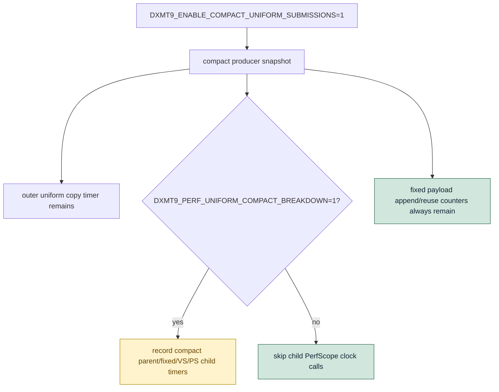

# Encode Phase 160 - Compact breakdown timer gate

## Question

H158/H159 showed useful compact-uniform breakdown attribution, but those nested
`PerfScope` timers perturb the producer hot path. What does the H169 compact
fixed-payload direct-compare path look like when the breakdown timers are off
again?

## Verdict

The compact breakdown timers are now gated behind
`DXMT9_PERF_UNIFORM_COMPACT_BREAKDOWN=1`. Normal compact A/B runs keep only the
existing outer `d3d9_snapshot_uniform_copy_cpu_ms` timing and the non-timed
fixed-payload append/reuse counters.

The H170 opt-in runtime gate confirms the timer gate works:

- all `d3d9_snapshot_uniform_compact_*_cpu_ms` rows are `0`;
- `d3d9_snapshot_uniform_copy_cpu_ms` returns to the H167 band
  (`0.254ms/present`);
- queue/replay recover most of the H168/H169 diagnostic overhead, but still do
  not beat the `v0.0.3` visual-safe baseline.

This is instrumentation hygiene, not a compact-submission promotion. Keep
`DXMT9_ENABLE_COMPACT_UNIFORM_SUBMISSIONS=1` default-off.

## Change



The new knob is documented in
`agents/rules/environment_variables_perf.rules.md`.

## Gates

Focused native checks:

```sh
meson compile -C build-arm64-nowine
meson test -C build-arm64-nowine \
  dxmt9-core-device-com-spec \
  dxmt9-dod-replay-observer-spec \
  dxmt9-state-draw-transform-spec
```

Runtime command:

```sh
DXMT9_ENABLE_COMPACT_UNIFORM_SUBMISSIONS=1 \
bash scripts/tools/run_3dmark05_perf_probe.sh \
  --suffix h170-compact-no-breakdown-r1 \
  --no-gputrace \
  --timeout 120 \
  --frame-sampling
```

Output:

`experiments/output/app-d3d9-3dmark05-h170-compact-no-breakdown-r1`

The run is `status=pass`, `capture_error=None`, `draw_skipped_no_pipeline=0`,
and `gpu_command_buffer_errors=0`.

Visual note: `actual.png` is very dark/occluded and much smaller than the H167
and H169 screenshots. Because time-based `actual.png` is not a same-frame
visual gate, and because H170 changes only timer collection, treat this as
inconclusive visual smoke rather than proof of a new rendering regression or a
visual-safe promotion.

## Metrics

| Metric | H167 fixed reuse | H169 direct compare + breakdown | H170 direct compare, breakdown off | Note |
|---|---:|---:|---:|---|
| `d3d9_snapshot_uniform_copy_cpu_ms / present` | `0.257ms` | `0.481ms` | `0.254ms` | timer overhead removed |
| `d3d9_snapshot_uniform_compact_cpu_ms / present` | n/a | `0.422ms` | `0.000ms` | gated off |
| `d3d9_snapshot_uniform_compact_fixed_cpu_ms / present` | n/a | `0.189ms` | `0.000ms` | gated off |
| `d3d9_snapshot_draw_submission_cpu_ms / present` | `3.216ms` | `3.489ms` | `3.350ms` | partial recovery |
| `commit_chunk_queue_draw_submission_cpu_ms / present` | `3.982ms` | `4.255ms` | `4.119ms` | still above H167 |
| `commit_chunk_replay_cpu_ms / present` | `8.307ms` | `8.667ms` | `8.537ms` | still above H167 |
| `completion_wait_ms / present` | `26.810ms` | `26.449ms` | `28.292ms` | noisy/worse |
| `sampled_avg_fps` | `16.377` | `16.123` | `16.142` | not promoted |

Fixed-payload reuse remains high:

| Counter | H170 |
|---|---:|
| `d3d9_snapshot_uniform_compact_fixed_payload_appends` | `95,293` |
| `d3d9_snapshot_uniform_compact_fixed_payload_reuses` | `756,727` |
| `d3d9_snapshot_uniform_compact_fixed_payload_reuse_saved_bytes` | `1.507GB` |

## Interpretation

H170 separates the H169 implementation from the H158/H159 diagnostic timers.
The direct-compare cleanup is real enough to keep, and the breakdown timer gate
should remain so normal compact A/B runs do not self-perturb.

The compact producer path is still not the current FPS fix:

1. normalized queue submission and replay remain above H167 and the
   `v0.0.3` baseline band;
2. completion wait remains the larger frame-time owner;
3. the broad screenshot is not strong visual-safe evidence.

Next compact work should move to direct compact construction or a smaller
submission carrier only if a focused probe shows enough remaining producer CPU
to matter. Otherwise the main frontier stays P4/replay-publish overlap and
larger serial replay/encode cadence work.
