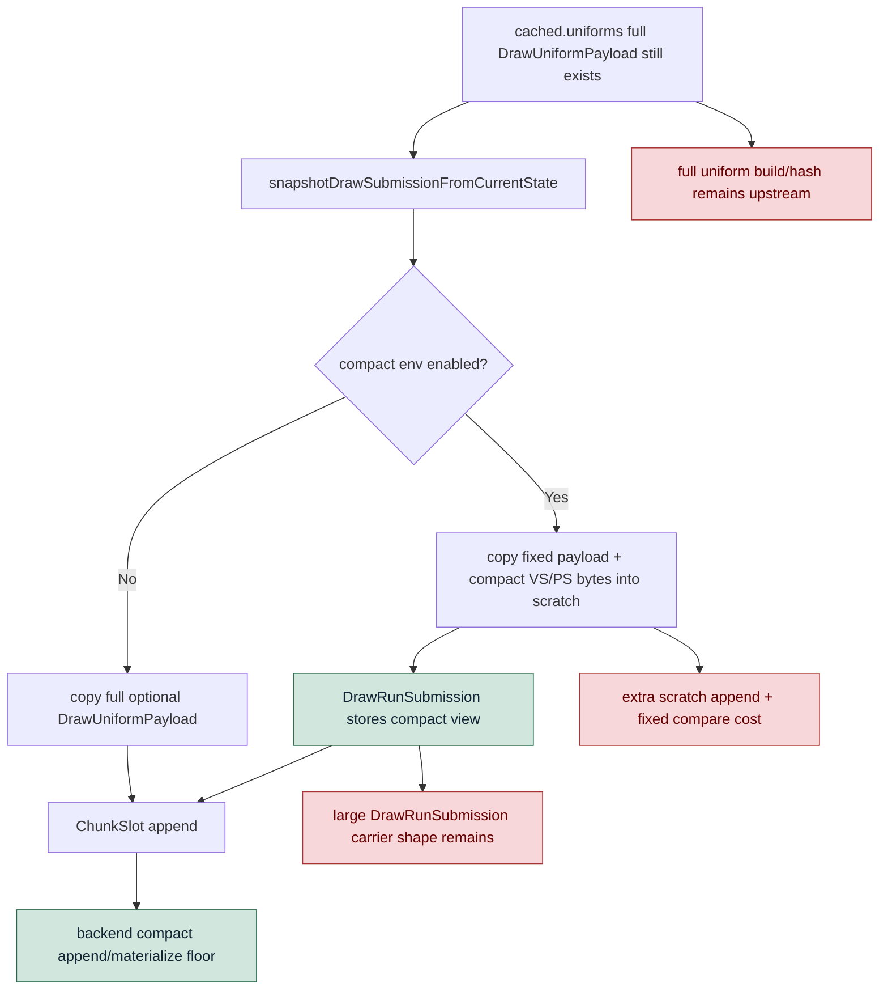

# Encode Phase 161 - Current compact uniform repeat

## Question

After the H98/H99 queue work, does `DXMT9_ENABLE_COMPACT_UNIFORM_SUBMISSIONS=1`
become a useful current-head P2/P3 or P4 lever, or does the H170 verdict still
hold?

## Verdict

The compact path still reaches the mechanism and remains visually coherent, but
it is not a current FPS lever.

It reduces producer-side materialized uniform storage by `71.65%`, yet the
normalized producer path gets slower: snapshot draw-submission CPU rises
`3.053 -> 3.171ms/present`, queue draw-submission CPU rises
`3.801 -> 3.917ms/present`, and commit replay rises
`8.147 -> 8.223ms/present`. It also does not create useful P4 overlap:
wait-with-enqueue falls `1.562 -> 0.139ms/present`, no-enqueue wait rises
`26.860 -> 27.554ms/present`, and sampled FPS is noise-flat
`16.621 -> 16.588`.

Keep `DXMT9_ENABLE_COMPACT_UNIFORM_SUBMISSIONS=1` default-off. The next compact
candidate must avoid the current extra producer work, not only shrink the bytes
stored by `DrawRunSubmission`.

## Runtime

Baseline:

```sh
bash scripts/tools/run_3dmark05_perf_probe.sh \
  --suffix h173-current-baseline-r1 \
  --no-gputrace \
  --no-encoder-breakdown \
  --frame-sampling \
  --timeout 120 \
  --wait-unlocked-sec 120
```

Candidate:

```sh
DXMT9_ENABLE_COMPACT_UNIFORM_SUBMISSIONS=1 \
bash scripts/tools/run_3dmark05_perf_probe.sh \
  --suffix h173-compact-uniform-current-r1 \
  --no-gputrace \
  --no-encoder-breakdown \
  --frame-sampling \
  --timeout 120 \
  --wait-unlocked-sec 120 \
  --compare-baseline-output experiments/output/app-d3d9-3dmark05-h173-current-baseline-r1 \
  --require-current-uniform-compact-saved-bytes-present
```

Both runs are `status=pass`, `capture_error=None`, and have normal broad visual
smoke in effects-heavy GT1 frames. The candidate gate proves compact saved bytes
are present.

## Metrics

| Metric | Baseline | Compact | Direction |
|---|---:|---:|---|
| `sampled_avg_fps` | `16.621` | `16.588` | flat |
| `completion_wait_ms_per_present` | `28.422` | `27.693` | slightly lower |
| `completion_wait_with_enqueue_ms_per_present` | `1.562` | `0.139` | worse overlap |
| `completion_wait_without_enqueue_ms_per_present` | `26.860` | `27.554` | worse no-enqueue |
| `commit_chunk_replay_cpu_ms_per_present` | `8.147` | `8.223` | worse |
| `commit_chunk_queue_draw_submission_cpu_ms_per_present` | `3.801` | `3.917` | worse |
| `d3d9_snapshot_draw_submission_cpu_ms_per_present` | `3.053` | `3.171` | worse |
| `d3d9_snapshot_cache_lookup_cpu_ms_per_present` | `2.463` | `2.477` | flat/worse |
| `snapshot_uniform_copy_cpu_ms_per_present` | `0.144` | `0.247` | worse |
| `uniform_materialized_bytes_per_present` | `5,045,593.935` | `1,430,257.053` | `-71.65%` |
| `submit_draw_run_batch_append_uniform_cpu_ms_per_present` | `0.657` | `0.627` | small backend win |
| `encode_chunk_cpu_ms_per_present` | `11.944` | `11.149` | lower but not FPS/P4 |
| `no_enqueue_before_publish_closure_ms_per_present` | `15.043` | `15.519` | worse |
| `no_enqueue_wait_to_next_enqueue_ms_per_present` | `31.678` | `32.661` | worse |

## Structure



## Interpretation

The storage-width mechanism is real, but the current implementation attacks the
wrong layer for average FPS:

1. `cached.uniforms` is already a full `DrawUniformPayload`, so compact
   submission does not remove the upstream uniform build/hash owner.
2. The compact path adds scratch append and fixed-payload comparison work inside
   the producer snapshot lane.
3. The queue still carries `DrawRunSubmission` objects with optional full-state
   and full-uniform storage in the carrier type, so byte reduction in the
   appended payload does not automatically translate into lower replay cadence.
4. P4 remains no-enqueue dominated; this candidate makes useful overlap smaller,
   not larger.

Future compact work should be gated by one of these stronger changes:

- direct compact construction before full `DrawUniformPayload` materialization;
- a smaller submission carrier that does not reserve full optional state/uniform
  storage per queued draw;
- or a broader replay/publish overlap design that moves
  `completion_wait_with_enqueue`, no-enqueue closure, and frame sampling.

Do not spend `.gputrace` budget on the current compact env alone.
