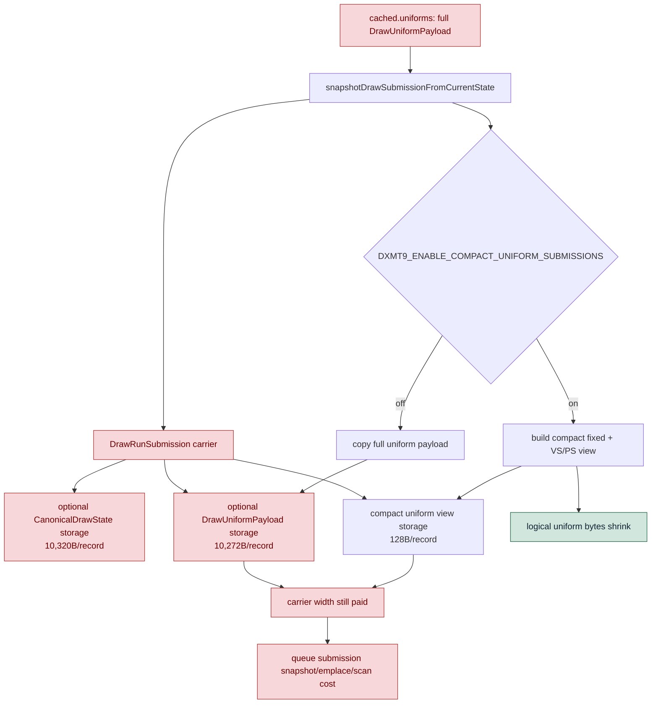

# Encode Phase 162 - Submission carrier counters

## Question

When compact uniform submissions cut logical uniform bytes, does the queued
`DrawRunSubmission` carrier also get smaller, or does the hot path still pay the
full inline storage width?

## Verdict

The compact mechanism cuts logical producer uniform bytes, but it does not shrink
the queued draw carrier. This is why compact submissions remain default-off as an
FPS lever.

New `d3d9_snapshot_submission_carrier_*` counters show both baseline and compact
runs carry the same fixed footprint per successful draw snapshot:
`DrawRunSubmission=21,176B`, `state storage=10,320B`, full-uniform storage
`10,272B`, and compact-uniform storage only `128B`. The compact path still
reduces materialized uniform bytes `5.076MB -> 1.427MB/present` (`-71.88%`), but
queue draw-submission CPU regresses `3.876 -> 4.120ms/present`, snapshot CPU
regresses `3.195 -> 3.410ms/present`, and encode chunk CPU regresses
`11.090 -> 11.606ms/present`.

The next compact candidate must either build compact payloads before the full
`cached.uniforms` payload exists or replace the current `DrawRunSubmission`
carrier with a smaller representation. More append/storage polishing inside the
same carrier is unlikely to move the current P2/P3/P4 owner.

## Runtime

Baseline:

```sh
bash scripts/tools/run_3dmark05_perf_probe.sh \
  --suffix h174-carrier-counter-r1 \
  --no-gputrace \
  --no-encoder-breakdown \
  --frame-sampling \
  --timeout 120 \
  --wait-unlocked-sec 120
```

Candidate:

```sh
DXMT9_ENABLE_COMPACT_UNIFORM_SUBMISSIONS=1 \
bash scripts/tools/run_3dmark05_perf_probe.sh \
  --suffix h174-carrier-counter-compact-r1 \
  --no-gputrace \
  --no-encoder-breakdown \
  --frame-sampling \
  --timeout 120 \
  --wait-unlocked-sec 120 \
  --compare-baseline-output experiments/output/app-d3d9-3dmark05-h174-carrier-counter-r1 \
  --require-current-uniform-compact-saved-bytes-present
```

Both runs are supervised 120s runs (`returncode=143`, `timed_out=true`) with
wrapper `status=pass`, `capture_error=None`, and broad effects-heavy visual
smoke. The compact run satisfies the saved-byte gate.

## Metrics

| Metric | Baseline | Compact | Direction |
|---|---:|---:|---|
| `present_encoded` | `1,740` | `1,680` | denominator differs |
| `d3d9_snapshot_submission_carrier_records` | `860,512` | `822,684` | fewer sampled records |
| `carrier_bytes_per_record` | `21,176` | `21,176` | invariant |
| `carrier_state_storage_bytes_per_record` | `10,320` | `10,320` | invariant |
| `carrier_uniform_storage_bytes_per_record` | `10,272` | `10,272` | invariant |
| `carrier_compact_uniform_storage_bytes_per_record` | `128` | `128` | invariant |
| `carrier_bytes_per_present` | `10.473MB` | `10.370MB` | only workload denominator movement |
| `uniform_materialized_bytes_per_present` | `5.076MB` | `1.427MB` | `-71.88%` |
| `commit_chunk_queue_draw_submission_cpu_ms_per_present` | `3.876` | `4.120` | worse |
| `commit_chunk_queue_draw_submission_snapshot_cpu_ms_per_present` | `3.195` | `3.410` | worse |
| `d3d9_snapshot_draw_submission_cpu_ms_per_present` | `3.132` | `3.341` | worse |
| `commit_chunk_replay_cpu_ms_per_present` | `8.202` | `8.613` | worse |
| `encode_chunk_cpu_ms_per_present` | `11.090` | `11.606` | worse |
| `completion_wait_without_enqueue_ms_per_present` | `27.922` | `27.181` | slightly lower, no overlap |
| `completion_wait_with_enqueue_ms_per_present` | `0.077` | `0.000` | worse overlap |

## Structure



## Interpretation

The compact uniform path is currently a logical-payload win inside a physically
large carrier. The counters explain the previous negative runtime gates:

1. The producer still starts from full `cached.uniforms`, so full uniform
   materialization and hash work are not avoided.
2. `DrawRunSubmission` still reserves full optional state and full optional
   uniform storage per queued draw snapshot.
3. Compact mode adds scratch/fixed compare work while leaving that carrier width
   in place.
4. P4 remains no-enqueue dominated, so a local byte reduction that does not
   reduce serial replay/snapshot/encode time cannot become an average-FPS proof.

The next viable compact design is therefore structural: direct compact
construction from the uniform builder, a smaller queued submission carrier, or a
larger replay/publish overlap design that can hide the remaining serial cost.
