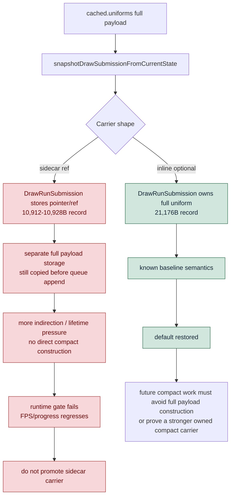

# Encode Phase 163 - Full uniform sidecar carrier rejection

## Question

Phase 162 proved compact uniform submissions cannot move the current hot path
while `DrawRunSubmission` still reserves the full inline uniform storage. Does a
full-uniform sidecar carrier turn that byte win into a runtime win?

## Verdict

No. The sidecar carrier shrinks the C++ record, but it is not a promotable GT1
runtime path. The experiment was reverted back to inline
`std::optional<DrawUniformPayload>` storage.

The shared-pointer prototype reduced the measured carrier from `21,176B/record`
to `10,928B/record`, but sampled FPS fell from `18.381` to `14.499`. Replacing
that with a raw pointer reduced the carrier to `10,912B/record`, but made the
runtime sample worse: sampled FPS fell to `7.334`, and the run reached only
`660` presents in the same supervised window.

Restoring the inline carrier restored the physical carrier width to
`21,176B/record`. A foreground-controlled repeat improved over the failed raw
run (`h178`: `1,200` presents, `13.631` sampled FPS mean), but still did not
match the h174 baseline (`1,740` presents, `18.381` sampled FPS mean). This
means the sidecar experiment should be read as rejected, while the h177/h178
spread also shows that no-gputrace GT1 frame progression is sensitive to
foreground/scene-progress conditions.

The standardized wrapper repeat (`h179`, `--keep-frontmost`) restores the
inline current path to the h174 progress band: `1,800` presents and `18.527`
sampled FPS mean, with `draw_skipped_no_pipeline=0` and
`gpu_command_buffer_errors=0`. It does not change the owner conclusion:
`completion_wait_without_enqueue` stays essentially unchanged
(`27.922 -> 28.032ms/present` versus h174), `encode_ready_depth_avg` remains
`1.000`, and only small local CPU movement appears in replay/snapshot rows.

`v0.0.3` remains the visual-safe anchor. These runs provide broad visual smoke
only; exact correctness still needs same-frame capture, a same-input replay, or
a draw/window proof against that anchor.

## Runtime

Baseline:

```sh
bash scripts/tools/run_3dmark05_perf_probe.sh \
  --suffix h174-carrier-counter-r1 \
  --no-gputrace \
  --no-encoder-breakdown \
  --frame-sampling \
  --timeout 120 \
  --wait-unlocked-sec 120
```

Rejected shared-pointer sidecar:

```sh
bash scripts/tools/run_3dmark05_perf_probe.sh \
  --suffix h175-uniform-carrier-ref-r1 \
  --no-gputrace \
  --no-encoder-breakdown \
  --frame-sampling \
  --timeout 120 \
  --wait-unlocked-sec 120 \
  --compare-baseline-output experiments/output/app-d3d9-3dmark05-h174-carrier-counter-r1
```

Rejected raw-pointer sidecar:

```sh
bash scripts/tools/run_3dmark05_perf_probe.sh \
  --suffix h176-uniform-carrier-raw-ref-r1 \
  --no-gputrace \
  --no-encoder-breakdown \
  --frame-sampling \
  --timeout 120 \
  --wait-unlocked-sec 120 \
  --compare-baseline-output experiments/output/app-d3d9-3dmark05-h174-carrier-counter-r1
```

Inline restore and foreground-controlled repeat:

```sh
bash scripts/tools/run_3dmark05_perf_probe.sh \
  --suffix h178-inline-carrier-restored-focused-r1 \
  --no-gputrace \
  --no-encoder-breakdown \
  --frame-sampling \
  --keep-frontmost \
  --timeout 120 \
  --wait-unlocked-sec 120 \
  --compare-baseline-output experiments/output/app-d3d9-3dmark05-h174-carrier-counter-r1
```

The original h178 run was paired with a local focus loop that repeatedly made
the `3DMark05.exe` process frontmost. The standardized wrapper repeat is:

```sh
bash scripts/tools/run_3dmark05_perf_probe.sh \
  --suffix h179-keepfront-current-r1 \
  --no-gputrace \
  --no-encoder-breakdown \
  --frame-sampling \
  --keep-frontmost \
  --timeout 120 \
  --wait-unlocked-sec 120 \
  --compare-baseline-output experiments/output/app-d3d9-3dmark05-h174-carrier-counter-r1
```

Use `--keep-frontmost` for no-gputrace A/B runs when present count or
frame-sampling FPS is part of the evidence.

## Metrics

| Metric | h174 inline baseline | h175 shared sidecar | h176 raw sidecar | h178 inline focused | h179 wrapper keep-frontmost |
|---|---:|---:|---:|---:|---:|
| `present_encoded` | `1,740` | `1,320` | `660` | `1,200` | `1,800` |
| frame-sampling rows | `1,799` | `1,370` | `689` | `1,251` | `1,810` |
| sampled FPS mean | `18.381` | `14.499` | `7.334` | `13.631` | `18.527` |
| sampled FPS p50 | `17.949` | `13.627` | `7.345` | `12.978` | `18.329` |
| sampled FPS last30 | `22.297` | `12.069` | `9.098` | `9.909` | `23.629` |
| carrier bytes/record | `21,176` | `10,928` | `10,912` | `21,176` | `21,176` |
| uniform carrier storage/record | `10,272` | `24` | `8` | `10,272` | `10,272` |
| queue draw submission ms/present | `3.876` | `4.941` | `9.840` | `5.533` | `3.809` |
| snapshot draw submission ms/present | `3.132` | `4.159` | `8.262` | `4.489` | `3.051` |
| encode chunk ms/present | `11.090` | `14.185` | `27.781` | `15.264` | `11.149` |
| completion wait ms/present | `27.999` | `25.101` | `16.870` | `24.632` | `28.058` |

## Structure



## Interpretation

The failed sidecar confirms that "smaller `sizeof(DrawRunSubmission)`" is not a
sufficient design target. The producer still starts from the full
`cached.uniforms` payload and still needs owned data until `ChunkSlot` consumes
the batch. Moving that full payload out of the carrier removes inline bytes, but
does not remove the construction, hashing, append, or lifetime work that the
current P2/P3 path exposes.

For the next attempt, do not reintroduce a full-uniform sidecar as a default
path. The viable designs are still:

- direct compact construction before a full `DrawUniformPayload` exists,
- an owned compact carrier whose consumers never materialize the full payload on
  the common path,
- or a larger replay/publish overlap design that hides the remaining serial
  producer work.

No-gputrace GT1 A/B runs should also control foreground state with
`--keep-frontmost` when FPS or present count is evidence. A run that reaches a
different scene window or much lower present count under the same timeout is a
runtime-condition diagnostic first, not a clean code-performance proof.
