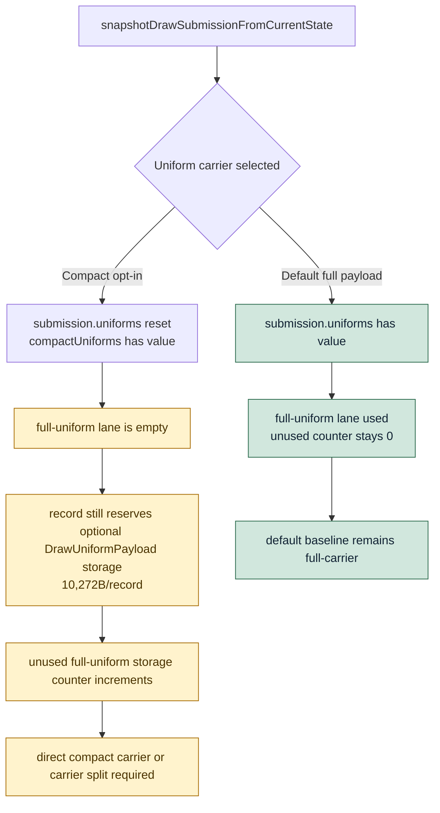

# Encode Phase 164 - Unused full uniform carrier lane counter

## Question

Phase 162 showed compact uniform submissions reduce logical uniform bytes but
do not shrink `DrawRunSubmission`. Can the runtime counters distinguish "full
uniform storage is reserved" from "full uniform storage is actually used"?

## Verdict

Yes. The new `d3d9_snapshot_submission_carrier_unused_uniform_storage_*`
counters prove the current compact producer path leaves the inline full-uniform
lane empty while still paying for it in every queued submission record.

In the default path, every submission still carries a full uniform payload:
unused full-uniform carrier storage is `0`. In the compact opt-in path,
`DXMT9_ENABLE_COMPACT_UNIFORM_SUBMISSIONS=1` reduces logical materialized
uniform bytes from `5.070MB/present` to `1.435MB/present` (`-71.69%`), but the
queued carrier remains exactly `21,176B/record`. The whole inline full-uniform
lane is unused: `492.633` records/present, `4.826MiB/present`, and
`10,272B/record`, equal to `100%` of the measured full-uniform storage lane.

This directly tightens the next design requirement: compact append/storage
polishing is secondary unless it also removes the inline full-uniform lane or
builds a compact carrier before `DrawRunSubmission` reserves that lane.

## Runtime

Default:

```sh
bash scripts/tools/run_3dmark05_perf_probe.sh \
  --suffix h180-carrier-unused-r1 \
  --no-gputrace \
  --timeout 120 \
  --keep-frontmost \
  --frame-sampling
```

Compact opt-in:

```sh
DXMT9_ENABLE_COMPACT_UNIFORM_SUBMISSIONS=1 \
  bash scripts/tools/run_3dmark05_perf_probe.sh \
    --suffix h181-carrier-unused-compact-r1 \
    --no-gputrace \
    --timeout 120 \
    --keep-frontmost \
    --frame-sampling
```

Comparison:

```sh
python3 scripts/tools/compare_3dmark05_perf_counters.py \
  experiments/output/app-d3d9-3dmark05-h180-carrier-unused-r1 \
  experiments/output/app-d3d9-3dmark05-h181-carrier-unused-compact-r1 \
  --before-label h180-default \
  --after-label h181-compact \
  --output experiments/output/app-d3d9-3dmark05-h181-carrier-unused-compact-r1/h180-vs-h181-carrier-unused.md
```

Both runs used the standardized `--keep-frontmost` no-gputrace path and
completed with `status=pass`, `draw_skipped_no_pipeline=0`, and
`gpu_command_buffer_errors=0`. The actual captures are effect-heavy GT1 frames
and serve as broad visual smoke only; exact visual correctness remains anchored
to `v0.0.3`.

## Metrics

| Metric | h180 default | h181 compact |
|---|---:|---:|
| `present_encoded` | `1,740` | `1,740` |
| `draw_calls` | `1,289,142` | `1,285,757` |
| `submission_carrier_bytes_per_record` | `21,176` | `21,176` |
| `submission_carrier_uniform_storage_bytes_per_record` | `10,272` | `10,272` |
| `submission_carrier_unused_uniform_storage_records_per_present` | `0.000` | `492.633` |
| `submission_carrier_unused_uniform_storage_mib_per_present` | `0.000` | `4.826` |
| `submission_carrier_unused_uniform_storage_bytes_per_record` | `0` | `10,272` |
| `submission_carrier_unused_uniform_storage_share_pct` | `0.000` | `100.000` |
| `uniform_materialized_bytes_per_present` | `5.070MB` | `1.435MB` |
| `commit_chunk_queue_draw_submission_cpu_ms_per_present` | `3.875` | `3.964` |
| `d3d9_snapshot_draw_submission_cpu_ms_per_present` | `3.112` | `3.203` |
| `encode_chunk_cpu_ms_per_present` | `12.938` | `12.972` |
| `completion_wait_without_enqueue_ms_per_present` | `26.893` | `26.707` |

## Structure



## Interpretation

The h181 compact run is not a promotion candidate. It still slightly regresses
the normalized producer rows (`queue_draw_submission` `+2.30%`,
`snapshot_draw_submission` `+2.94%`) and does not create useful P4 overlap.

Its value is narrower and clearer: it proves that the current byte win stops at
the logical payload boundary. The next compact implementation must change the
queued carrier shape itself. The safe next designs are:

- direct compact construction from the uniform builder, avoiding a full
  `DrawUniformPayload` producer snapshot;
- a compact-only `DrawRunSubmission` carrier variant that does not reserve the
  full optional lane;
- or a split carrier where full uniform storage is allocated only for records
  that actually carry a full payload.

Do not spend another GT1 runtime gate on compact fixed/stage copy polishing
unless one of those designs also moves
`submission_carrier_bytes_per_record` or
`submission_carrier_unused_uniform_storage_mib_per_present`.
