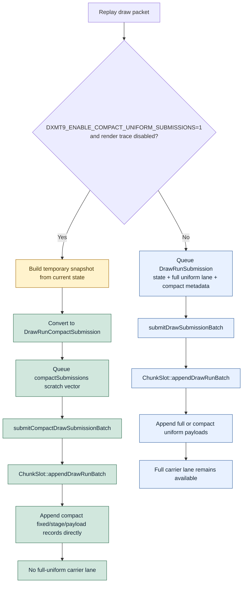

# Encode Phase 165 - Compact draw submission carrier

> **Outdated — the knob or code path this experiment measured no longer exists in `src/`.** It cannot be re-run. Kept as history; do not cite it as current evidence.

## Question

Phase 164 proved that compact uniform submissions left the full
`DrawUniformPayload` lane unused but still reserved inside every queued
`DrawRunSubmission`. Does a compact-only draw submission carrier remove that
lane without repeating the failed full-uniform sidecar experiment from phase
163?

## Verdict

Yes for carrier shape, no for runtime promotion.

The compact-only queue path removes the inline full-uniform lane under
`DXMT9_ENABLE_COMPACT_UNIFORM_SUBMISSIONS=1` when render tracing is off.
`DrawRunCompactSubmission` carries optional state, compact uniform payload
metadata, arena view, draw params, payload view, binding override, and generation
stamps, but it does not reserve `std::optional<DrawUniformPayload>`.

The h182 -> h183 r2 no-gputrace gate proves the storage target:
`submission_carrier_bytes_per_record` falls `21,176 -> 10,904` (`-48.51%`),
full-uniform storage falls `10,272 -> 0B/record`, and the old unused-lane
counter stays `0` because the compact carrier no longer has that lane.

That does not make it a GT1 FPS owner. The current implementation still creates
a temporary full `DrawRunSubmission` snapshot before converting it to the compact
carrier, so producer CPU remains slightly worse. Treat this as a successful
carrier-shape primitive and a rejected runtime promotion.

## Runtime

Default:

```sh
bash scripts/tools/run_3dmark05_perf_probe.sh \
  --suffix h182-compact-carrier-current-default-r1 \
  --no-gputrace \
  --timeout 120 \
  --keep-frontmost \
  --frame-sampling
```

Compact carrier:

```sh
DXMT9_ENABLE_COMPACT_UNIFORM_SUBMISSIONS=1 \
  bash scripts/tools/run_3dmark05_perf_probe.sh \
    --suffix h183-compact-carrier-current-compact-r2 \
    --no-gputrace \
    --timeout 120 \
    --keep-frontmost \
    --frame-sampling
```

Comparison:

```sh
python3 scripts/tools/compare_3dmark05_perf_counters.py \
  experiments/output/app-d3d9-3dmark05-h182-compact-carrier-current-default-r1 \
  experiments/output/app-d3d9-3dmark05-h183-compact-carrier-current-compact-r2 \
  --before-label h182-default \
  --after-label h183-compact-carrier-r2 \
  --output experiments/output/app-d3d9-3dmark05-h183-compact-carrier-current-compact-r2/h182-vs-h183-compact-carrier-r2.md \
  --require-submission-carrier-bytes-per-record-decrease \
  --require-submission-carrier-uniform-storage-per-record-decrease
```

Both runs completed with `status=pass`, `draw_skipped_no_pipeline=0`, and
`gpu_command_buffer_errors=0`. The compact r2 `actual.png` is an effects-heavy
GT1 frame with muzzle flash/bloom/sparks visible, so it passes broad smoke. It
is not a substitute for exact visual safety; `v0.0.3` remains the anchor for
black/translucent vertex, lighting, fog, bloom, and texture correctness.

## Metrics

| Metric | h182 default | h183 compact carrier r2 | Delta |
|---|---:|---:|---:|
| `present_encoded` | `1,740` | `1,790` | `+50` |
| `sampled_avg_fps` | `16.188` | `16.332` | `+0.144` |
| `submission_carrier_bytes_per_record` | `21,176` | `10,904` | `-48.51%` |
| `submission_carrier_uniform_storage_bytes_per_record` | `10,272` | `0` | `-100.00%` |
| `submission_carrier_unused_uniform_storage_records_per_present` | `0.000` | `0.000` | `0` |
| `submission_carrier_unused_uniform_storage_mib_per_present` | `0.000` | `0.000` | `0` |
| `uniform_materialized_bytes_per_present` | `5.052MB` | `1.427MB` | `-71.75%` |
| `commit_chunk_queue_draw_submission_cpu_ms_per_present` | `3.857` | `4.025` | `+4.38%` |
| `d3d9_snapshot_draw_submission_cpu_ms_per_present` | `3.096` | `3.186` | `+2.91%` |
| `snapshot_uniform_copy_cpu_ms_per_present` | `0.145` | `0.247` | `+69.68%` |
| `submit_draw_run_batch_append_uniform_cpu_ms_per_present` | `0.669` | `0.621` | `-7.16%` |
| `encode_chunk_cpu_ms_per_present` | `12.861` | `12.829` | `-0.25%` |
| `completion_wait_without_enqueue_ms_per_present` | `26.840` | `26.994` | `+0.57%` |
| `encode_ready_depth_avg` | `1.000` | `1.000` | `0` |

## Structure



## Interpretation

This closes the phase 164 carrier-shape requirement. The measured width is now
compact in the queued vector and backend append path, and the full-uniform lane
is not merely empty; it is absent.

It also exposes the next limit more cleanly. The compact path still pays a
temporary snapshot/convert cost before the smaller carrier exists:
`snapshot_uniform_copy_cpu_ms_per_present` rises from `0.145` to `0.247`, and
the producer rows remain worse. The backend append side improves slightly, but
not enough to overcome the frontend construction cost.

Next compact-uniform work should not add another carrier variant. The next
useful compact proof is direct compact construction from the uniform builder:

- build fixed/stage compact records without first materializing full
  `DrawUniformPayload`;
- preserve the existing ABI-prefix correctness rules from the `v0.0.3`
  visual-safe line;
- keep the render-trace path on the full carrier unless trace serialization is
  explicitly taught compact payloads;
- rerun the same no-gputrace gate only if queue/snapshot CPU moves, then apply
  the `v0.0.3` visual gate before any FPS claim.

Until then, P4/replay-publish cadence remains the stronger average-FPS target.
