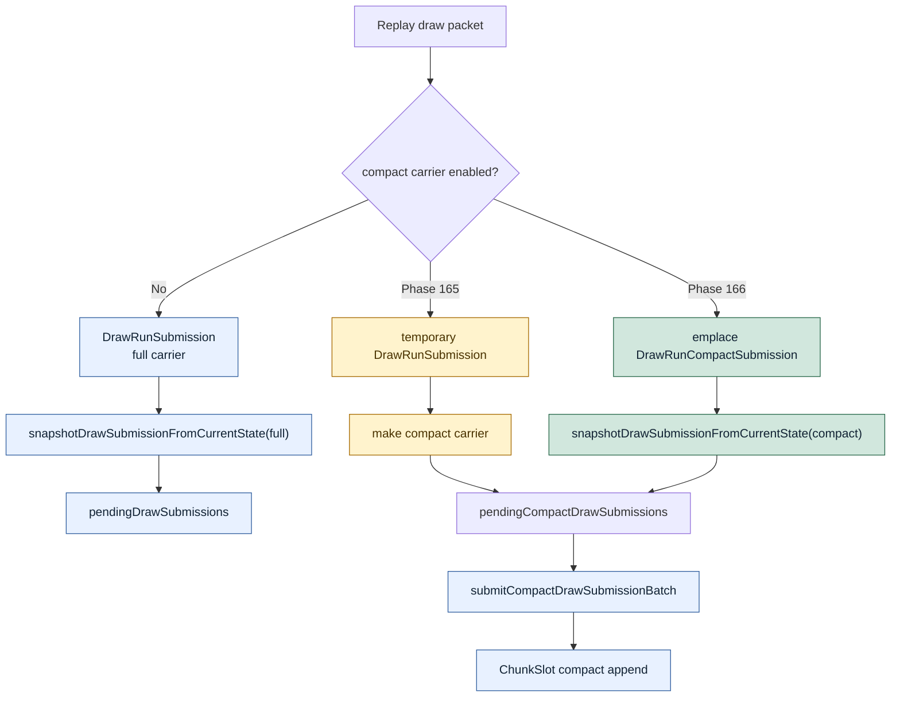

# Encode Phase 166 - Direct compact submission snapshot

## Question

Phase 165 removed the full-uniform lane from the queued compact carrier, but
the opt-in path still built a temporary full `DrawRunSubmission` and converted
it to `DrawRunCompactSubmission`. Does constructing the compact submission
directly remove enough producer cost to promote
`DXMT9_ENABLE_COMPACT_UNIFORM_SUBMISSIONS=1`?

## Verdict

No. This is a useful cleanup and a better implementation shape, but not a GT1
promotion.

The new overload lets chunk replay fill `DrawRunCompactSubmission` in place.
The compact path no longer creates a full submission bridge or carries a
temporary `std::optional<DrawUniformPayload>` before queueing. Native coverage
proves the direct compact overload materializes compact uniforms and elides
unchanged compact state/uniforms on the adjacent same-generation draw.

The isolated h183 -> h184 compact comparison shows the expected local cleanup:
`commit_chunk_queue_draw_submission_cpu_ms_per_present` improves
`4.025 -> 3.927` (`-2.44%`). However, the broader producer/encode picture does
not improve: snapshot draw submission worsens `3.186 -> 3.301`, encode chunk
worsens `12.829 -> 13.222`, `completion_wait_without_enqueue` remains
effectively flat (`26.994 -> 26.771`), and `encode_ready_depth_avg` stays
`1.000`.

The h182 default -> h184 compact comparison still proves the carrier-shape
gate from phase 165 (`21,176 -> 10,904B/record`, full-uniform storage
`10,272 -> 0B/record`), but normalized CPU is not better than the default path.
Keep compact submissions default-off. P4/replay-publish cadence remains the
current average-FPS owner.

## Runtime

Direct compact candidate:

```sh
DXMT9_ENABLE_COMPACT_UNIFORM_SUBMISSIONS=1 \
  bash scripts/tools/run_3dmark05_perf_probe.sh \
    --suffix h184-compact-direct-current-compact-r1 \
    --no-gputrace \
    --timeout 120 \
    --keep-frontmost \
    --frame-sampling
```

Direct cleanup comparison:

```sh
python3 scripts/tools/compare_3dmark05_perf_counters.py \
  experiments/output/app-d3d9-3dmark05-h183-compact-carrier-current-compact-r2 \
  experiments/output/app-d3d9-3dmark05-h184-compact-direct-current-compact-r1 \
  --before-label h183-compact-carrier \
  --after-label h184-compact-direct \
  --output experiments/output/app-d3d9-3dmark05-h184-compact-direct-current-compact-r1/h183-vs-h184-compact-direct.md
```

Storage gate comparison:

```sh
python3 scripts/tools/compare_3dmark05_perf_counters.py \
  experiments/output/app-d3d9-3dmark05-h182-compact-carrier-current-default-r1 \
  experiments/output/app-d3d9-3dmark05-h184-compact-direct-current-compact-r1 \
  --before-label h182-default \
  --after-label h184-compact-direct \
  --output experiments/output/app-d3d9-3dmark05-h184-compact-direct-current-compact-r1/h182-vs-h184-compact-direct.md \
  --require-submission-carrier-bytes-per-record-decrease \
  --require-submission-carrier-uniform-storage-per-record-decrease
```

The run completed with `status=pass`, `draw_skipped_no_pipeline=0`, and
`gpu_command_buffer_errors=0`. `actual.png` is an effects-heavy GT1 frame with
muzzle flash, sparks, bloom, and visible geometry. This is broad smoke only;
`v0.0.3` remains the visual-safe anchor for black/translucent vertex, lighting,
fog, bloom, texture, and muzzle-flash correctness.

## Metrics

| Metric | h183 compact carrier | h184 compact direct | Delta |
|---|---:|---:|---:|
| `present_encoded` | `1,790` | `1,740` | `-50` |
| `sampled_avg_fps` | `16.332` | `15.971` | `-0.361` |
| `submission_carrier_bytes_per_record` | `10,904` | `10,904` | `0` |
| `submission_carrier_uniform_storage_bytes_per_record` | `0` | `0` | `0` |
| `uniform_materialized_bytes_per_present` | `1.427MB` | `1.422MB` | `-0.40%` |
| `commit_chunk_queue_draw_submission_cpu_ms_per_present` | `4.025` | `3.927` | `-2.44%` |
| `d3d9_snapshot_draw_submission_cpu_ms_per_present` | `3.186` | `3.301` | `+3.61%` |
| `commit_chunk_replay_cpu_ms_per_present` | `8.352` | `8.381` | `+0.34%` |
| `encode_chunk_cpu_ms_per_present` | `12.829` | `13.222` | `+3.07%` |
| `completion_wait_without_enqueue_ms_per_present` | `26.994` | `26.771` | `-0.83%` |
| `encode_ready_depth_avg` | `1.000` | `1.000` | `0` |

Against h182 default, h184 still passes the storage gate:

| Metric | h182 default | h184 compact direct | Delta |
|---|---:|---:|---:|
| `submission_carrier_bytes_per_record` | `21,176` | `10,904` | `-48.51%` |
| `submission_carrier_uniform_storage_bytes_per_record` | `10,272` | `0` | `-100.00%` |
| `uniform_materialized_bytes_per_present` | `5.052MB` | `1.422MB` | `-71.86%` |
| `commit_chunk_queue_draw_submission_cpu_ms_per_present` | `3.857` | `3.927` | `+1.83%` |
| `d3d9_snapshot_draw_submission_cpu_ms_per_present` | `3.096` | `3.301` | `+6.62%` |

## Structure



## Interpretation

The direct compact overload removes a real awkwardness from the implementation:
compact queueing no longer has to bridge through a full carrier just to reuse
the snapshot function. That makes future compact work less error-prone and
keeps the queue-side shape aligned with the measured storage goal.

It does not remove the larger cost: `cached.uniforms` is still the source of
truth, so compact snapshots still pay full uniform build/hash/cache work before
they can copy fixed/stage compact components into scratch. The direct carrier
only removes the temporary submission shell, not the full cached uniform
construction.

Do not add another queued carrier variant before changing that source of truth.
The next compact-uniform proof must either build compact components as the
primary cached representation, or move back to the larger P4/replay-publish
owner where `completion_wait_without_enqueue` and ready depth can actually
change.
