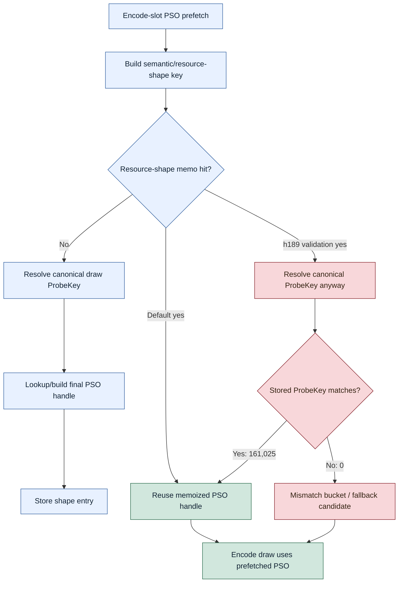

# Encode Phase 167 - Resource shape memo ProbeKey validation

## Question

After the visual-safety anchor was corrected to `v0.0.3` and a current build
showed black/translucent lighting artifacts, is the default encode-slot
resource-shape PSO memo reusing stale pipeline handles for a different
canonical draw probe key?

## Verdict

No evidence in this run. The resource-shape memo is not the likely owner of the
reported visual regression, and validating every default hit should not be
promoted.

The h189 scout temporarily forced the memo hit path to resolve the canonical
`probeKey` before reusing the memoized handle, then counted validated hits and
mismatches. Every memo hit validated: `161,025 / 161,025` hits matched the
resolved key, `validated_misses=0`, and every mismatch bucket stayed `0`. The
run also had `draw_skipped_no_pipeline=0` and `gpu_command_buffer_errors=0`.
Its `actual.png` is a gross visual smoke only; it does not prove same-frame
parity against `v0.0.3` for the reported black/translucent vertex issue.

The temporary validation path is a CPU regression. It raises
`encode_slot_pso_prefetch_draw_key_resolve_cpu_ms_per_present` to `1.104`,
versus the recent default band of about `0.437-0.497`, and raises the prefetch
parent to `1.872ms/present` versus about `1.212-1.347`. The code experiment was
therefore reverted. Keep the existing resource-shape memo default path, and use
`DXMT9_PERF_ENCODE_SLOT_PSO_RESOURCE_SHAPE_OPPORTUNITY=1` or
`DXMT9_DISABLE_ENCODE_SLOT_PSO_RESOURCE_SHAPE_MEMO=1` only as targeted A/B
diagnostics if the visual artifact is reproduced.

## Runtime

```sh
bash scripts/tools/run_3dmark05_perf_probe.sh \
  --suffix h189-resource-shape-probekey-gate-r1 \
  --no-gputrace \
  --timeout 120 \
  --keep-frontmost \
  --frame-sampling
```

The candidate was a temporary local modification to the default resource-shape
memo hit path in `src/dxmt9/dxmt9_command_queue.cpp`. It resolved the canonical
draw probe key before reusing the shape handle and compared it to the stored
entry. That change was intentionally not kept because it proved zero
mismatches while adding per-hit resolve cost.

## Metrics

| Metric | h189 validation |
|---|---:|
| `present_encoded` | `1,740` |
| `sampled_avg_fps` | `16.237` |
| `draw_skipped_no_pipeline` | `0` |
| `gpu_command_buffer_errors` | `0` |
| `encode_slot_pso_prefetch_draw_resource_shape_memo_candidates` | `265,703` |
| `encode_slot_pso_prefetch_draw_resource_shape_memo_hits` | `161,025` |
| `encode_slot_pso_prefetch_draw_resource_shape_memo_misses` | `104,678` |
| `encode_slot_pso_prefetch_draw_resource_shape_memo_overflow` | `0` |
| `encode_slot_pso_prefetch_draw_resource_shape_memo_validated_hits` | `161,025` |
| `encode_slot_pso_prefetch_draw_resource_shape_memo_validated_misses` | `0` |
| resource-shape mismatch buckets | all `0` |
| `encode_slot_pso_prefetch_cpu_ms_per_present` | `1.872` |
| `encode_slot_pso_prefetch_draw_key_resolve_cpu_ms_per_present` | `1.104` |
| `encode_slot_pso_prefetch_draw_lookup_cpu_ms` | `405.710` |
| `encode_chunk_cpu_ms_per_present` | `13.078` |
| `completion_wait_ms_per_present` | `26.428` |

Recent default/reference runs without forced validation were lower in the
resolve rows:

| Run | `resource_shape_hits` | `validated_hits` | `validated_misses` | `prefetch ms/present` | `draw_key_resolve ms/present` |
|---|---:|---:|---:|---:|---:|
| h187 present-prefix tail shape | `141,115` | `0` | `0` | `1.347` | `0.497` |
| h188 current PE cadence | `131,343` | `0` | `0` | `1.212` | `0.437` |
| h189 forced validation | `161,025` | `161,025` | `0` | `1.872` | `1.104` |

## Structure



## Interpretation

This closes one plausible visual-regression branch: the texture-handle-blind
resource-shape memo did not produce stale canonical PSO reuse in the h189
sample. A future black/translucent lighting artifact should not be blamed on
this memo without a nonzero validation mismatch or a reproduced visual A/B
where `DXMT9_DISABLE_ENCODE_SLOT_PSO_RESOURCE_SHAPE_MEMO=1` fixes the frame.

The remaining visual suspects stay elsewhere: opt-in direct-cbuf if enabled,
opt-in compact uniform submissions if enabled, dynamic backing snapshots,
shader/constant source changes, blend/depth/order behavior, or a frame-specific
final-writer issue. The next promoted performance work should still require the
`v0.0.3` visual gate; gross `actual.png` smoke is not enough for black-vertex or
weapon-transparency regressions.
