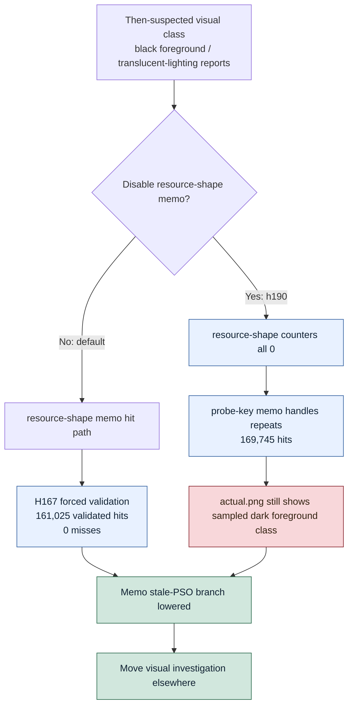

# Encode Phase 168 - Resource shape memo opt-out visual A/B

## Question

If the default resource-shape PSO memo is disabled entirely, does the
then-suspected current black-foreground / translucent-lighting visual class
disappear?

## Verdict

No. Disabling the resource-shape memo does not fix the visual issue, and it is
not a performance candidate.

The h190 run sets only `DXMT9_DISABLE_ENCODE_SLOT_PSO_RESOURCE_SHAPE_MEMO=1`
on top of the standard 3DMark05 perf probe. The counters prove the opt-out is
active: resource-shape memo candidates, hits, misses, stores, and validation
rows are all `0`. The run still renders the sampled dark foreground/silhouette
class in `actual.png`, so the default memo is not the current visual-fix lever.
This matches H167's forced-validation result, where all `161,025` memo hits
matched the canonical `probeKey`. H172 later shows this sampled window class
also exists in the `v0.0.3` safe tag, so do not treat h190's time-based
foreground shape as standalone regression proof.

The opt-out also does not improve the average-FPS owner. It shifts the repeated
work to the probe-key memo path (`probe_key_memo_hits=169,745`) and keeps PSO
prefetch in the expensive resolve band: `draw_key_resolve=1.108ms/present`,
`prefetch=1.845ms/present`, and `encode_ready_depth_avg=1.000`. Completion wait
remains no-enqueue dominated.

## Runtime

```sh
DXMT9_DISABLE_ENCODE_SLOT_PSO_RESOURCE_SHAPE_MEMO=1 \
  bash scripts/tools/run_3dmark05_perf_probe.sh \
    --suffix h190-resource-shape-memo-disabled-r1 \
    --no-gputrace \
    --timeout 120 \
    --keep-frontmost \
    --frame-sampling
```

Comparison report:

```sh
python3 scripts/tools/compare_3dmark05_perf_counters.py \
  experiments/output/app-d3d9-3dmark05-h189-resource-shape-probekey-gate-r1 \
  experiments/output/app-d3d9-3dmark05-h190-resource-shape-memo-disabled-r1 \
  --before-label h189-validated \
  --after-label h190-disabled \
  --output experiments/output/app-d3d9-3dmark05-h190-resource-shape-memo-disabled-r1/h189-vs-h190-resource-shape-memo-disabled.md
```

Cross-run image compare:

```sh
python3 scripts/tools/compare_experiment_images.py \
  --before experiments/output/app-d3d9-3dmark05-h189-resource-shape-probekey-gate-r1/actual.png \
  --after experiments/output/app-d3d9-3dmark05-h190-resource-shape-memo-disabled-r1/actual.png \
  --crop-bottom 96 \
  --output traces/app-d3d9-3dmark05-h190-resource-shape-memo-disabled-r1/analysis/h189-vs-h190-actual-image-compare.md
```

The image comparison is only a frame/time-drift detector: h189 and h190 captured
different GT1 moments, with `90.55%` full-frame changed pixels. It must not be
used as same-frame visual proof.

## Metrics

| Metric | h190 disabled memo |
|---|---:|
| `present_encoded` | `1,740` |
| `sampled_avg_fps` | `16.371` |
| `draw_skipped_no_pipeline` | `0` |
| `gpu_command_buffer_errors` | `0` |
| `encode_slot_pso_prefetch_draw_resource_shape_memo_candidates` | `0` |
| `encode_slot_pso_prefetch_draw_resource_shape_memo_hits` | `0` |
| `encode_slot_pso_prefetch_draw_resource_shape_memo_misses` | `0` |
| `encode_slot_pso_prefetch_draw_probe_key_memo_hits` | `169,745` |
| `encode_slot_pso_prefetch_draw_probe_key_memo_misses` | `97,640` |
| `encode_slot_pso_prefetch_cpu_ms_per_present` | `1.845` |
| `encode_slot_pso_prefetch_draw_key_resolve_cpu_ms_per_present` | `1.108` |
| `encode_chunk_cpu_ms_per_present` | `12.961` |
| `completion_wait_ms_per_present` | `26.723` |
| `completion_wait_without_enqueue_ms_per_present` | `26.693` |
| `encode_ready_depth_avg` | `1.000` |

Against h189 forced validation, the opt-out keeps the same broad cadence shape:
command buffers per present stay `3.999`, ready depth stays `1.000`, completion
wait changes by only `+0.295ms/present`, and encode chunk changes by
`-0.117ms/present`. The then-suspected visual class persists in h190, so the
useful conclusion is root-cause exclusion rather than a performance delta.

## Structure



## Interpretation

The resource-shape memo branch is now checked two ways:

- H167: keep the memo but validate the resolved `probeKey` on every hit.
- H168: disable the memo entirely.

Both routes reject the memo as the visual owner. H172 later lowers this sampled
window to normal-scene/post-process because it also appears in `v0.0.3`. The
next visual-debug work should move only after a reproduced object-specific
artifact: dynamic backing snapshots, stream/IB payload state, shader constant
source changes, blend/depth order, or final-writer/pass behavior. Do not spend
another `.gputrace` on the resource-shape memo unless a same-frame A/B
contradicts these no-gputrace gates.
