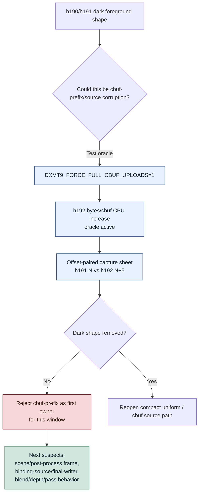

# Encode Phase 169 - Full-cbuf oracle for black geometry window

## Question

The h190 `actual.png` and current h191 capture window show large dark foreground
silhouettes during the GT1 firefight. Is this a recurrence of the
post-`v0.0.3` compact uniform / cbuf-prefix visual corruption class?

## Verdict

No evidence in this window. Forcing full VS/PS cbuf uploads does not remove the
dark foreground shape.

The h191 current run captures frames `1060..1100` at step `5`. It shows a
wide firefight window with heavy muzzle bloom, sparks, tracers, dead bodies,
crates, and dark foreground silhouettes. The h192 oracle repeats the same
window with `DXMT9_FORCE_FULL_CBUF_UPLOADS=1`. The scenes drift by about one
capture step, so the paired sheet compares h191 `N` against h192 `N+5`; within
that alignment the dark foreground silhouettes remain visually present in both
runs. That means this window is not a strong cbuf-prefix/source corruption
proof.

This does not make `actual.png` a correctness oracle. Time-based captures can
land in heavy post-process, alpha, shadow, and motion-composition sections. The
claim is narrower: full-cbuf does not obviously normalize the currently sampled
black-geometry window, so do not reopen the compact uniform ABI-prefix fix as
the first suspect without a same-frame contradiction.

## Runtime

Current window:

```sh
bash scripts/tools/run_3dmark05_perf_probe.sh \
  --suffix h191-current-black-geometry-window-r1 \
  --no-gputrace \
  --timeout 120 \
  --keep-frontmost \
  --frame-sampling \
  --capture-range 1060:1100:5
```

Full-cbuf oracle:

```sh
DXMT9_FORCE_FULL_CBUF_UPLOADS=1 \
  bash scripts/tools/run_3dmark05_perf_probe.sh \
    --suffix h192-full-cbuf-black-geometry-window-r1 \
    --no-gputrace \
    --timeout 120 \
    --keep-frontmost \
    --frame-sampling \
    --capture-range 1060:1100:5
```

Comparison:

```sh
python3 scripts/tools/compare_3dmark05_perf_counters.py \
  experiments/output/app-d3d9-3dmark05-h191-current-black-geometry-window-r1 \
  experiments/output/app-d3d9-3dmark05-h192-full-cbuf-black-geometry-window-r1 \
  --before-label h191-current \
  --after-label h192-full-cbuf \
  --output experiments/output/app-d3d9-3dmark05-h192-full-cbuf-black-geometry-window-r1/h191-vs-h192-full-cbuf-black-geometry-window.md
```

Image artifacts:

- h191 current strip:
  `traces/app-d3d9-3dmark05-h191-current-black-geometry-window-r1/analysis/h191-capture-strip.png`
- h192 full-cbuf strip:
  `traces/app-d3d9-3dmark05-h192-full-cbuf-black-geometry-window-r1/analysis/h192-capture-strip.png`
- offset-paired h191 `N` vs h192 `N+5` sheet:
  `traces/app-d3d9-3dmark05-h192-full-cbuf-black-geometry-window-r1/analysis/h191-vs-h192-offset-pairs.png`

## Metrics

| Metric | h191 current | h192 full-cbuf | Reading |
|---|---:|---:|---|
| `present_encoded` | `1,796` | `1,740` | Same 120s class |
| `sampled_avg_fps` | `16.391` | `16.379` | Noise-flat |
| `draw_skipped_no_pipeline` | `0` | `0` | No skipped-pipeline branch |
| `gpu_command_buffer_errors` | `0` | `0` | No Metal error branch |
| `argbuf_hybrid_bytes_per_encoder` | `937,374,776` | `4,958,743,232` | Oracle is active (`+429%`) |
| `argbuf_cbuf_update_cpu_ms_per_present` | `1.010` | `1.332` | Full-cbuf cost visible |
| `encode_chunk_cpu_ms_per_present` | `12.841` | `13.478` | CPU cost worsens |
| `completion_wait_ms_per_present` | `26.744` | `25.809` | No P4 owner movement |
| `resource_shape_memo_hits` | `166,603` | `161,865` | PSO memo remains normal |

The full-cbuf oracle changes the expected byte/CPU rows but not the visual
class being sampled. Treat the small completion-wait/GPU differences as run
noise and frame drift, not a full-cbuf performance win.

## Structure



## Interpretation

This result protects the previous compact-uniform ABI-prefix fix from being
reopened based only on a time-based screenshot. The current window still needs
careful visual triage, but the sampled dark foreground shapes behave more like
scene/post-process silhouettes or a non-cbuf final-writer/state issue than like
the old constant-prefix zeroing class.

The next visual-coupling step should be same-frame or draw-local: capture a
specific offending frame under current and an oracle/reference, then isolate
the final writer or pass state. Do not spend Xcode/gputrace on cbuf prefix
width for this window unless a same-frame image gate first shows full-cbuf
removes the artifact.
