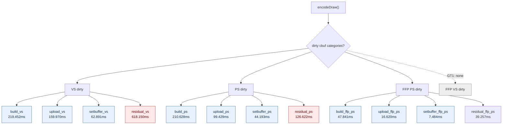
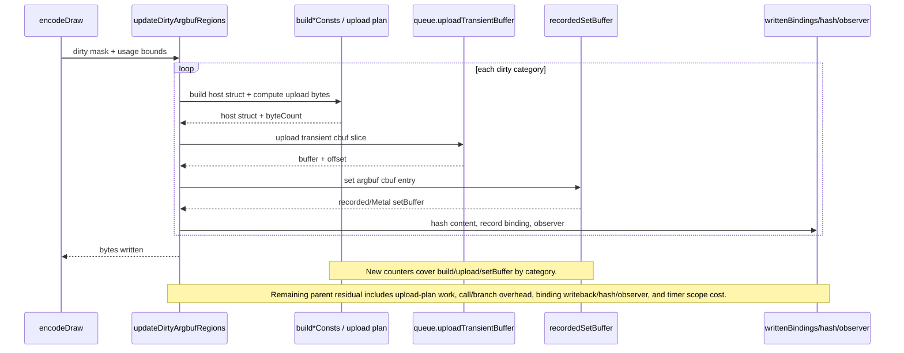

# Cbuf Category Operation Split

> **Outdated — every artifact this leaf cites in `source:` is gone from disk.** The numbers below cannot be re-derived or re-checked. Kept as history; do not cite it as current evidence.

**Question / hypothesis.** After [state-churn-encode-encode-phase.16](state-churn-encode-encode-phase.16.md) removed
the rejected texture pre-resolve branch, the remaining named backend CPU bucket
was still `encode_draw_argbuf_cbuf_update_cpu_ms ~= 1.85s` per GT1 run. Existing
counters split the bucket two different ways:

- by category: VS, PS, FFPVS, FFPPS update parent time; and
- by operation: build, transient upload, Metal `setBuffer`.

They did not answer the cross-product question: is the dominant VS update time
owned by cbuf struct build, transient upload, Metal pointer repoint, or
something else inside `updateDirtyArgbufRegions()`?

**Implementation.** Add attribution-only counters:

- `encode_draw_argbuf_cbuf_build_{vs,ps,ffp_vs,ffp_ps}_cpu_ms`
- `encode_draw_argbuf_cbuf_upload_{vs,ps,ffp_vs,ffp_ps}_cpu_ms`
- `encode_draw_argbuf_cbuf_setbuffer_{vs,ps,ffp_vs,ffp_ps}_cpu_ms`

The global operation counters remain unchanged. `PerfScope` records global and
category counters from the same start/end clock so the added split does not
double the clock timing cost for those scopes. The counters are not a
performance optimization; they are a no-gputrace probe for the next CPU target.



**Method.**

```bash
bash scripts/tools/run_3dmark05_perf_probe.sh \
  --suffix cbuf-category-split-r1 \
  --frame 50 \
  --no-gputrace \
  --no-encoder-breakdown \
  --timeout 180

python3 scripts/tools/compare_3dmark05_perf_counters.py \
  experiments/output/app-d3d9-3dmark05-texture-preresolve-removed-default-r1 \
  experiments/output/app-d3d9-3dmark05-cbuf-category-split-r1 \
  --output experiments/output/app-d3d9-3dmark05-cbuf-category-split-r1/dxmt9-perf-counter-comparison-vs-texture-preresolve-removed-default.md
```

The wrapper hit the expected watchdog status `124` after writing artifacts.
`actual.png` is a normal GT1 frame with robot, flare, background, and HUD
visible (`Frame: 1001`, HUD `FPS: 17`). This run processed `1680` presents, not
`1740`, so all interpretation below uses per-present shape where needed.

**Measured split.**

| Counter | Total | Per present | Reading |
|---|---:|---:|---|
| `present_encoded` | 1,680 | 1.000 | shorter than removed-default baseline |
| `draw_calls` | 1,238,436 | 737.164 | shape-stable enough for attribution |
| `encode_draw_argbuf_cbuf_update_cpu_ms` | 1,822.671 | 1.085ms | parent bucket |
| `encode_draw_argbuf_cbuf_build_cpu_ms` | 477.921 | 0.284ms | visible leaf |
| `encode_draw_argbuf_cbuf_upload_cpu_ms` | 276.019 | 0.164ms | visible leaf |
| `encode_draw_argbuf_cbuf_setbuffer_cpu_ms` | 114.568 | 0.068ms | visible leaf |
| inferred update residual | 954.163 | 0.568ms | dominant remaining cost |

Category rows:

| Category | Update parent | Build | Upload | SetBuffer | Residual | Main reading |
|---|---:|---:|---:|---:|---:|---|
| VS | 1,060.463 | 219.452 | 159.970 | 62.891 | 618.150 | dominant parent and dominant residual |
| PS | 480.872 | 210.628 | 99.429 | 44.193 | 126.622 | build is large, residual still non-trivial |
| FFPVS | 0.000 | 0.000 | 0.000 | 0.000 | 0.000 | GT1 path does not dirty it here |
| FFPPS | 111.202 | 47.841 | 16.620 | 7.484 | 39.257 | small but non-zero |

The category sums match the global operation counters:

- build: `219.452 + 210.628 + 0 + 47.841 = 477.921ms`
- upload: `159.970 + 99.429 + 0 + 16.620 = 276.019ms`
- setBuffer: `62.891 + 44.193 + 0 + 7.484 = 114.568ms`

That makes the residual real within the current attribution model. It is not
hidden in a missing FFPVS row.



**Verdict.** Accepted attribution. The remaining cbuf-update problem is not
primarily Metal `setBuffer` (`114.568ms`) or transient upload (`276.019ms`).
`build*Consts()` is material (`477.921ms`) but still only about half of the
`954.163ms` inferred residual. The next cbuf work should split the residual
before mutating behavior.

**Next cbuf probes.**

1. Split VS/PS residual into upload-plan computation, `hashConstantBufferBytes`,
   `writtenBindings` writeback, observer callback, and outer dirty/category
   dispatch.
2. Check whether VS upload bytes are still too wide for known usage bounds:
   `VS bytes/present = 214,955.9`, while PS is `22,457.8`.
3. If build remains hot after residual split, target `buildVsConsts()` /
   `buildPsConsts()` copy/hash locality rather than Metal buffer calls.

**Related.** [state-churn-encode](index.md) ·
[state-churn-encode-encode-phase.16](state-churn-encode-encode-phase.16.md) · [const-upload](../const-upload/index.md).
