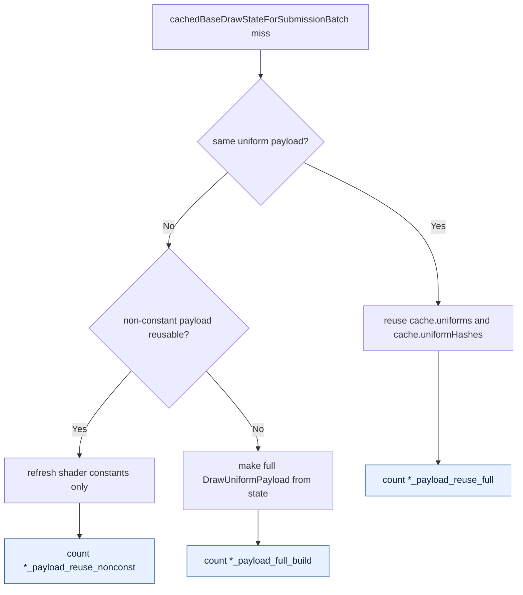

# Encode Phase 170 - Batch-miss uniform payload path counters

> **Outdated — the knob or code path this experiment measured no longer exists in `src/`.** It cannot be re-run. Kept as history; do not cite it as current evidence.

## Question

After the compact-carrier work, `DXMT9_ENABLE_COMPACT_UNIFORM_SUBMISSIONS=1`
still fails promotion because `CachedBaseDrawState` keeps full
`DrawUniformPayload` as the source of truth. Before changing that representation,
what fraction of binding-agnostic snapshot-cache batch misses actually rebuilds
the full payload, reuses the full payload, or only refreshes shader constants
while reusing non-constant payload fields?

## Verdict

Runtime proof accepted.

The new counters split the existing batch-miss uniform branch into three
behavior-preserving rows:

- `d3d9_snapshot_cache_batch_miss_uniform_payload_reuse_full`
- `d3d9_snapshot_cache_batch_miss_uniform_payload_reuse_nonconst`
- `d3d9_snapshot_cache_batch_miss_uniform_payload_full_build`

This is not a performance change. It is a sizing gate for the next real
uniform-cache design. The h200 current run shows that the branch is dominated
by shader-constant-only refreshes, not by complete payload rebuilds:

| Counter | h200 value | Share of selected paths |
|---|---:|---:|
| `d3d9_snapshot_cache_batch_miss_uniform_payload_reuse_full` | `3,449` | `1.00%` |
| `d3d9_snapshot_cache_batch_miss_uniform_payload_reuse_nonconst` | `306,976` | `88.90%` |
| `d3d9_snapshot_cache_batch_miss_uniform_payload_full_build` | `34,903` | `10.11%` |

`reuse_nonconst + full_build = 341,879`, matching
`d3d9_snapshot_cache_batch_miss_uniform_build_calls`. `reuse_full` does not
enter the build timer because it reuses the cached `DrawUniformPayload` and
hashes directly.

The residual timers are therefore mostly shader-constant/hash width, especially
VS constant hashing:

| Counter | h200 value | Per present |
|---|---:|---:|
| `present_encoded` | `1,500` | - |
| `d3d9_snapshot_cache_batch_miss_uniform_build_cpu_ms` | `1071.926ms` | `0.715ms` |
| `d3d9_snapshot_cache_batch_miss_uniform_build_hash_cpu_ms` | `764.934ms` | `0.510ms` |
| `d3d9_snapshot_cache_batch_miss_uniform_build_vs_const_hash_cpu_ms` | `488.736ms` | `0.326ms` |

Interpretation:

- if `full_build` dominates, compact-primary construction must attack the full
  payload build/hash source of truth;
- if `reuse_nonconst` dominates, shader-constant-only refresh and VS constant
  hash width are the main residual;
- if `reuse_full` dominates, changing the cached representation is unlikely to
  move the current P4/P2/P3 owner.

h200 selects the second case. This keeps a compact-primary cached-uniform design
open, but it narrows the target: do not spend another carrier-width experiment
first. The likely local lever is VS constant hash/copy width or a direct compact
constant representation; the global FPS owner remains P4/no-enqueue serial
cadence plus encode/replay CPU.

## Change



The branch behavior is unchanged; the new counter function only records which
existing path was selected.

## Verification

Build and focused tests:

```sh
meson compile -C build-arm64-nowine
meson test -C build-arm64-nowine \
  dxmt9-core-device-com-spec \
  dxmt9-dod-replay-observer-spec \
  dxmt9-state-draw-transform-spec
python3 -m py_compile \
  scripts/tools/summarize_3dmark05_perf.py \
  scripts/tools/compare_3dmark05_perf_counters.py
```

All focused tests passed. The compare script also tolerates older run artifacts
where the new counters are absent, reporting them as `missing`.

## Runtime Gate

Run:

```sh
bash scripts/tools/run_3dmark05_perf_probe.sh \
  --suffix h200-uniform-payload-path-current-r1 \
  --no-gputrace \
  --timeout 120 \
  --keep-frontmost \
  --frame-sampling
```

Artifacts:

- `experiments/output/app-d3d9-3dmark05-h200-uniform-payload-path-current-r1/3dmark05-perf-summary.md`
- `experiments/output/app-d3d9-3dmark05-h200-uniform-payload-path-current-r1/actual.png`

The wrapper reports `status: pass` and `timed_out: true`, which is acceptable
for this sample because the perf artifacts were finalized under the standard
positive 120s timeout policy. The screenshot is a coherent effects-heavy GT1
frame rather than a black-screen failure, but it is not a `v0.0.3` pixel oracle.

The P4/serial-cadence class is unchanged:

| Metric | h200 value |
|---|---:|
| `sampled_avg_fps` | `13.934` |
| `completion_wait_without_enqueue_ms_per_present` | `24.474ms` |
| `completion_wait_with_enqueue_ms_per_present` | `0.000ms` |
| `commit_chunk_replay_cpu_ms_per_present` | `9.456ms` |
| `d3d9_snapshot_draw_submission_cpu_ms_per_present` | `3.633ms` |
| `encode_chunk_cpu_ms_per_present` | `14.819ms` |
| `encode_draw_cpu_ms_per_present` | `11.494ms` |
| `completion_no_enqueue_stage_commit_entry_to_publish_p50_ms` | `46.389ms` |
| `completion_no_enqueue_stage_encode_dequeue_to_command_buffer_commit_p50_ms` | `28.894ms` |
| `completion_no_enqueue_wait_to_next_enqueue_p50_ms` | `77.878ms` |

The attribution is useful, but this run does not justify another FPS claim
without either a P4 overlap change or a larger replay/encode CPU reduction.
