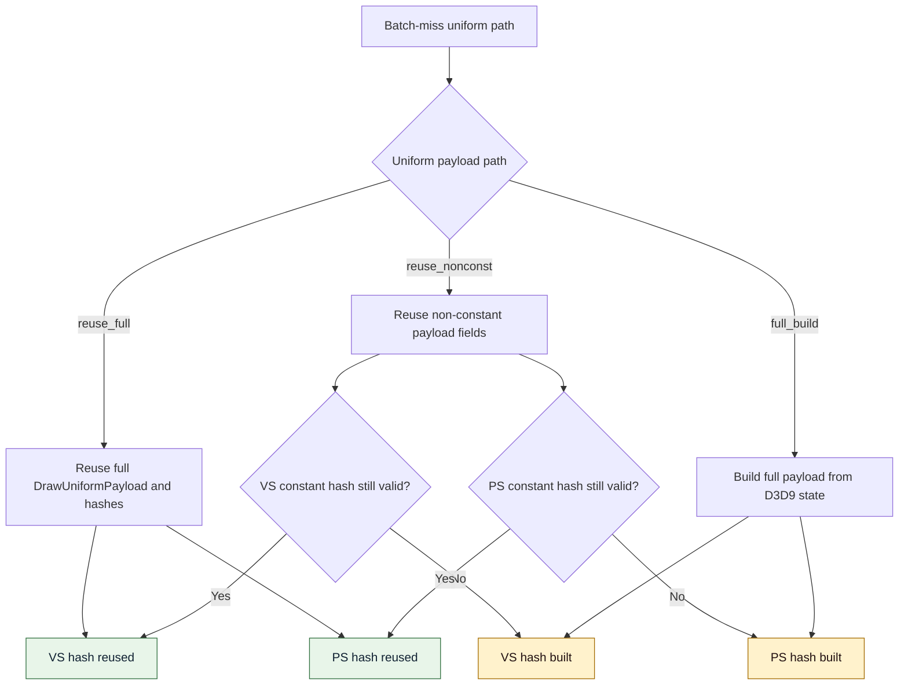

# Encode Phase 171 - Batch-miss shader-constant hash path counters

## Question

H170 proved that binding-agnostic snapshot-cache batch misses mostly reuse the
non-constant uniform payload and refresh shader constants. Does that refresh
usually rebuild the VS/PS constant hashes, or does it mostly reuse existing
shader-constant hashes?

## Verdict

Runtime attribution accepted.

The h202 run adds per-stage path counters for the same batch-miss branch. The
new counters cover all selected batch-miss uniform paths:

```text
reuse_full + reuse_nonconst + full_build = 407,597
```

The older `d3d9_snapshot_cache_batch_miss_uniform_build_calls` remains smaller
because it only counts `reuse_nonconst + full_build`:

```text
362,639 + 40,577 = 403,216
```

The new VS/PS hash path split shows that most selected batch misses still build
shader-constant hashes:

| Counter | h202 value | Share |
|---|---:|---:|
| `d3d9_snapshot_cache_batch_miss_uniform_vs_const_hash_reuse` | `135,368` | `33.21%` |
| `d3d9_snapshot_cache_batch_miss_uniform_vs_const_hash_build` | `272,229` | `66.79%` |
| `d3d9_snapshot_cache_batch_miss_uniform_ps_const_hash_reuse` | `115,435` | `28.32%` |
| `d3d9_snapshot_cache_batch_miss_uniform_ps_const_hash_build` | `292,162` | `71.68%` |

This keeps shader-constant hash reuse open as a local CPU cleanup. It does not
promote it to the global FPS owner: the total batch-miss VS+PS hash CPU is only
about `0.315ms/present`, while h202 remains dominated by no-enqueue completion
wait and serial replay/encode cadence.

## Path Model



## Runtime Gate

Run:

```sh
DXMT_LOG_LEVEL=info bash scripts/tools/run_3dmark05_perf_probe.sh \
  --suffix h202-batch-miss-shader-hash-path-current-r1 \
  --no-gputrace \
  --no-encoder-breakdown \
  --frame-sampling \
  --timeout 120 \
  --keep-frontmost \
  --wait-unlocked-sec 1 \
  --wait-unlocked-interval-sec 1
```

Artifacts:

- `experiments/output/app-d3d9-3dmark05-h202-batch-miss-shader-hash-path-current-r1/3dmark05-perf-summary.md`
- `experiments/output/app-d3d9-3dmark05-h202-batch-miss-shader-hash-path-current-r1/h200-vs-h202-perf-counters.md`
- `experiments/output/app-d3d9-3dmark05-h202-batch-miss-shader-hash-path-current-r1/actual.png`

The wrapper reports `status: pass`. `actual.png` is a coherent effects-heavy GT1
frame, not a black-screen or gross-corruption failure. It is still not a
same-frame `v0.0.3` pixel oracle.

Key h202 rows:

| Metric | h202 value |
|---|---:|
| `present_encoded` | `1,740` |
| `sampled_avg_fps` | `16.331` |
| `completion_wait_without_enqueue_ms_per_present` | `27.505ms` |
| `completion_wait_with_enqueue_ms_per_present` | `0.000ms` |
| `commit_chunk_replay_cpu_ms_per_present` | `8.318ms` |
| `encode_chunk_cpu_ms_per_present` | `11.230ms` |
| `d3d9_snapshot_cache_batch_miss_uniform_build_cpu_ms` | `1069.802ms` / `0.615ms/present` |
| `d3d9_snapshot_cache_batch_miss_uniform_build_hash_cpu_ms` | `763.061ms` / `0.439ms/present` |
| `d3d9_snapshot_cache_batch_miss_uniform_build_vs_const_hash_cpu_ms` | `486.358ms` / `0.280ms/present` |
| `d3d9_snapshot_cache_batch_miss_uniform_build_ps_const_hash_cpu_ms` | `61.588ms` / `0.035ms/present` |
| `d3d9_snapshot_cache_batch_miss_uniform_build_vs_const_hash_bytes` | `345,342,240` |
| `d3d9_snapshot_cache_batch_miss_uniform_build_ps_const_hash_bytes` | `35,349,888` |

The h200 comparison keeps the same broad bottleneck class. h202 has lower
normalized replay/encode CPU than h200, but completion wait remains entirely
no-enqueue:

| Metric | h200 | h202 |
|---|---:|---:|
| `completion_wait_with_enqueue_ms_per_present` | `0.000ms` | `0.000ms` |
| `completion_wait_without_enqueue_ms_per_present` | `24.474ms` | `27.505ms` |
| `commit_chunk_replay_cpu_ms_per_present` | `9.456ms` | `8.318ms` |
| `encode_chunk_cpu_ms_per_present` | `14.819ms` | `11.230ms` |
| `snapshot_cache_batch_miss_uniform_build_cpu_ms_per_present` | `0.715ms` | `0.615ms` |
| `snapshot_cache_batch_miss_vs_const_hash_cpu_ms_per_present` | `0.326ms` | `0.280ms` |
| `snapshot_cache_batch_miss_ps_const_hash_cpu_ms_per_present` | `0.041ms` | `0.035ms` |

## Interpretation

The next local uniform/hash experiment should not be another carrier-width
variant. The carrier lane has already been measured and the compact carrier path
does not beat the default.

The only remaining local opportunity shown by h202 is to avoid rebuilding
shader-constant hashes when a stable generation/lane or per-stage generation
already proves the bytes are unchanged. A byte-width-only reduction is a smaller
candidate: h202's indexed-float VS full-hash rows expose only
`21,240,480` potential saved bytes against `345,342,240` batch-miss VS hash
bytes.

Do not read this as an FPS-facing owner. Even a perfect removal of the h202
batch-miss VS+PS hash timers would save roughly `0.315ms/present`; P4 remains
`27.505ms/present` of no-enqueue completion wait, and replay+encode still cost
about `19.55ms/present`. A shader-constant hash memo is therefore a bounded
P2/P3 cleanup that still needs the `v0.0.3` visual gate before promotion.

## Verification

Build and tests:

```sh
python3 -m pytest \
  tests/scripts/test_compare_3dmark05_perf_counters.py \
  tests/scripts/test_summarize_3dmark05_perf.py
meson compile -C build-arm64-nowine
meson test -C build-arm64-nowine \
  dxmt9-core-device-com-spec \
  dxmt9-state-draw-transform-spec \
  dxmt9-dod-replay-observer-spec
python3 -m py_compile \
  scripts/tools/summarize_3dmark05_perf.py \
  scripts/tools/compare_3dmark05_perf_counters.py
meson compile -C build-x86_64-builtin
meson compile -C build-win32-x86-builtin d3d9 winemetal
meson compile -C build-win32-x64-builtin d3d9 winemetal
git diff --check
```

All listed checks passed before the h202 runtime gate.
