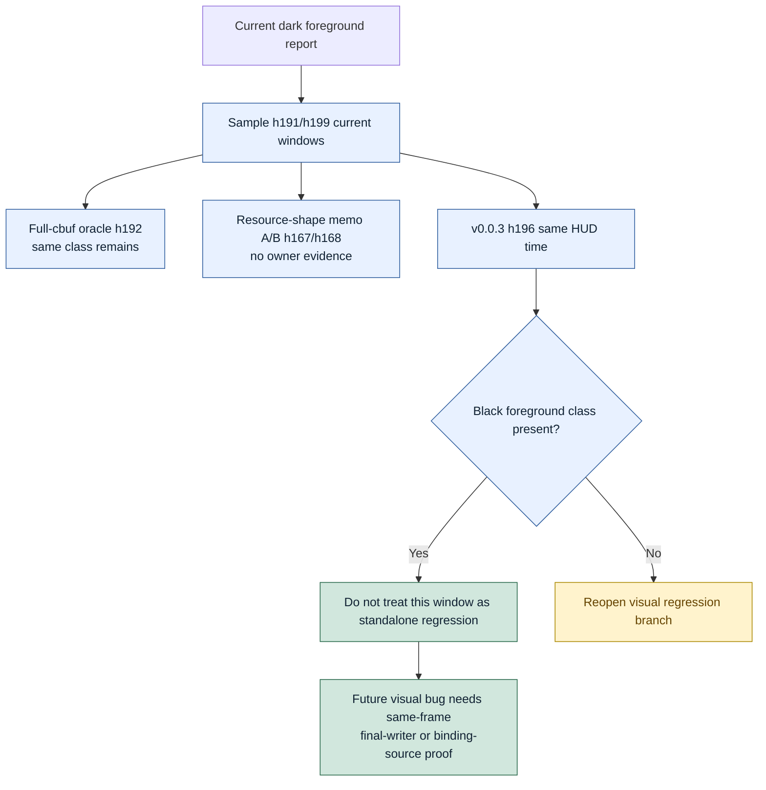

# Encode Phase 172 - `v0.0.3` black-foreground window oracle

## Question

After re-confirming that `v0.0.3` is the last known GT1 visual-safe code point,
does the currently sampled dark foreground / black silhouette window indicate a
post-`v0.0.3` correctness regression?

## Verdict

Not for this sampled window. The same visual class exists in the `v0.0.3`
release capture at the same GT1 HUD time range.

The most comparable pair is:

- `h196-v003-tag-release-black-geometry-window-r3`: HUD `Time 0:59.30`,
  `Frame 642`, `FPS 4`.
- `h199-current-black-geometry-window-r3-f910`: HUD `Time 0:59.36`,
  `Frame 816`, `FPS 5`.

Both frames show the same firefight scene with strong spark/bloom passes,
crates, foreground silhouettes, and dark limb/prop shapes. The raw image diff is
large (`94.217%` full-frame changed, `97.147%` after cropping the HUD) because
the animation, particles, camera, and debris are not frame-locked. That numeric
diff is not a pass/fail gate. The important qualitative result is that the
black foreground/silhouette class itself is present in the safe tag and should
not be treated as a standalone current correctness regression.

This does not dismiss a different user-observed artifact where weapon-attached
geometry or lighting moves incorrectly with a gun. That remains a separate
same-frame proof problem. It should be reopened only with a capture that shows
the offending object in both current and `v0.0.3`/oracle input, or with a
draw-local final-writer / binding-source isolation.

## Runtime / artifacts

Existing safe-tag/current captures:

```sh
experiments/output/app-d3d9-3dmark05-h196-v003-tag-release-black-geometry-window-r3/actual.png
experiments/output/app-d3d9-3dmark05-h199-current-black-geometry-window-r3-f910/actual.png
```

Generated comparison:

```sh
python3 scripts/tools/compare_experiment_images.py \
  --before experiments/output/app-d3d9-3dmark05-h196-v003-tag-release-black-geometry-window-r3/actual.png \
  --after experiments/output/app-d3d9-3dmark05-h199-current-black-geometry-window-r3-f910/actual.png \
  --label-before h196-v003 \
  --label-after h199-current \
  --crop-bottom 96 \
  --output traces/app-d3d9-3dmark05-h199-current-black-geometry-window-r3-f910/analysis/h196-v003-vs-h199-current-image-compare.md \
  --diff-output traces/app-d3d9-3dmark05-h199-current-black-geometry-window-r3-f910/analysis/h196-v003-vs-h199-current-image-diff.png
```

## Metrics

| Metric | h196 `v0.0.3` | h199 current | Reading |
|---|---:|---:|---|
| HUD time | `0:59.30` | `0:59.36` | Same GT1 moment class |
| HUD frame | `642` | `816` | Different runtime FPS, not same frame |
| HUD FPS | `4` | `5` | Different runtime cadence |
| full-frame changed pixels | — | `94.217%` | Expected from unsynchronized animation |
| cropped changed pixels | — | `97.147%` | Not a pixel gate |
| full-frame SSIM | — | `0.627516` | Time-drift / effect-drift only |
| cropped SSIM | — | `0.559733` | Time-drift / effect-drift only |

## Interpretation

The H167/H168/H169 branch should be reworded mentally as a *suspected* current
black-foreground window, not a proven visual regression:

- H167/H168 still reject stale resource-shape PSO memo as the owner.
- H169 still rejects full-cbuf as the first fix for this window.
- H172 adds the missing `v0.0.3` visual oracle: this specific black foreground
  / silhouette class also appears in the safe tag.


