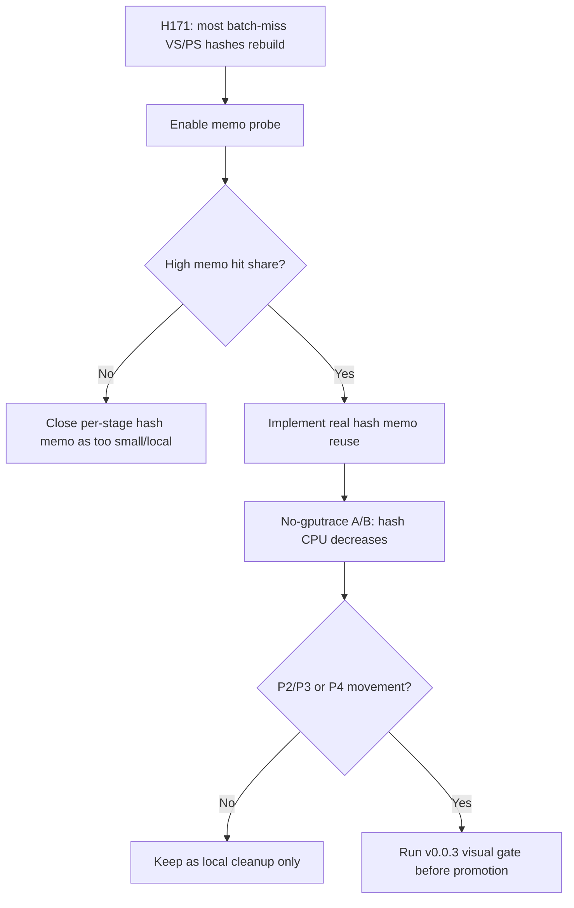

# Encode Phase 173 - Batch-miss shader-hash memo opportunity probe

## Question

H171 showed that binding-agnostic snapshot-cache batch misses rebuild most VS/PS
constant hashes, but it only measured adjacent cache reuse. Is there enough
non-adjacent recurrence of `(constant generation, ShaderConstantUsageBounds)` to
justify a real per-stage shader-constant hash memo?

## Instrumentation

`DXMT9_PERF_BATCH_MISS_SHADER_HASH_MEMO_PROBE=1` adds an observation-only ring
memo inside `Device::cachedBaseDrawStateForSubmissionBatch()`.

The probe:

- runs only on binding-agnostic snapshot-cache batch misses;
- checks the VS stage only when the current path would otherwise rebuild the VS
  constant hash;
- checks the PS stage only when the current path would otherwise rebuild the PS
  constant hash;
- stores the current per-stage `(constant generation, usage, hash)` after the
  normal uniform path has produced authoritative hashes;
- does not reuse hashes and does not change rendering behavior.

The new counters are:

| Counter | Meaning |
|---|---|
| `d3d9_snapshot_cache_batch_miss_uniform_vs_const_hash_memo_probe` | VS hash rebuild candidates sampled by the memo probe |
| `d3d9_snapshot_cache_batch_miss_uniform_vs_const_hash_memo_hits` | VS candidates whose `(generation, usage)` already existed in the ring |
| `d3d9_snapshot_cache_batch_miss_uniform_vs_const_hash_memo_misses` | VS candidates absent from the ring |
| `d3d9_snapshot_cache_batch_miss_uniform_vs_const_hash_memo_stores` | VS stage states stored after the normal path |
| `d3d9_snapshot_cache_batch_miss_uniform_ps_const_hash_memo_probe` | PS hash rebuild candidates sampled by the memo probe |
| `d3d9_snapshot_cache_batch_miss_uniform_ps_const_hash_memo_hits` | PS candidates whose `(generation, usage)` already existed in the ring |
| `d3d9_snapshot_cache_batch_miss_uniform_ps_const_hash_memo_misses` | PS candidates absent from the ring |
| `d3d9_snapshot_cache_batch_miss_uniform_ps_const_hash_memo_stores` | PS stage states stored after the normal path |

The compare tool derives per-present probe/hit/miss/store rows and hit-share
percentages for both stages.

## Decision Gate



This is deliberately not a GPU or FPS claim. Even a perfect VS+PS hash reuse
can only attack the bounded H171 CPU bucket first; promotion still requires a
no-gputrace CPU movement proof, no new P4/locality regression, and the `v0.0.3`
visual-safe gate.

## Run

```sh
DXMT9_PERF_BATCH_MISS_SHADER_HASH_MEMO_PROBE=1 \
bash scripts/tools/run_3dmark05_perf_probe.sh \
  --suffix h203-batch-miss-shader-hash-memo-probe-r1 \
  --no-gputrace --no-encoder-breakdown --frame-sampling \
  --timeout 120 --keep-frontmost \
  --wait-unlocked-sec 1 --wait-unlocked-interval-sec 1
```

## Runtime Result

`app-d3d9-3dmark05-h203-batch-miss-shader-hash-memo-probe-r1` completed without
the wrapper timeout and encoded `1,800` presents. The broad screenshot was a
normal effects-heavy GT1 firefight frame, and the basic correctness counters
stayed clean:

| Counter | Value |
|---|---:|
| `status` | `pass` |
| `timed_out` | `false` |
| `sampled_avg_fps` | `16.498` |
| `draw_skipped_no_pipeline` | `0` |
| `gpu_command_buffer_errors` | `0` |

The memo opportunity itself is effectively absent:

| Stage | Probes | Hits | Misses | Stores | Hit share |
|---|---:|---:|---:|---:|---:|
| VS | `278,940` | `0` | `278,940` | `419,617` | `0.000%` |
| PS | `300,577` | `253` | `300,324` | `419,617` | `0.084%` |

Normalized against presents, the probed rebuild candidates are still the same
bounded local CPU bucket: VS hash CPU is `0.279ms/present`, PS hash CPU is
`0.037ms/present`, and combined batch-miss VS+PS hash CPU is about
`0.316ms/present`. The global cadence remains unchanged:

| Metric | Value |
|---|---:|
| `completion_wait_without_enqueue_ms_per_present` | `27.493` |
| `completion_wait_with_enqueue_ms_per_present` | `0.024` |
| `completion_wait_no_enqueue_share_pct` | `99.913%` |
| `commit_chunk_replay_cpu_ms_per_present` | `8.183` |
| `encode_chunk_cpu_ms_per_present` | `11.203` |

## Verdict

Close the real per-stage `(constant generation, usage) -> constant hash` memo as
not worth implementing for GT1. H171's shader-constant hash bucket is real, but
H203 shows the non-adjacent recurrence needed by this specific memo is not
there: VS has zero hits, and PS is below one tenth of one percent.

Keep the default-off probe only as attribution instrumentation. The next
FPS-facing work should return to P4/replay-publish overlap or a larger
replay/snapshot/encode cadence owner, with `v0.0.3` as the current
visual-safety anchor for any mutating candidate.
