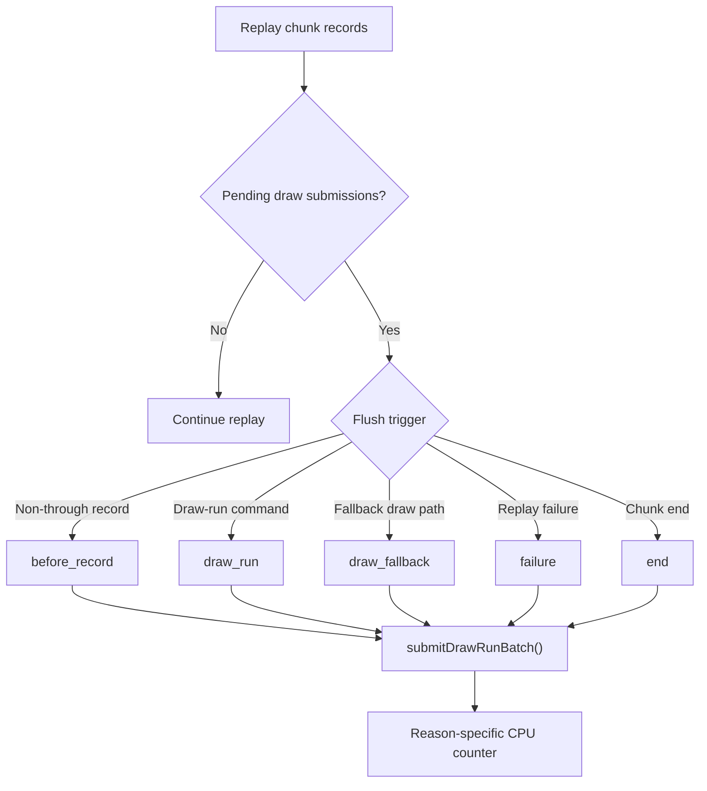

# Encode Phase 174 - Pending draw submission flush reason split (superseded)

## Supersession

This h204 run is superseded by
[state-churn-encode-encode-phase.175](state-churn-encode-encode-phase.175.md). The initial instrumentation wired the
direct/indexed draw-run preflush call sites to the wrong reason bucket, so the
large `draw_fallback` share below is a label error. The h205 rerun with corrected
labels shows the same broad pending-flush owner, but the split is `draw_run`
plus chunk `end`, with real `draw_fallback` near zero.

Keep this note only as the record of the mistaken h204 attribution. Do not use
its reason split for optimization priority.

## Question

After H203 rejected the batch-miss shader-hash memo, the next replay/snapshot
summary still showed a broad `commit_chunk_replay_pending_flush_cpu_ms` row. Is
that flush cost caused by non-draw record boundaries, by draw-run interaction,
or by normal fallback/end-of-chunk draining?

## Instrumentation

`device_c_chunk_replay.cpp` now tags every non-empty pending draw-submission
flush with one of five reasons:

| Reason | Meaning |
|---|---|
| `before_record` | Pending batch flushed before replaying a non-through/non-batch record |
| `draw_run` | Pending batch flushed before a draw-run command |
| `draw_fallback` | Pending batch flushed before the non-batch draw fallback path |
| `failure` | Pending batch flushed while unwinding a replay failure |
| `end` | Pending batch flushed at the end of the chunk replay loop |

The existing broad counter remains the owner:
`commit_chunk_replay_pending_flush_cpu_ms`. The reason counters only split that
total:



## Run

```sh
bash scripts/tools/run_3dmark05_perf_probe.sh \
  --suffix h204-pending-flush-reason-r1 \
  --frame 60 \
  --no-gputrace \
  --no-encoder-breakdown \
  --timeout 120 \
  --keep-frontmost \
  --frame-sampling
```

The run completed as `status=pass` with `1,800` presents. The broad screenshot
is an effects-heavy GT1 firefight frame and not a black-screen or gross
corruption failure. It is still a broad smoke, not a same-frame `v0.0.3` pixel
oracle.

## Runtime Result

The current no-gputrace cadence class is unchanged:

| Metric | Value |
|---|---:|
| `sampled_avg_fps` | `16.580` |
| `gpu_command_buffer_time_ms_per_present` | `3.163` |
| `completion_wait_ms_per_present` | `27.408` |
| `completion_wait_with_enqueue_ms_per_present` | `0.000` |
| `completion_wait_without_enqueue_ms_per_present` | `27.408` |
| `commit_chunk_replay_cpu_ms_per_present` | `8.069` |
| `encode_chunk_cpu_ms_per_present` | `11.290` |

The pending-flush owner is real but not dominant:

| Counter | Total ms | ms/present | Share of replay |
|---|---:|---:|---:|
| `commit_chunk_replay_cpu_ms` | `14523.403` | `8.069` | `100.00%` |
| `commit_chunk_replay_pending_flush_cpu_ms` | `2987.476` | `1.660` | `20.57%` |
| `commit_chunk_replay_pending_flush_draw_fallback_cpu_ms` | `1425.451` | `0.792` | `9.81%` |
| `commit_chunk_replay_pending_flush_end_cpu_ms` | `1406.568` | `0.781` | `9.68%` |
| `commit_chunk_replay_pending_flush_before_record_cpu_ms` | `148.099` | `0.082` | `1.02%` |
| `commit_chunk_replay_pending_flush_draw_run_cpu_ms` | `7.358` | `0.004` | `0.05%` |
| `commit_chunk_replay_pending_flush_failure_cpu_ms` | `0.000` | `0.000` | `0.00%` |

Reason shares within the pending-flush bucket:

| Reason | Share |
|---|---:|
| `draw_fallback` | `47.71%` |
| `end` | `47.08%` |
| `before_record` | `4.96%` |
| `draw_run` | `0.25%` |
| `failure` | `0.00%` |

The residual rows after known child accounting stay small enough to keep the
next owner at snapshot/cache and draw-submission shape, not hidden queue
overhead:

| Derived metric | Value |
|---|---:|
| `queue_submission_known_child_residual_ms_per_present` | `0.124` |
| `draw_record_known_child_residual_ms_per_present` | `1.360` |
| `commit_chunk_queue_draw_submission_cpu_ms_per_present` | `3.796` |
| `d3d9_snapshot_draw_submission_cpu_ms_per_present` | `3.055` |
| `d3d9_snapshot_cache_lookup_cpu_ms_per_present` | `2.456` |
| `d3d9_snapshot_cache_batch_miss_cpu_ms_per_present` | `1.749` |

## Superseded decision

The only still-valid reading is that `before_record` and failure drains are not
the primary pending-flush owner. The fallback-draw conclusion is invalid. Use
H185 for the corrected priority: pending flushes are mostly draw-run boundary
drains and chunk-end drains, so the next CPU work should target the interaction
between queued submissions and draw-run commands, `submitDrawRunBatch()` /
`appendDrawRunBatch()` cost, or larger replay/snapshot/P4 movement.
