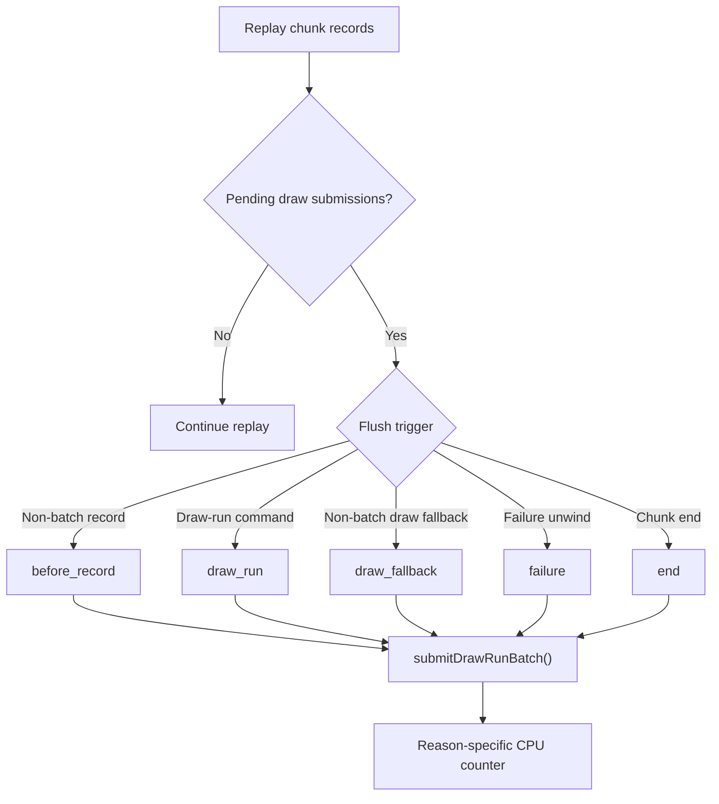

# Encode Phase 175 - Corrected pending draw submission flush reason split

## Question

H174 showed a large `draw_fallback` share in
`commit_chunk_replay_pending_flush_cpu_ms`, but a source audit found that the
direct/indexed draw-run preflush call sites had been tagged as fallback. After
fixing the labels, what actually owns pending draw-submission flush time?

## Label correction

The corrected mapping is:

| Replay path | Flush reason |
|---|---|
| Non-through/non-batch record preflush | `before_record` |
| Direct draw-run command preflush | `draw_run` |
| Indexed draw-run command preflush | `draw_run` |
| Direct non-batch draw fallback preflush | `draw_fallback` |
| Indexed non-batch draw fallback preflush | `draw_fallback` |
| Replay failure unwind | `failure` |
| Chunk replay loop exit | `end` |



## Run

```sh
bash scripts/tools/run_3dmark05_perf_probe.sh \
  --suffix h205-pending-flush-reason-fixed-r1 \
  --frame 60 \
  --no-gputrace \
  --no-encoder-breakdown \
  --timeout 120 \
  --keep-frontmost \
  --frame-sampling
```

The run completed as `status=pass` with `1,800` presents. `actual.png` is an
effects-heavy GT1 firefight frame (`Time 0:59.47`, `Frame 1093`) with bloom,
sparks, and geometry visible. Treat it as broad smoke only: it is not a
same-frame `v0.0.3` pixel oracle.

## Runtime result

The cadence class is unchanged from recent no-gputrace scouts:

| Metric | Value |
|---|---:|
| `sampled_avg_fps` | `16.510` |
| `gpu_command_buffer_time_ms_per_present` | `3.137` |
| `completion_wait_ms_per_present` | `27.163` |
| `completion_wait_with_enqueue_ms_per_present` | `0.000` |
| `completion_wait_without_enqueue_ms_per_present` | `27.163` |
| `commit_chunk_replay_cpu_ms_per_present` | `8.126` |
| `encode_chunk_cpu_ms_per_present` | `11.289` |

The broad pending-flush owner remains real:

| Counter | Total ms | ms/present | Share of replay |
|---|---:|---:|---:|
| `commit_chunk_replay_cpu_ms` | `14626.070` | `8.126` | `100.00%` |
| `commit_chunk_replay_pending_flush_cpu_ms` | `3018.555` | `1.677` | `20.64%` |
| `commit_chunk_replay_pending_flush_draw_run_cpu_ms` | `1431.249` | `0.795` | `9.79%` |
| `commit_chunk_replay_pending_flush_end_cpu_ms` | `1427.722` | `0.793` | `9.76%` |
| `commit_chunk_replay_pending_flush_before_record_cpu_ms` | `151.921` | `0.084` | `1.04%` |
| `commit_chunk_replay_pending_flush_draw_fallback_cpu_ms` | `7.663` | `0.004` | `0.05%` |
| `commit_chunk_replay_pending_flush_failure_cpu_ms` | `0.000` | `0.000` | `0.00%` |

Reason shares within the pending-flush bucket:

| Reason | Share |
|---|---:|
| `draw_run` | `47.42%` |
| `end` | `47.30%` |
| `before_record` | `5.03%` |
| `draw_fallback` | `0.25%` |
| `failure` | `0.00%` |

Known-child residuals stay bounded:

| Derived metric | Value |
|---|---:|
| `queue_submission_known_child_residual_ms_per_present` | `0.125` |
| `draw_record_known_child_residual_ms_per_present` | `1.367` |
| `commit_chunk_queue_draw_submission_cpu_ms_per_present` | `3.817` |
| `commit_chunk_draw_run_submit_cpu_ms_per_present` | `1.165` |
| `commit_chunk_replay_draw_record_cpu_ms_per_present` | `6.624` |

## Decision

H184's fallback-draw conclusion is rejected. The corrected owner is split
almost exactly between:

- `draw_run`: queued submissions flushed before a draw-run command can be
  replayed; and
- `end`: ordinary chunk-end draining of queued submissions.

This keeps the broad "non-draw boundary churn" branch rejected
(`before_record=0.084ms/present`) and makes real fallback draws a non-owner
(`0.004ms/present`). The next replay/snapshot work should not chase fallback
classification. It should instead target one of these:

- reduce the boundary churn between the pending submission carrier and explicit
  draw-run command replay;
- shrink `submitDrawRunBatch()` / `appendDrawRunBatch()` cost for the pending
  submissions that must drain; or
- move larger replay/snapshot/P4 rows that reduce
  `commit_chunk_queue_draw_submission_cpu_ms` and no-enqueue wait together.

This remains CPU-only evidence. Do not spend `.gputrace` from this result alone.
Any mutating candidate still needs a no-gputrace CPU/P4 movement proof and the
`v0.0.3` visual-safe gate before promotion.
