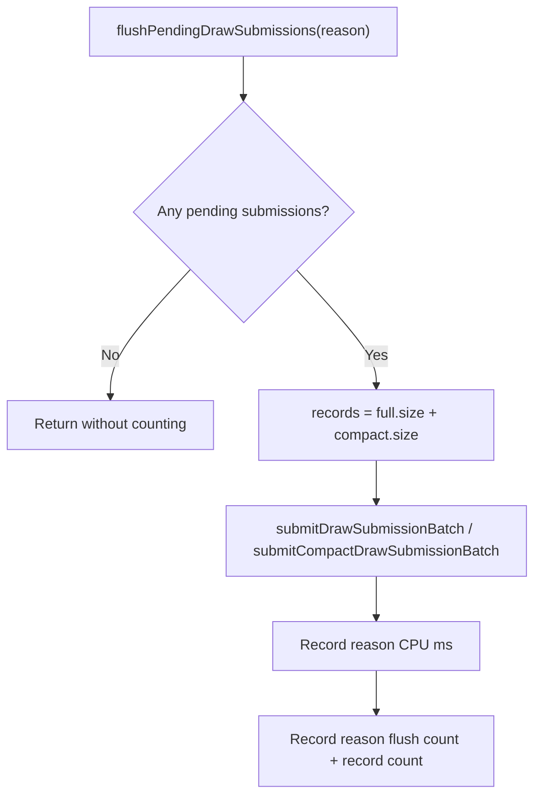

# Encode Phase 176 - Pending flush reason volume

## Question

H185 corrected the pending-flush reason split: `draw_run` and chunk `end`
dominate, while real fallback draws are near zero. But CPU time alone did not
say whether those reasons are a few large drains or many small boundary drains.
How many pending submission batches are flushed by each reason, and how many
queued draw submission records do they carry?

## Instrumentation

The pending draw-submission flush path now records, per reason:

- `*_flushes`: number of non-empty pending flushes; and
- `*_records`: number of queued draw submission records drained by those
  flushes.

Both full and compact pending submission vectors are counted in the same
record total before either vector is cleared.



## Run

```sh
bash scripts/tools/run_3dmark05_perf_probe.sh \
  --suffix h206-pending-flush-volume-r1 \
  --frame 60 \
  --no-gputrace \
  --no-encoder-breakdown \
  --timeout 120 \
  --keep-frontmost \
  --frame-sampling
```

The wrapper finalized through the normal 120s timeout path
(`status=pass`, `timed_out=true`, `returncode=143`) and wrote complete perf
artifacts. This is valid for the no-gputrace CPU counter sample. `actual.png`
is an effects-heavy GT1 firefight frame (`Time 0:59.16`, `Frame 1094`) with
bloom, sparks, muzzle/effects light, geometry, and HUD visible. It is broad
smoke only, not a same-frame `v0.0.3` pixel oracle.

## Runtime result

The P4/cadence class is unchanged:

| Metric | Value |
|---|---:|
| `present_encoded` | `1,740` |
| `sampled_avg_fps` | `16.385` |
| `gpu_command_buffer_time_ms_per_present` | `3.146` |
| `completion_wait_ms_per_present` | `27.216` |
| `completion_wait_with_enqueue_ms_per_present` | `0.062` |
| `completion_wait_without_enqueue_ms_per_present` | `27.154` |
| `commit_chunk_replay_cpu_ms_per_present` | `8.146` |
| `commit_chunk_queue_draw_submission_cpu_ms_per_present` | `3.853` |
| `encode_chunk_cpu_ms_per_present` | `11.268` |

The reason CPU split repeats H185:

| Reason | CPU ms | Share of pending CPU | ms/present |
|---|---:|---:|---:|
| `draw_run` | `1375.415` | `47.36%` | `0.790` |
| `end` | `1373.222` | `47.29%` | `0.789` |
| `before_record` | `147.977` | `5.10%` | `0.085` |
| `draw_fallback` | `7.353` | `0.25%` | `0.004` |
| `failure` | `0.000` | `0.00%` | `0.000` |

The new volume split is the important part:

| Reason | flushes | records | records/flush | flushes/present | records/present |
|---|---:|---:|---:|---:|---:|
| `before_record` | `4,669` | `30,372` | `6.505` | `2.683` | `17.455` |
| `draw_run` | `57,367` | `416,211` | `7.255` | `32.970` | `239.202` |
| `draw_fallback` | `457` | `2,996` | `6.556` | `0.263` | `1.722` |
| `failure` | `0` | `0` | `n/a` | `0.000` | `0.000` |
| `end` | `32,330` | `408,196` | `12.626` | `18.580` | `234.595` |

`draw_run + end` account for `89,697` non-empty flushes and `824,407` queued
submission records in this run: `51.55` flushes/present and roughly
`473.80` records/present. This is not a few large chunk-end drains. It is a
high-frequency small-batch drain pattern.

The backend batch append shape is consistent with that reading:

| Metric | Value |
|---|---:|
| `submit_draw_run_batch_records` | `857,775` |
| `submit_draw_run_batch_groups` | `449,158` |
| `backend_draw_run_batch_records_per_group` | `1.910` |
| `submit_draw_run_batch_append_cpu_ms_per_present` | `1.271` |
| `submit_draw_run_batch_append_uniform_cpu_ms_per_present` | `0.659` |
| `commit_chunk_draw_run_submit_cpu_ms_per_present` | `1.162` |

## Decision

The pending-flush owner is frequency and carrier-shape, not fallback
classification and not a small number of huge end drains.

Accepted implications:

- Real fallback drains are closed as a target: only `457` flushes,
  `2,996` records, and `0.004ms/present`.
- `before_record` remains secondary: `5.10%` of pending CPU and
  `0.085ms/present`.
- The large rows are `draw_run` and `end`, but both are repeated small drains.
  The average drain carries only `7.3` records for `draw_run` and `12.6`
  records for `end`.
- Backend append then fragments those drained records further to
  `1.91` records/group, keeping append/uniform copy work exposed.

Next work should therefore investigate one of:

- a replay carrier that can keep pending submissions and explicit draw-run
  commands in one drain path without violating D3D order;
- delaying or merging chunk-end pending drains when the next chunk immediately
  continues compatible draw work; or
- reducing `submitDrawRunBatch()` / `appendDrawRunBatch()` per-group and
  per-record width, especially uniform append, because frequent small drains
  make that overhead visible.

This is still CPU-only evidence. Do not spend `.gputrace` from H186 alone.
Any mutating candidate needs no-gputrace P4/cadence movement and the `v0.0.3`
visual-safe gate before promotion.
