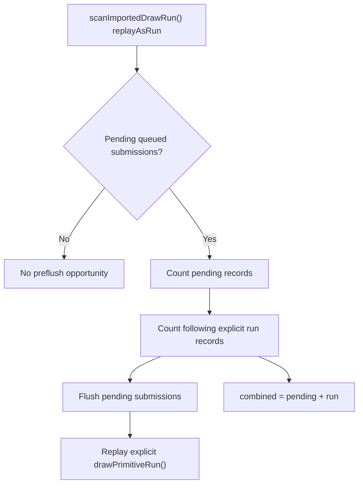

# Encode Phase 177 - Draw-run preflush carrier opportunity

## Question

H186 proved that pending draw submission flushes are frequent small drains.
The largest two reasons are `draw_run` and chunk `end`. The open question for
the `draw_run` half is whether a non-empty pending drain before an imported
draw-run is a real carrier-combine opportunity, and how large the immediately
following explicit run is.

## Instrumentation

When `scanImportedDrawRun()` accepts replay-as-run and pending queued
submissions are non-empty, the replay path now records:

- pending submission records that will be flushed;
- records in the immediately following explicit imported draw-run; and
- their combined size.

This is observation-only. The path still flushes pending submissions first and
then replays the explicit draw-run exactly as before.



## Run

```sh
bash scripts/tools/run_3dmark05_perf_probe.sh \
  --suffix h207-drawrun-preflush-opportunity-r1 \
  --frame 60 \
  --no-gputrace \
  --no-encoder-breakdown \
  --timeout 120 \
  --keep-frontmost \
  --frame-sampling
```

The wrapper finalized through the supervised timeout path and wrote complete
artifacts. `actual.png` is a broad normal-smoke frame with bloom, sparks, HUD,
and geometry visible. It is not a same-frame visual oracle; any mutating
candidate still uses `v0.0.3` as the last GT1 visual-safe code point.

## Runtime result

The run remains in the same no-enqueue cadence class:

| Metric | Value |
|---|---:|
| `present_encoded` | `1,740` |
| `sampled_avg_fps` | `16.066` |
| `gpu_command_buffer_time_ms_per_present` | `3.110` |
| `completion_wait_ms_per_present` | `27.410` |
| `completion_wait_with_enqueue_ms_per_present` | `0.000` |
| `completion_wait_without_enqueue_ms_per_present` | `27.410` |
| `commit_chunk_replay_cpu_ms_per_present` | `8.372` |
| `commit_chunk_queue_draw_submission_cpu_ms_per_present` | `3.955` |
| `encode_chunk_cpu_ms_per_present` | `11.432` |

Pending-flush volume repeats the H186 shape:

| Reason | CPU ms | share of pending CPU | flushes | records | records/flush | flushes/present | records/present |
|---|---:|---:|---:|---:|---:|---:|---:|
| `before_record` | `149.228` | `5.03%` | `4,580` | `29,811` | `6.509` | `2.632` | `17.133` |
| `draw_run` | `1411.276` | `47.52%` | `57,128` | `414,472` | `7.255` | `32.832` | `238.202` |
| `draw_fallback` | `7.551` | `0.25%` | `455` | `2,989` | `6.569` | `0.261` | `1.718` |
| `failure` | `0.000` | `0.00%` | `0` | `0` | `n/a` | `0.000` | `0.000` |
| `end` | `1401.510` | `47.20%` | `31,995` | `405,095` | `12.661` | `18.388` | `232.813` |

The new carrier-opportunity counters prove that every `draw_run` pending drain
has an immediately following explicit imported draw-run:

| Metric | Value |
|---|---:|
| `draw_run_preflush_opportunities` | `57,128` |
| `draw_run_preflush_pending_records` | `414,472` |
| `draw_run_preflush_run_records` | `219,283` |
| `draw_run_preflush_combined_records` | `633,755` |
| `draw_run_preflush_pending_records_per_boundary` | `7.255` |
| `draw_run_preflush_run_records_per_boundary` | `3.838` |
| `draw_run_preflush_combined_records_per_boundary` | `11.094` |
| `draw_run_preflush_combined_records_per_present` | `364.227` |
| `draw_run_preflush_opportunity_share_of_draw_run_flushes` | `100.00%` |

The backend append shape remains small:

| Metric | Value |
|---|---:|
| `commit_chunk_draw_run_submits` | `100,517` |
| `commit_chunk_draw_run_records` | `414,960` |
| `submit_draw_run_batch_groups` | `450,246` |
| `submit_draw_run_batch_records` | `852,367` |
| `backend_draw_run_batch_records_per_group` | `1.893` |
| `submit_draw_run_batch_append_cpu_ms_per_present` | `1.298` |
| `submit_draw_run_batch_append_uniform_cpu_ms_per_present` | `0.674` |

## Decision

The `draw_run` half of the pending-flush bucket is now a concrete carrier
candidate, not just a plausible branch. In h207, `57,128 / 57,128` non-empty
`draw_run` pending flushes are immediately followed by an explicit imported
draw-run. Their combined shape is `11.094` records per boundary and
`364.227` combined records per present.

Accepted implications:

- A future replay carrier can target pending-submission plus explicit draw-run
  merge without guessing about frequency.
- This only covers the `draw_run` half of pending flush CPU. The chunk `end`
  half remains separate and still needs a cross-chunk delay/merge proof or a
  different submit-width reduction.
- A mutation should first run as a no-gputrace CPU/P4 gate. It should reduce
  pending-flush or submit/append work without increasing command buffers,
  render-pass locality damage, completion wait, or visual risk.
- Any promotion still needs the `v0.0.3` visual-safe gate. H207's `actual.png`
  is broad smoke only.

Do not spend `.gputrace` from H187 alone. This is CPU/replay carrier evidence,
not a GPU backend-storage claim.
