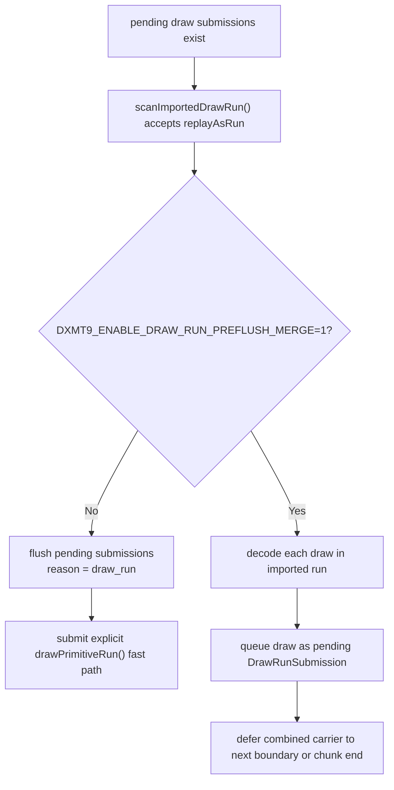

# Encode Phase 178 - Draw-run preflush merge runtime A/B

> **Outdated — the knob or code path this experiment measured no longer exists in `src/`.** It cannot be re-run. Kept as history; do not cite it as current evidence.

## Question

H187 proved that every non-empty pending-submission drain before an imported
draw-run is immediately followed by a concrete explicit run. The next question
was whether removing that `draw_run` preflush boundary, by materializing the
following imported run into the existing pending-submission carrier, reduces the
current replay/P4 owner enough to promote the mechanism.

## Implementation

`DXMT9_ENABLE_DRAW_RUN_PREFLUSH_MERGE=1` is a default-off replay-carrier
experiment. When replay sees a non-empty pending submission batch followed by an
accepted imported draw-run, it queues each draw from that run as a normal
`DrawRunSubmission` / `DrawRunCompactSubmission` instead of flushing first and
then calling the explicit `drawPrimitiveRun()` fast path.



This preserves record order, but it deliberately trades the explicit imported
run's shared-state fast path for ordinary per-draw submission snapshots.

## Runs

Candidate:

```sh
DXMT9_ENABLE_DRAW_RUN_PREFLUSH_MERGE=1 \
  bash scripts/tools/run_3dmark05_perf_probe.sh \
    --suffix h208-drawrun-preflush-merge-r1 \
    --frame 60 \
    --no-gputrace \
    --no-encoder-breakdown \
    --timeout 120 \
    --keep-frontmost \
    --frame-sampling
```

Same-code control:

```sh
bash scripts/tools/run_3dmark05_perf_probe.sh \
  --suffix h209-drawrun-preflush-merge-control-r1 \
  --frame 60 \
  --no-gputrace \
  --no-encoder-breakdown \
  --timeout 120 \
  --keep-frontmost \
  --frame-sampling
```

Both runs finalized through the supervised path with `1,800` presents and no
skipped-pipeline or Metal command-buffer error counters. Their `actual.png`
frames are broad normal-smoke frames with GT1 geometry, bloom/sparks, and HUD
visible. These are not same-frame pixel oracles; `v0.0.3` remains the current
GT1 visual-safe anchor for any promotion claim.

## Runtime Result

The candidate removes the explicit `draw_run` pending-flush reason, but mostly
moves that work into chunk-end draining and per-draw queued-submission
materialization.

| Metric | h208 merge | h209 control | Reading |
|---|---:|---:|---|
| `present_encoded` | `1,800` | `1,800` | matched |
| `sampled_avg_fps` | `16.644` | `16.517` | small favorable movement, not enough alone |
| `gpu_command_buffer_time_ms_per_present` | `3.078` | `3.180` | unchanged class |
| `completion_wait_ms_per_present` | `26.101` | `27.395` | favorable, but still no-enqueue dominated |
| `completion_wait_with_enqueue_ms_per_present` | `0.026` | `0.000` | no useful run-ahead |
| `completion_wait_without_enqueue_ms_per_present` | `26.074` | `27.395` | still the P4 owner |
| `commit_chunk_replay_cpu_ms_per_present` | `7.552` | `8.079` | favorable local replay movement |
| `commit_chunk_queue_draw_submission_cpu_ms_per_present` | `4.218` | `3.805` | regression from per-draw materialization |
| `commit_chunk_queue_draw_submission_snapshot_cpu_ms_per_present` | `3.301` | `3.123` | regression from per-draw snapshots |
| `encode_chunk_cpu_ms_per_present` | `10.961` | `11.044` | flat/noisy |
| `draw_skipped_no_pipeline` | `0` | `0` | clean |
| `gpu_command_buffer_errors` | `0` | `0` | clean |

The direct explicit-run fast path becomes much colder:

| Metric | h208 merge | h209 control | Reading |
|---|---:|---:|---|
| `commit_chunk_draw_run_build_cpu_ms` | `68.348` | `268.074` | expected drop |
| `commit_chunk_draw_run_submit_cpu_ms` | `506.944` | `2,091.400` | expected drop |
| `submit_draw_run_batch_groups` | `444,615` | `466,853` | fewer backend groups |
| `submit_draw_run_batch_records` | `1,217,493` | `882,567` | many more queued records |
| `backend_draw_run_batch_records_per_group` | `2.738` | `1.890` | larger groups, but via wider queued carrier |
| `submit_draw_run_batch_append_cpu_ms_per_present` | `1.299` | `1.272` | flat/slightly worse |
| `submit_draw_run_batch_append_uniform_cpu_ms_per_present` | `0.707` | `0.658` | worse |

Pending flushes show the cost shift directly:

| Reason | h208 CPU ms | h208 records | h208 records/flush | h209 CPU ms | h209 records | h209 records/flush |
|---|---:|---:|---:|---:|---:|---:|
| `before_record` | `201.761` | `53,632` | `10.939` | `149.000` | `30,901` | `6.485` |
| `draw_run` | `0.000` | `0` | `n/a` | `1,431.340` | `429,431` | `7.265` |
| `draw_fallback` | `34.509` | `18,229` | `20.881` | `7.249` | `3,066` | `6.622` |
| `end` | `2,816.407` | `1,145,632` | `29.412` | `1,406.691` | `419,169` | `12.631` |
| total pending flush | `3,052.677` | `1,217,493` | `27.221` | `2,994.280` | `882,567` | `9.050` |

The H187 opportunity counters also change interpretation under the merge:

| Metric | h208 merge | h209 control |
|---|---:|---:|
| `draw_run_preflush_opportunities` | `84,910` | `59,109` |
| `draw_run_preflush_pending_records` | `1,327,822` | `429,431` |
| `draw_run_preflush_run_records` | `334,437` | `227,446` |
| `draw_run_preflush_combined_records` | `1,662,259` | `656,877` |
| `draw_run_preflush_combined_records_per_boundary` | `19.577` | `11.113` |
| `draw_run_preflush_combined_records_per_present` | `923.477` | `364.932` |

Under the merge, `draw_run_preflush_opportunities` no longer means "flushes
that will occur now"; it means "places where a future explicit run was folded
into the pending carrier." Since there are no actual `draw_run` flushes, the
opportunity share of draw-run flushes becomes `n/a`.

## Decision

The mechanism works, but this implementation is not promotable.

Accepted:

- The experiment proves the `draw_run` preflush boundary is removable without a
  gross smoke failure in this broad run.
- The explicit draw-run build/submit rows collapse as expected.
- Backend batches get wider (`1.890 -> 2.738` records/group), so the carrier
  direction is real.

Rejected for default:

- The current carrier buys that by materializing imported-run draws as ordinary
  queued submissions, which raises queue-submission and snapshot CPU.
- Pending flush CPU does not materially fall (`2,994.280ms -> 3,052.677ms`);
  the cost is mostly shifted from `draw_run` to chunk `end`.
- It does not create meaningful enqueue overlap (`0.026ms/present`), so the P4
  class remains `under-pipelined-no-enqueue`.
- The FPS and completion-wait movements are favorable but too small and too
  coupled to run/scene noise to spend `.gputrace` or promote.

The useful next design is not "materialize the explicit run as N draw
submissions." It is a carrier that combines the pending submissions and the
following imported draw-run while preserving the explicit-run shared-state path,
or a separate cross-chunk/end drain merge that attacks the chunk-end half
without increasing per-draw snapshot work.

Keep `DXMT9_ENABLE_DRAW_RUN_PREFLUSH_MERGE` default-off as a diagnostic
prototype. Do not spend `.gputrace` on this candidate unless a follow-up carrier
first moves no-gputrace P4/replay rows and passes the `v0.0.3` visual-safe gate.
