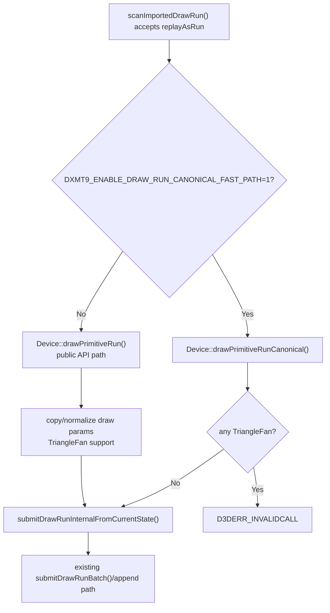

# Encode Phase 179 - Canonical imported draw-run submit fast path

> **Outdated — the knob or code path this experiment measured no longer exists in `src/`.** It cannot be re-run. Kept as history; do not cite it as current evidence.

## Question

H188 showed that materializing imported explicit draw-runs as ordinary pending
submissions removes the `draw_run` preflush boundary, but does so by paying more
per-draw snapshot and carrier cost. The smaller follow-up question was whether
the explicit imported-run path itself has avoidable CPU overhead before the
larger carrier redesign.

`scanImportedDrawRun()` already rejects `TriangleFan` by accepting only
batchable draw packets, but the replay path still called public
`Device::drawPrimitiveRun()`. That public API has to defend against
`TriangleFan` by normalizing/copying draw params before it can submit the
current-state run. For imported canonical runs, that normalization should be
unnecessary.

## Implementation

`DXMT9_ENABLE_DRAW_RUN_CANONICAL_FAST_PATH=1` routes accepted imported draw-runs
to `Device::drawPrimitiveRunCanonical()`. The new device entry point rejects
`TriangleFan` defensively, then submits the borrowed canonical `DrawParam` span
directly through the existing current-state draw-run path. It does not change
batching, pending-flush policy, render-pass structure, or draw ordering.



Native coverage proves both sides of the narrow contract:

- canonical `TriangleList` runs reach the backend unchanged;
- canonical `TriangleFan` runs return `D3DERR_INVALIDCALL` and do not reach the
  backend.

## Runs

Candidate:

```sh
DXMT9_ENABLE_DRAW_RUN_CANONICAL_FAST_PATH=1 \
  bash scripts/tools/run_3dmark05_perf_probe.sh \
    --suffix h210-drawrun-canonical-fastpath-r1 \
    --frame 60 \
    --no-gputrace \
    --no-encoder-breakdown \
    --timeout 120 \
    --keep-frontmost \
    --frame-sampling
```

Same-code control:

```sh
bash scripts/tools/run_3dmark05_perf_probe.sh \
  --suffix h211-drawrun-canonical-fastpath-control-r1 \
  --frame 60 \
  --no-gputrace \
  --no-encoder-breakdown \
  --timeout 120 \
  --keep-frontmost \
  --frame-sampling
```

Both runs passed with `draw_skipped_no_pipeline=0` and
`gpu_command_buffer_errors=0`. The screenshots are broad visual smokes only:
h210 is a dark late-frame ship/particle frame and h211 is a bright firefight
bloom frame. Neither is a same-frame pixel oracle; `v0.0.3` remains the current
GT1 visual-safe anchor before any FPS or counter promotion.

## Runtime Result

The candidate does not materially move the runtime owner. The apparent total
`commit_chunk_draw_run_submit_cpu_ms` drop is mostly explained by h210 ending
at `1,740` presents and fewer draw calls, while the control reaches `1,800`
presents.

| Metric | h210 canonical fast path | h211 control | Reading |
|---|---:|---:|---|
| `present_encoded` | `1,740` | `1,800` | unmatched run length |
| `sampled_avg_fps` | `16.412` | `16.546` | no FPS win |
| `draw_calls` | `1,283,585` | `1,323,832` | h210 ran less work |
| `draw_skipped_no_pipeline` | `0` | `0` | clean |
| `gpu_command_buffer_errors` | `0` | `0` | clean |
| `completion_wait_ms_per_present` | `29.321` | `27.195` | worse/no P4 movement |
| `completion_wait_with_enqueue_ms_per_present` | `0.000` | `0.000` | no overlap |
| `completion_wait_without_enqueue_ms_per_present` | `29.321` | `27.195` | still no-enqueue dominated |
| `commit_chunk_replay_cpu_ms_per_present` | `8.330` | `8.087` | worse/no replay win |
| `commit_chunk_queue_draw_submission_cpu_ms_per_present` | `3.978` | `3.803` | worse/no queue win |
| `commit_chunk_queue_draw_submission_snapshot_cpu_ms_per_present` | `3.283` | `3.125` | worse/no snapshot win |
| `encode_chunk_cpu_ms_per_present` | `11.230` | `11.114` | flat/slightly worse |

The targeted explicit-run row is effectively unchanged after normalizing by
present count:

| Metric | h210 canonical fast path | h211 control | Reading |
|---|---:|---:|---|
| `commit_chunk_draw_run_build_cpu_ms` | `264.889` | `271.126` | total lower only because h210 is shorter |
| `commit_chunk_draw_run_submit_cpu_ms` | `2,019.753` | `2,103.850` | total lower only because h210 is shorter |
| `commit_chunk_draw_run_submit_cpu_ms_per_present` | `1.161` | `1.169` | negligible |
| `commit_chunk_draw_run_submit_cpu_p50_ms` | `0.019` | `0.019` | unchanged |
| `commit_chunk_draw_run_submit_cpu_p95_ms` | `0.030` | `0.037` | small/noisy |
| `submit_draw_run_batch_records` | `855,025` | `881,628` | h210 less work |
| `backend_draw_run_batch_records_per_group` | `1.900` | `1.910` | unchanged class |
| `submit_draw_run_batch_append_cpu_ms` | `2,276.427` | `2,271.043` | unchanged |
| `submit_draw_run_batch_append_uniform_cpu_ms` | `1,176.323` | `1,177.957` | unchanged |

Pending flushes are also unchanged in kind:

| Metric | h210 canonical fast path | h211 control | Reading |
|---|---:|---:|---|
| `commit_chunk_replay_pending_flush_cpu_ms` | `2,972.285` | `2,981.219` | flat |
| `commit_chunk_replay_pending_flush_draw_run_cpu_ms` | `1,435.550` | `1,413.102` | flat/noisy |
| `commit_chunk_replay_pending_flush_end_cpu_ms` | `1,384.456` | `1,411.722` | flat/noisy |

## Decision

Rejected as a current performance lever.

Accepted:

- The canonical API boundary is valid and tested: imported run replay can bypass
  public `TriangleFan` normalization when the scanner has already accepted the
  run shape.
- The knob is useful as a narrow diagnostic for isolating public API
  normalization from the larger carrier costs.

Rejected for default:

- The target row moves only `1.169 -> 1.161ms/present`, which is below the
  current run-noise level and does not move FPS.
- P4 remains unchanged in kind: `completion_wait_with_enqueue` is still zero
  and the wait is still no-enqueue dominated.
- Replay, queue submission, snapshot, and encode rows do not improve.
- This does not attack the H188/H187 structural owner: high-frequency small
  pending drains plus discarded N-1 state/uniform materialization.

Keep `DXMT9_ENABLE_DRAW_RUN_CANONICAL_FAST_PATH` default-off. The next useful
state-churn work should return to either:

- a carrier that merges pending submissions with the following imported
  draw-run while preserving explicit-run shared-state behavior, or
- direct N-1 state/uniform materialization elision in the queued submission
  path, with a `v0.0.3` visual-safe gate before promotion.

Do not spend `.gputrace` on this candidate.
