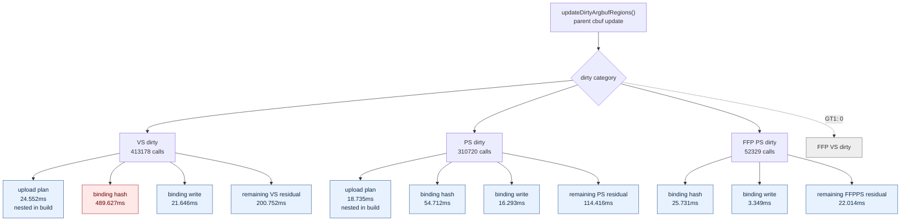
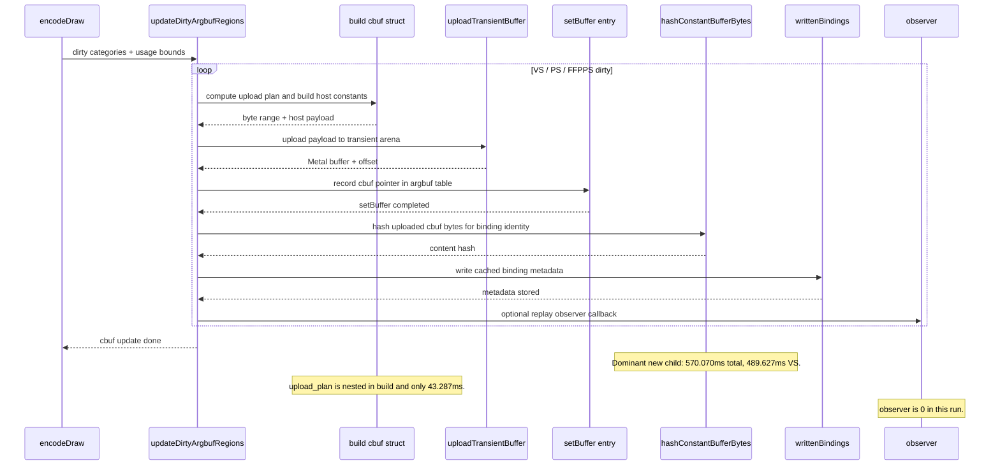

# Cbuf Residual Split

**Question / hypothesis.** [state-churn-encode-encode-phase.17](state-churn-encode-encode-phase.17.md) showed that
the remaining cbuf-update parent was not mainly Metal `setBuffer` or transient
upload. The inferred residual was larger than those visible leaves
(`954.163ms` total, `618.150ms` VS residual). Which hidden child owns that
residual: upload-plan computation, `hashConstantBufferBytes()`,
`writtenBindings` writeback, observer callbacks, or outer dispatch/timer cost?

**Implementation.** Add attribution-only counters inside
`updateDirtyArgbufRegions()`:

- upload-plan CPU: global, VS, and PS;
- binding content hash CPU: global, VS, PS, FFPVS, and FFPPS;
- binding writeback CPU: global, VS, PS, FFPVS, and FFPPS;
- observer callback CPU: global, VS, PS, FFPVS, and FFPPS.

`upload_plan` is nested in the existing build scope, so it explains part of
`build_cpu_ms`; it must not be subtracted from the parent as a separate sibling.
The binding-hash, binding-write, upload, setBuffer, and outer build scopes are
sibling attribution buckets under cbuf update.



**Method.**

```bash
bash scripts/tools/run_3dmark05_perf_probe.sh \
  --suffix cbuf-residual-split-r1 \
  --frame 50 \
  --no-gputrace \
  --no-encoder-breakdown \
  --timeout 180

python3 scripts/tools/compare_3dmark05_perf_counters.py \
  experiments/output/app-d3d9-3dmark05-cbuf-category-split-r1 \
  experiments/output/app-d3d9-3dmark05-cbuf-residual-split-r1 \
  --output experiments/output/app-d3d9-3dmark05-cbuf-residual-split-r1/dxmt9-perf-counter-comparison-vs-cbuf-category-split.md
```

The run finished with `status=pass` and processed more presents than
[state-churn-encode-encode-phase.17](state-churn-encode-encode-phase.17.md) (`1680 -> 1740`). GPU command-buffer
time moved only `+66.747ms` (`+1.29%`), so the shape is suitable for CPU
attribution. The `actual.png` artifact exists, but this leaf treats it only as
smoke; [baselines-visual-capture.01](../baselines/baselines-visual-capture.01.md) rejects time-based GT1 screenshots as a
visual correctness oracle.

**Measured split.**

| Counter | Total | Per present | Reading |
|---|---:|---:|---|
| `present_encoded` | 1,740 | 1.000 | comparison run length |
| `draw_calls` | 1,275,582 | 733.093 | stable enough for attribution |
| `encode_draw_argbuf_cbuf_update_cpu_ms` | 2,115.474 | 1.216ms | parent bucket |
| `encode_draw_argbuf_cbuf_build_cpu_ms` | 564.829 | 0.325ms | includes nested upload-plan |
| `encode_draw_argbuf_cbuf_upload_cpu_ms` | 289.714 | 0.167ms | transient upload |
| `encode_draw_argbuf_cbuf_setbuffer_cpu_ms` | 125.806 | 0.072ms | Metal cbuf pointer repoint |
| `encode_draw_argbuf_cbuf_upload_plan_cpu_ms` | 43.287 | 0.025ms | nested, not a dominant owner |
| `encode_draw_argbuf_cbuf_binding_hash_cpu_ms` | 570.070 | 0.328ms | dominant newly named child |
| `encode_draw_argbuf_cbuf_binding_write_cpu_ms` | 41.288 | 0.024ms | small |
| `encode_draw_argbuf_cbuf_observer_cpu_ms` | 0.000 | 0.000ms | not active here |
| residual excluding nested plan | 523.767 | 0.301ms | still open dispatch/timer/other cost |

Category rows:

| Category | Parent | Build | Upload | SetBuffer | Binding hash | Binding write | Residual | Main reading |
|---|---:|---:|---:|---:|---:|---:|---:|---|
| VS | 1,214.881 | 266.537 | 167.037 | 69.282 | 489.627 | 21.646 | 200.752 | binding hash is the largest VS child |
| PS | 591.747 | 251.330 | 106.008 | 48.988 | 54.712 | 16.293 | 114.416 | build is largest, hash is secondary |
| FFPVS | 0.000 | 0.000 | 0.000 | 0.000 | 0.000 | 0.000 | 0.000 | GT1 does not dirty it here |
| FFPPS | 122.260 | 46.962 | 16.668 | 7.536 | 25.731 | 3.349 | 22.014 | small but fully named |

`upload_plan` is only `43.287ms` total (`24.552ms` VS, `18.735ms` PS), so the
phase.17 suspicion that upload-plan might own the residual is rejected.
`observer` is zero. The newly named dominant child is
`hashConstantBufferBytes()` through `encode_draw_argbuf_cbuf_binding_hash_*`,
especially VS (`489.627ms`).



**Verdict.** Accepted attribution. The phase.17 residual is now mostly explained
by binding content hashing, not upload-plan, observer, or `setBuffer`. There is
still an open residual (`523.767ms` total, `200.752ms` VS), but the largest
newly actionable cbuf target is the `hashConstantBufferBytes()` path.

**Next cbuf probes.**

1. Test a safe content-hash reduction: identity-first or deferred content hash
   for freshly uploaded cbuf slices, without weakening cache correctness.
2. Keep same-input image proof mandatory for any cbuf cache-key semantic change.
   The recent time-based `actual.png` concern is not enough to accept or reject
   a correctness-sensitive change.
3. If hash reduction does not move the parent, split the remaining VS residual
   into category dispatch, timer overhead, and helper call cost before changing
   constants layout.

**Related.** [state-churn-encode](../state-churn-encode.md) ·
[state-churn-encode-encode-phase.17](state-churn-encode-encode-phase.17.md) · [baselines-visual-capture.01](../baselines/baselines-visual-capture.01.md) ·
[const-upload](../const-upload.md).
