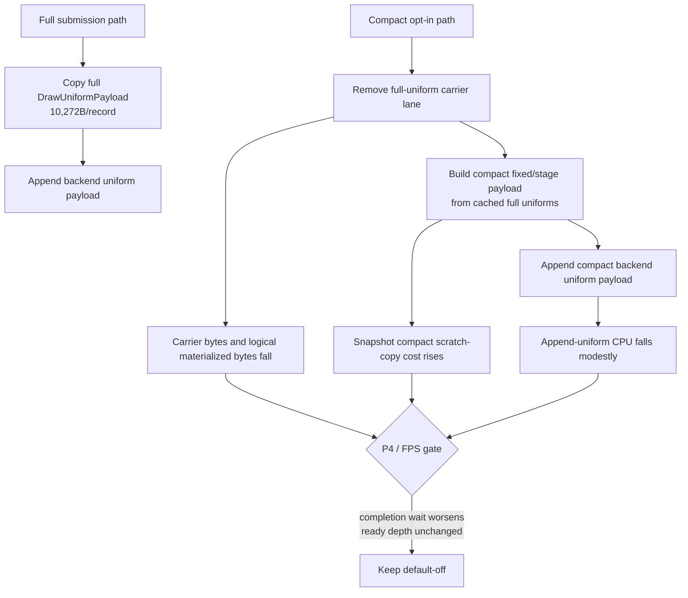

# Encode Phase 180 - Current compact-uniform carrier repeat

## Question

The current frontier still shows a large full-uniform producer footprint:
`d3d9_snapshot_uniform_materialized_bytes` is about `9.05GB/run` and
`DrawRunSubmission` carries `10,272B` of full-uniform storage per queued draw.
Earlier compact-uniform work removed much of that logical byte width, but it
failed the runtime/P4 gate. After the current state-elision and draw-run
carrier work, does the existing opt-in compact path now become promotable?

## Runs

Baseline:

```sh
bash scripts/tools/run_3dmark05_perf_probe.sh \
  --suffix h211-drawrun-canonical-fastpath-control-r1 \
  --frame 60 \
  --no-gputrace \
  --no-encoder-breakdown \
  --timeout 120 \
  --keep-frontmost \
  --frame-sampling
```

Candidate:

```sh
DXMT9_ENABLE_COMPACT_UNIFORM_SUBMISSIONS=1 \
  bash scripts/tools/run_3dmark05_perf_probe.sh \
    --suffix h212-compact-uniform-current-r1 \
    --frame 60 \
    --no-gputrace \
    --no-encoder-breakdown \
    --timeout 120 \
    --keep-frontmost \
    --frame-sampling
```

The compare report is:

```sh
python3 scripts/tools/compare_3dmark05_perf_counters.py \
  experiments/output/app-d3d9-3dmark05-h211-drawrun-canonical-fastpath-control-r1 \
  experiments/output/app-d3d9-3dmark05-h212-compact-uniform-current-r1 \
  --before-label h211-control \
  --after-label h212-compact \
  --output experiments/output/app-d3d9-3dmark05-h212-compact-uniform-current-r1/h212-vs-h211-compare.md
```

Both runs reached `1,800` presents and stayed clean:
`draw_skipped_no_pipeline=0`, `gpu_command_buffer_errors=0`. h212's
`actual.png` is a broad normal firefight frame with bloom, sparks, geometry,
and HUD visible. This is still a broad smoke, not a same-frame pixel oracle;
`v0.0.3` remains the visual-safe anchor for promotion.

## Runtime Result

The storage mechanism works exactly as intended:

| Metric | h211 control | h212 compact | Delta |
|---|---:|---:|---:|
| `submission_carrier_bytes_per_record` | `21,176` | `10,904` | `-48.51%` |
| `submission_carrier_uniform_storage_bytes_per_record` | `10,272` | `0` | `-100.00%` |
| `d3d9_snapshot_submission_carrier_bytes` | `18.669GB` | `9.635GB` | `-48.39%` |
| `d3d9_snapshot_uniform_materialized_bytes` | `9.049GB` | `2.577GB` | `-71.53%` |
| `uniform_materialized_bytes_per_present` | `5.027MB` | `1.431MB` | `-71.53%` |
| `d3d9_snapshot_uniform_compact_fixed_payload_reuses` | `0` | `785,968` | mechanism active |
| `d3d9_snapshot_uniform_compact_fixed_payload_appends` | `0` | `97,683` | mechanism active |

The CPU/P4 gate still rejects promotion:

| Metric | h211 control | h212 compact | Reading |
|---|---:|---:|---|
| `sampled_avg_fps` | `16.546` | `16.654` | noise-level favorable |
| `completion_wait_ms_per_present` | `27.195` | `27.740` | worse |
| `completion_wait_with_enqueue_ms_per_present` | `0.000` | `0.024` | negligible overlap |
| `completion_wait_without_enqueue_ms_per_present` | `27.195` | `27.716` | worse |
| `encode_ready_depth_avg` | `1.000` | `1.000` | no run-ahead |
| `commit_chunk_replay_cpu_ms_per_present` | `8.087` | `8.016` | small favorable |
| `commit_chunk_queue_draw_submission_cpu_ms_per_present` | `3.803` | `3.749` | small favorable |
| `commit_chunk_queue_draw_submission_snapshot_cpu_ms_per_present` | `3.125` | `3.212` | worse |
| `encode_chunk_cpu_ms_per_present` | `11.114` | `11.006` | small favorable |
| `submit_draw_run_batch_append_uniform_cpu_ms_per_present` | `0.654` | `0.613` | favorable but small |
| `d3d9_snapshot_uniform_copy_cpu_ms_per_present` | `0.143` | `0.236` | worse |

The no-enqueue closure rows are mixed but not sufficient:

| Metric | h211 control | h212 compact | Reading |
|---|---:|---:|---|
| `no_enqueue_stage_commit_entry_to_publish_ms_per_present` | `15.926` | `15.390` | favorable |
| `no_enqueue_stage_encode_dequeue_to_command_buffer_commit_ms_per_present` | `12.971` | `12.587` | favorable |
| `no_enqueue_wait_to_next_enqueue_ms_per_present` | `33.280` | `32.466` | favorable |
| `completion_present_wait_ms_per_present` | `27.195` | `27.740` | worse final gate |

## Interpretation



This repeats the old compact conclusion in the current code shape:

- The compact carrier now proves the desired storage shape:
  full-uniform inline storage is gone from the queued draw carrier.
- The backend append row improves slightly, but that row is too small to own
  average FPS.
- Snapshot compact materialization still adds local CPU, and the source remains
  `cached.uniforms`; the path does not remove the upstream full uniform/hash
  source.
- P4 does not improve: useful ready depth stays `1.000`, overlap is negligible,
  and final completion wait worsens.

## Decision

Keep `DXMT9_ENABLE_COMPACT_UNIFORM_SUBMISSIONS=1` default-off.

The next compact-uniform implementation must not be another carrier-width
variant. It must remove or reduce the source work that remains before the
compact carrier:

- direct compact construction from `DeviceState` / cached component hashes, so
  the producer does not first build and then compact a full `DrawUniformPayload`;
- or a larger serial-cadence/P4 design where the small append/snapshot wins are
  hidden behind useful run-ahead.

Do not spend `.gputrace` on the current compact carrier. It has not moved the
no-gputrace P4 gate, even though its broad screenshot is visually normal.
