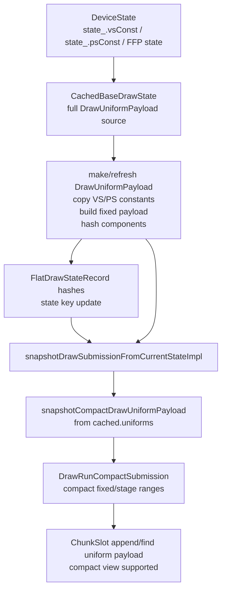
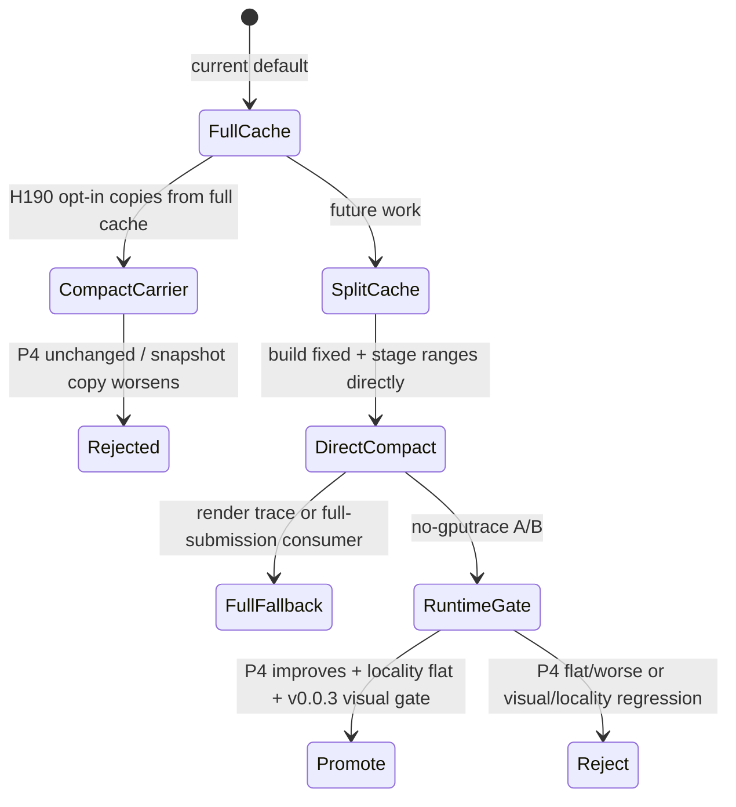

# Encode Phase 181 - Direct compact uniform construction source audit

> **Outdated — the knob or code path this experiment measured no longer exists in `src/`.** It cannot be re-run. Kept as history; do not cite it as current evidence.

## Question

H190 proved that the compact queued carrier removes the full-uniform lane, but
it still fails the P4 gate. Can the next step be a small patch that changes only
`snapshotCompactDrawUniformPayload()` to construct compact uniform records
directly, or does the source-side full-uniform work live earlier in the draw
state cache?

## Answer

The small snapshot-only patch is not the right implementation unit. The backend
and queued carrier already accept compact uniforms, but the current frontend
source of truth is still `CachedBaseDrawState::uniforms`, a full
`DrawUniformPayload`.

The code path is:

1. `cachedBaseDrawStateForSubmissionBatch()` refreshes the binding-agnostic draw
   cache before a queued draw submission is snapshotted.
2. On a cache hit with changed uniform generation, `refreshUniforms()` calls
   `refreshDrawUniformPayloadShaderConstantsFromState(...)`, copying updated
   shader constants into `cache.uniforms` and rehashing them.
3. On a batch-cache miss, the non-constant-reuse path still refreshes
   `cache.uniforms`; the full-build path calls `makeDrawUniformPayloadFromState(...)`.
4. Only after that does `snapshotDrawSubmissionFromCurrentStateImpl()` call
   `snapshotCompactDrawUniformPayload(cached.uniforms, ...)` when
   `DXMT9_ENABLE_COMPACT_UNIFORM_SUBMISSIONS=1`.
5. The backend `ChunkSlot` append path can consume either a full payload or a
   `DrawUniformCompactPayloadView`, so the backend side is not the blocker.

So changing only the `Snapshot -> Compact` edge removes one local copy, but it
does not remove the larger `State -> Cache -> FullRefresh` work.

## Current Numeric Shape

H190/h212 already gives the boundary:

| Metric | h212 compact | Reading |
|---|---:|---|
| `d3d9_snapshot_uniform_build_calls` | `993,776` | full source builder still active |
| `d3d9_snapshot_uniform_build_hash_cpu_ms` | `1,701.597` | larger than compact scratch copy |
| `d3d9_snapshot_uniform_build_vs_const_hash_cpu_ms` | `1,025.998` | dominant source-side hash row |
| `d3d9_snapshot_uniform_build_ps_const_hash_cpu_ms` | `75.244` | smaller source-side hash row |
| `d3d9_snapshot_uniform_build_nonconst_hash_cpu_ms` | `293.326` | fixed/FFP hash still present |
| `d3d9_snapshot_uniform_copy_cpu_ms` | `425.185` | compact scratch copy plus fallback copy scope |
| `d3d9_snapshot_uniform_compact_fixed_payload_reuses` | `785,968` | fixed payload reuse works |
| `d3d9_snapshot_uniform_compact_fixed_payload_appends` | `97,683` | changed fixed payloads still materialize |
| `completion_wait_with_enqueue_ms_per_present` | `0.024` | no useful overlap |
| `completion_wait_without_enqueue_ms_per_present` | `27.716` | P4 owner unchanged |

This means direct compact construction is a cache-representation change, not a
simple queued-submission copy-loop cleanup.

## Required Design Shape

A promotable direct compact implementation must move the source of truth from
"always own a full `DrawUniformPayload`" to a split cache that can own:

- component hashes and generation metadata;
- fixed payload storage or a stable fixed-payload reference;
- stage constant spans/bytes sourced directly from `DeviceState`;
- full-payload materialization only for legacy/full submission paths, render
  trace, debug or fixture surfaces that actually need it.

The correctness constraints are the same as the `v0.0.3` uniform ABI-prefix
fix:

- preserve float/int/bool ABI-prefix expansion when int or bool constants are
  present;
- keep shader-usage and indexed-constant fallback behavior conservative;
- keep full payload materialization available where render trace/debug paths
  consume `FlatDrawStateView::uniformPayload()`;
- do not promote on carrier byte reduction alone.

## Decision

Do not implement another narrow compact carrier or snapshot-only variant as the
next FPS candidate. The current compact path is useful as a diagnostic and as a
target backend format, but the next compact work must change
`CachedBaseDrawState` so full uniform payload construction is avoidable on the
compact lane.

Until that larger cache split is built, the higher-confidence FPS work remains
the current P4/no-enqueue owner: residual producer/record cadence,
replay/snapshot/encode serial time, or a render-pass-safe overlap carrier that
does not increase command buffers, render passes, tile preservation, final
same-key reopens, or load/store traffic. No `.gputrace` spend is justified for
another compact-only carrier unless a no-gputrace run first moves the P4 gate
and passes the `v0.0.3` visual anchor.
