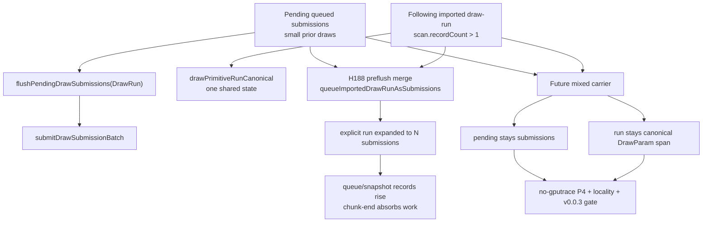
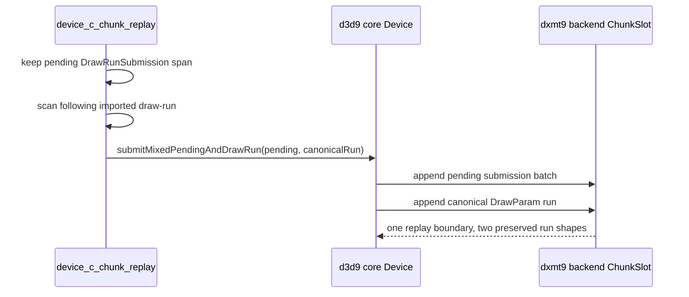

# Encode Phase 182 - Mixed pending plus explicit draw-run carrier audit

> **Outdated — the knob or code path this experiment measured no longer exists in `src/`.** It cannot be re-run. Kept as history; do not cite it as current evidence.

## Question

H187 found that every non-empty pending draw-run preflush is immediately
followed by an explicit imported draw-run. H188's naive merge removed that
boundary, but failed runtime promotion. Does that reject the carrier idea, or
only the specific shape that converted the explicit draw-run into per-record
queued submissions?

## Answer

It rejects only the naive shape. The implementation target is still plausible,
but it must be a mixed carrier:

- keep pending single-record submissions as submissions;
- keep the following imported draw-run as one canonical shared-state run;
- submit both through one replay-side carrier boundary without expanding the
  explicit run into N queued submissions.

The current code has two separate shapes:

1. `flushPendingDrawSubmissions()` submits accumulated
   `DrawRunSubmission` / `DrawRunCompactSubmission` records through
   `submitDrawSubmissionBatch()`.
2. The explicit run path scans compatible imported draw records, builds
   `DrawParam` plus binding overrides, and submits one shared-state run through
   `drawPrimitiveRun()` or `drawPrimitiveRunCanonical()`.
3. `DXMT9_ENABLE_DRAW_RUN_PREFLUSH_MERGE=1` bypasses the flush by calling
   `queueImportedDrawRunAsSubmissions(...)`, which replays each run record into
   the pending submission vector.

That third shape removes the boundary but destroys the explicit-run invariant:
one shared canonical state becomes many queued draw submissions.

## H188 Failure Mode

The H188 candidate did prove the boundary can be removed:

| Metric | control | naive merge | Reading |
|---|---:|---:|---|
| `commit_chunk_replay_pending_flush_draw_run` | `59,109` | `0` | boundary removed |
| explicit draw-run build/submit CPU | `268.074 / 2,091.400ms` | `68.348 / 506.944ms` | explicit path mostly bypassed |
| `commit_chunk_queue_draw_submission_cpu_ms_per_present` | `3.805` | `4.218` | worse |
| `commit_chunk_queue_draw_submission_snapshot_cpu_ms_per_present` | `3.123` | `3.301` | worse |
| `commit_chunk_draw_submission_batch_records` | `882,567` | `1,217,493` | run expanded into submissions |
| `commit_chunk_replay_pending_flush_end_cpu_ms` | `1,406.691` | `2,816.407` | work moved to chunk end |

So H188 is not a proof that combining the boundary is impossible. It is a proof
that materializing the following run as queued submissions is the wrong carrier.

## Required Mixed Carrier Contract

A useful implementation needs a new replay/core API boundary. It should accept
both lanes together:

The contract must preserve:

- strict draw order: all pending submissions before the imported run;
- the pending submission lane's per-draw state/uniform handles;
- the explicit run lane's single shared canonical state and binding-override
  payloads;
- one `DrawSubmissionUniformScratch` lifetime for compact payload arena views
  while both lanes are appended;
- existing render-trace behavior, where full payloads and per-draw trace rows
  still need the conservative path;
- no increase in command buffers, render passes, final same-key reopens,
  tile-preservation bytes, color loads, or depth loads.

## Decision

Keep `DXMT9_ENABLE_DRAW_RUN_PREFLUSH_MERGE=1` default-off as a negative
diagnostic prototype. The next draw-run carrier implementation should be a
mixed pending-plus-canonical-run API, not another attempt to queue the explicit
run as submissions.

This remains a CPU/P4 candidate, not a GPU-counter candidate. It needs a
no-gputrace A/B that moves `commit_chunk_replay_pending_flush_*`,
`commit_chunk_queue_draw_submission_*`, and the no-enqueue before-publish rows
in the right direction while keeping locality flat and passing the `v0.0.3`
visual gate before any `.gputrace` or Xcode replay spend.
