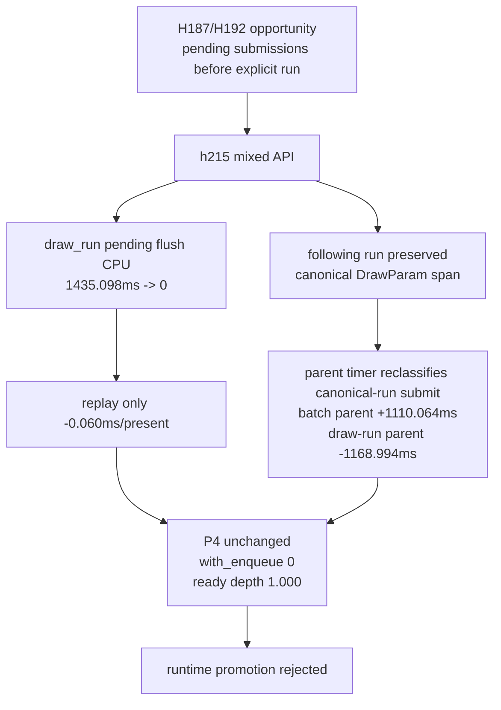

# Encode Phase 183 - Mixed pending plus explicit draw-run carrier runtime

> **Outdated — the knob or code path this experiment measured no longer exists in `src/`.** It cannot be re-run. Kept as history; do not cite it as current evidence.

## Question

H192 defined the corrected carrier shape for the H187 opportunity: keep pending
draws as queued submissions, keep the following imported draw-run as one
canonical shared-state `DrawParam` span, and submit both through one mixed
backend boundary. Does that corrected shape move the no-gputrace P4/replay
owner without repeating H188's per-record expansion failure?

## Answer

No. The corrected carrier removes the targeted `draw_run` pending flushes, but
the child counters show that the main backend append/resource/compat costs stay
flat. The large top-level `commit_chunk_draw_batch_submit_cpu_ms` increase is
mostly the canonical imported draw-run submit being timed under the mixed
batch-submit parent rather than a new local child cost. P4 remains fully
no-enqueue, ready depth stays `1.000`, and locality is slightly worse. Keep
`DXMT9_ENABLE_DRAW_RUN_PREFLUSH_MIXED_CARRIER` default-off as a diagnostic
mechanism, not a promotion candidate.

The candidate still passes only broad visual smoke: `actual.png` is a normal
effects-heavy GT1 firefight frame with bloom/sparks/HUD, not a same-frame
`v0.0.3` pixel oracle. `v0.0.3` remains the current visual-safe anchor for any
future promotion.

## Method

Control:

```sh
bash scripts/tools/run_3dmark05_perf_probe.sh \
  --suffix h213-mixed-carrier-control-r1 \
  --frame 60 --no-gputrace --no-encoder-breakdown \
  --timeout 120 --keep-frontmost --frame-sampling
```

Candidate:

```sh
DXMT9_ENABLE_DRAW_RUN_PREFLUSH_MIXED_CARRIER=1 \
bash scripts/tools/run_3dmark05_perf_probe.sh \
  --suffix h215-mixed-carrier-timerfix-r1 \
  --frame 60 --no-gputrace --no-encoder-breakdown \
  --timeout 120 --keep-frontmost --frame-sampling
```

`h214` was the first mixed-carrier run, but it counted the combined submit under
both draw-run-submit and batch-submit timers. `h215` is the timer-fixed run used
for the verdict.

## Result

Both runs complete `1,800` presents.

| Metric | h213 control | h215 mixed carrier | Delta |
|---|---:|---:|---:|
| sampled avg FPS | `16.476` | `16.557` | `+0.081` |
| `commit_chunk_replay_cpu_ms/present` | `8.153` | `8.092` | `-0.060` |
| `commit_chunk_replay_pending_flush_cpu_ms` | `3014.913` | `1585.011` | `-1429.902` |
| `commit_chunk_replay_pending_flush_draw_run_cpu_ms` | `1435.098` | `0.000` | `-1435.098` |
| `commit_chunk_replay_pending_flush_end_cpu_ms` | `1421.848` | `1421.825` | `-0.023` |
| `commit_chunk_draw_batch_submit_cpu_ms` | `2987.523` | `4097.587` | `+1110.064` |
| `commit_chunk_draw_run_submit_cpu_ms` | `2113.798` | `944.804` | `-1168.994` |
| `submit_draw_run_batch_append_cpu_ms` | `2295.245` | `2290.760` | `-4.485` |
| `submit_draw_run_batch_append_uniform_cpu_ms` | `1182.069` | `1180.647` | `-1.422` |
| `submit_draw_run_batch_append_state_cpu_ms` | `591.000` | `595.339` | `+4.339` |
| `submit_draw_run_batch_resource_mark_cpu_ms` | `25.945` | `26.083` | `+0.138` |
| `submit_draw_run_batch_compat_scan_cpu_ms` | `58.257` | `60.748` | `+2.491` |
| `commit_chunk_queue_draw_submission_cpu_ms/present` | `3.830` | `3.808` | `-0.022` |
| `d3d9_snapshot_draw_submission_cpu_ms/present` | `3.081` | `3.058` | `-0.022` |
| `completion_wait_with_enqueue_ms/present` | `0.000` | `0.000` | `0.000` |
| `completion_wait_without_enqueue_ms/present` | `27.102` | `27.343` | `+0.241` |
| `encode_ready_depth_avg` | `1.000` | `1.000` | `0.000` |
| `gpu_command_buffer_time_ms` | `5584.715` | `5618.607` | `+33.892` |
| `render_pass_begin` | `21121` | `21158` | `+37` |
| tile preservation | `215898.340 MiB` | `216539.461 MiB` | `+641.121 MiB` |

The targeted boundary was removed:



## Interpretation

The corrected carrier proves that H188's failed shape was not required: the
following imported draw-run can stay canonical while pending submissions are
submitted beside it. However, removing this replay boundary is not enough to
move the frame-facing pipeline.

The child counter shape matters. `submit_draw_run_batch_append_cpu_ms` is flat
(`2295.245 -> 2290.760ms`), uniform append is flat
(`1182.069 -> 1180.647ms`), state append is noise-flat
(`591.000 -> 595.339ms`), resource marking is flat
(`25.945 -> 26.083ms`), and compat scan only moves `+2.491ms`. The apparent
`commit_chunk_draw_batch_submit_cpu_ms` regression is therefore a top-level
timer reclassification of the same canonical-run submit path, not evidence that
the mixed carrier created a new first-order child owner.

The useful lesson is negative and specific:

- `draw_run` pending flush labels can be eliminated mechanically;
- the combined operation still pays the same fundamental batch append/resource
  mark/state-uniform handling costs;
- the frame remains `under-pipelined-no-enqueue`, so no P4 overlap was created;
- locality did not improve, and `render_pass_begin`, tile preservation, and GPU
  command-buffer time all move slightly in the wrong direction.

## Decision

Keep `DXMT9_ENABLE_DRAW_RUN_PREFLUSH_MIXED_CARRIER=1` default-off. Do not spend
`.gputrace` on this candidate.

The next state-churn work should not be another draw-run preflush carrier
variant unless it also removes underlying materialization. Better candidates are:

1. true N-1 state/uniform materialization elision before the submission vector;
2. direct compact/uniform cache representation work that avoids first building
   full `CachedBaseDrawState::uniforms`;
3. a P4 overlap design that creates useful enqueue-during-wait without
   increasing command buffers, render passes, or tile preservation.

Any mutating follow-up still needs no-gputrace P4 movement, flat locality, and
the `v0.0.3` visual-safe gate before Xcode or `.gputrace` budget.
