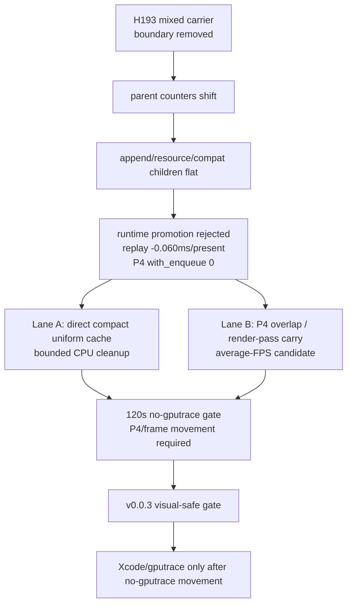
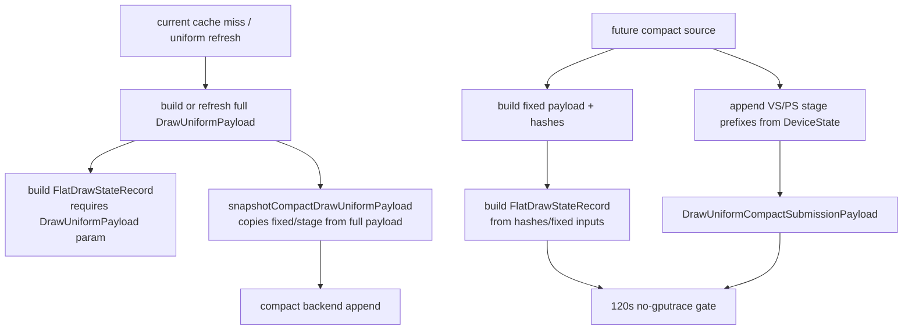

# Encode Phase 184 - Post mixed carrier owner review

## Question

After H193 removes the pending-plus-explicit-run boundary without moving P4 or
FPS, what is the next credible bottleneck target? Is another carrier mutation
useful, or should the work return to uniform-cache representation and P4
overlap?

## Answer

Do not build another draw-run preflush carrier variant now. H193 closed the
specific boundary-elision mechanism: the targeted `draw_run` pending flush CPU
goes to zero, but the backend child counters remain essentially flat and P4
stays fully no-enqueue.

The next credible work splits into two lanes:

1. **Direct compact uniform cache representation** as a bounded P2/P3 CPU
   cleanup. H181 shows the compact backend format is ready, but the producer
   still builds `CachedBaseDrawState::uniforms` as a full
   `DrawUniformPayload` before compacting it.
2. **Locality-preserving P4 overlap / render-pass carry** as the real
   average-FPS lane. Present-pacing docs still show that P4 is no-enqueue
   dominated and previous overlap carriers failed when they increased command
   buffers, render passes, tile preservation, or final same-key reopens.

`v0.0.3` remains the current visual-safe anchor. Older `v0.0.1` captures are
historical triage artifacts only.

## H193 Re-read

The H193 top-level rows can be misread as a new mixed-batch regression:

| Metric | h213 | h215 | Delta |
|---|---:|---:|---:|
| `commit_chunk_replay_pending_flush_draw_run_cpu_ms` | `1435.098` | `0.000` | `-1435.098` |
| `commit_chunk_draw_batch_submit_cpu_ms` | `2987.523` | `4097.587` | `+1110.064` |
| `commit_chunk_draw_run_submit_cpu_ms` | `2113.798` | `944.804` | `-1168.994` |

The child rows show the important part:

| Child metric | h213 | h215 | Delta |
|---|---:|---:|---:|
| `submit_draw_run_batch_append_cpu_ms` | `2295.245` | `2290.760` | `-4.485` |
| `submit_draw_run_batch_append_uniform_cpu_ms` | `1182.069` | `1180.647` | `-1.422` |
| `submit_draw_run_batch_append_state_cpu_ms` | `591.000` | `595.339` | `+4.339` |
| `submit_draw_run_batch_resource_mark_cpu_ms` | `25.945` | `26.083` | `+0.138` |
| `submit_draw_run_batch_compat_scan_cpu_ms` | `58.257` | `60.748` | `+2.491` |

So the parent shift is mostly timing attribution: the canonical imported
draw-run submit is counted under the mixed batch-submit parent, while the old
draw-run-submit parent shrinks. It is not a new child-level owner.

## Candidate Ranking

| Candidate | Why it remains plausible | Why it is not immediately promotable | Next gate |
|---|---|---|---|
| Direct compact uniform cache | H181 proves full `cached.uniforms` is still built before compact carrier; this is real source-side work. | It is a cache-representation change, not a small snapshot loop patch, and previous compact carriers did not move P4. | Source split plus 120s no-gputrace A/B: snapshot/replay rows down, P4/frame not worse, `v0.0.3` visual gate. |
| P4 overlap / render-pass carry | Average FPS is still dominated by no-enqueue completion wait plus serial replay/encode cadence. | Prior carriers created overlap by damaging locality: more command buffers, render passes, tile preservation, or final same-key reopens. | New design must create enqueue-during-wait while keeping CB/pass/tile/final-reopen/load-store flat. |
| PE getter/body microfixes | Some exact app re-entry markers are measurable. | Current PE docs demote them: dominant rows are app cadence markers or bounded body CPU, not dxmt9 getter body owners. | Only revisit if a candidate moves no-enqueue/P4 or residual record cadence. |
| More draw-run preflush carriers | H187 opportunity was real. | H193 preserves the correct shape and still fails; the boundary itself is not enough. | Closed unless paired with underlying materialization removal. |
| `.gputrace` for H193 | GPU counters are useful after a candidate moves no-gputrace gates. | H193 worsens locality slightly and P4/FPS are flat. | Do not spend `.gputrace` on this candidate. |

## Implementation Cut For Direct Compact

The direct compact lane has one important source-level prerequisite:
`FlatDrawStateRecord` construction currently takes a `DrawUniformPayload`.
Even though most of the key/hot fields use `DrawUniformPayloadHashes` when
available, the function signatures still force the caller to present a full
payload:

- `makeFlatDrawStateRecordFromState(..., const DrawUniformPayload& uniforms, ...)`
- `refreshFlatDrawStateRecordFromState(..., const DrawUniformPayload& uniforms, ...)`
- `makeFlatDrawStateKeyFromState(..., const DrawUniformPayload& uniforms, ...)`

That means the first useful implementation unit is not "compact snapshot faster."
It is "allow hot-state build from state plus uniform hashes/fixed-state inputs
without requiring a full `DrawUniformPayload` object." Only after that can
`cachedBaseDrawStateForSubmissionBatch()` skip full `cache.uniforms`
materialization on the compact lane.

## Decision

Treat H193 as a mechanism proof and stop that branch. The next implementation
unit should either:

- split the uniform cache source so compact submissions do not first build full
  `CachedBaseDrawState::uniforms`; or
- design a new P4 overlap carrier that preserves normal command-buffer,
  render-pass, tile-preservation, and final-writer shape.

Either path must pass the cheap 120s no-gputrace gate first. Xcode and
`.gputrace` are reserved for candidates that already move P4/locality or for
GPU-side hidden-backend/locality questions.
