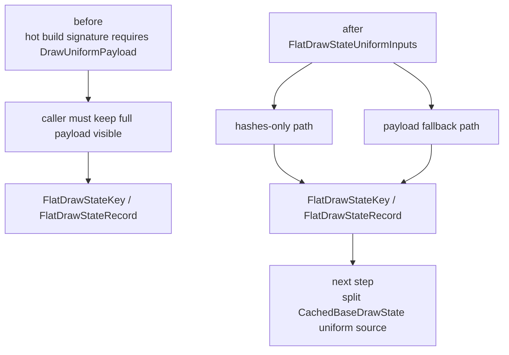

# Encode Phase 185 - Hot state hash-only uniform input refactor

## Question

H184 identified a source-level blocker for direct compact uniform construction:
`FlatDrawStateRecord` hot-state construction required a full
`DrawUniformPayload` argument even when all fields it needed were already
available in `DrawUniformPayloadHashes`. Can that blocker be removed without
changing runtime behavior?

## Answer

Yes. `src/d3d9/core_draw.cpp` now has a narrow `FlatDrawStateUniformInputs`
view for hot-state construction. It can carry either component hashes or a
fallback full payload. The current hot-build call sites that already have
`DrawUniformPayloadHashes` now pass hashes-only, so key/hot construction no
longer depends on a full uniform payload object at that boundary.

This is not a performance result by itself. The cache still builds full
`CachedBaseDrawState::uniforms` before the hot-build step. The change only
removes the first function-signature blocker so the next direct compact cache
implementation can split full payload materialization from hot-state key
construction.



## Implementation Shape

The refactor keeps ownership local and immediate:

- `FlatDrawStateUniformInputs` is a stack-only view inside `core_draw.cpp`.
- It stores only borrowed pointers consumed during the hot-build call.
- It does not cross the PE/unix boundary and does not change any bridge record.
- Existing full-submit paths still build and submit full `DrawUniformPayload`
  where the backend/API requires it.
- Hashes-only hot-build call sites now pass
  `FlatDrawStateUniformInputs{.hashes = &uniformHashes}`.

## Verification

Focused native tests pass:

```sh
meson test -C build-arm64-nowine \
  dxmt9-core-device-coverage-spec \
  dxmt9-chunk-record-replay-spec \
  dxmt9-chunk-record-import-spec \
  --print-errorlogs
```

Result: `3/3` passed. The rebuild still reports pre-existing warnings in
`dxmt9_shader_decoder.cpp` and `winemetal_private_api.mm`, but no new
`core_draw.cpp` warnings remain after the cleanup.

## Decision

Keep the refactor. It is a safe prerequisite for the next direct compact
uniform-cache step, not an FPS claim and not a `.gputrace` candidate.

The next mutating step must still remove or bypass the full
`CachedBaseDrawState::uniforms` build/refresh on the compact submission lane,
then run the standard 120s no-gputrace gate with the `v0.0.3` visual-safe anchor.
