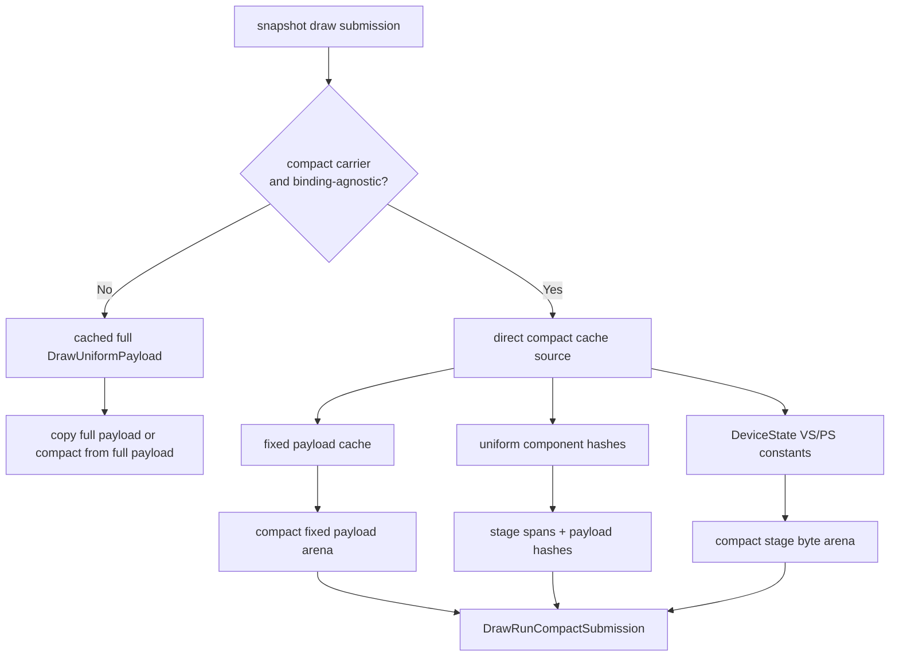

# Encode Phase 186 - Direct compact uniform cache source

## Question

H185 removed the hot-state signature blocker, but the compact submission lane
still built `CachedBaseDrawState::uniforms` before compacting it. Can the
opt-in compact carrier source its fixed payload, stage constants, and hashes
directly from cached metadata plus `DeviceState`, without changing the default
full-uniform path?

## Answer

Yes. The binding-agnostic cache now stores compact-source metadata alongside
the existing full `DrawUniformPayload`:

- `DrawUniformFixedPayload`
- `DrawUniformPayloadHashes`
- combined full-payload and fixed-payload hashes
- validity bits for the full payload and fixed payload

When the caller is the compact submission carrier
(`DXMT9_ENABLE_COMPACT_UNIFORM_SUBMISSIONS=1` and no render trace), the cache
can refresh/build the compact source directly. Shader constants are hashed from
`DeviceState::{vsConst,psConst}`, non-constant fields are held in the cached
fixed payload, and the compact materializer appends stage bytes directly from
the current shader-constant snapshots.

Default behavior is unchanged. Full submission carriers and non-compact paths
still require a valid full `DrawUniformPayload`; if a previous compact-direct
lookup left the full payload stale, the next full path materializes it before
copying.



## Correctness Boundary

The direct path deliberately uses the same span construction rule as the full
compact materializer. That matters for the post-`v0.0.3` visual-safety class:
when int or bool constants are live, the Metal-visible constant ABI may require
float/int prefix preservation beyond the minimal changed count. The new native
test compares direct compact stage spans against the full compact materializer
for the same state, so future direct-source edits cannot silently diverge from
the accepted compact path.

This is still not a visual-safe or FPS result. `v0.0.3` remains the GT1
visual-safe anchor, and this implementation needs a 120s no-gputrace GT1 smoke
before any runtime promotion.

## Implementation Shape

The change stays inside the D3D9 frontend cache/snapshot layer:

- No PE/unix ABI record changes.
- No Metal/backend ownership movement.
- No default-on runtime knob change.
- Compact-direct is selected only through the existing opt-in compact
  submission carrier path.
- Full fallback keeps a `DXMT_ASSERT(cached.fullUniformsValid)` at the copy
  site, making stale-full-payload misuse explicit in debug builds.

## Verification

Focused native tests pass:

```sh
meson test -C build-arm64-nowine \
  dxmt9-core-device-com-spec \
  dxmt9-core-device-coverage-spec \
  dxmt9-chunk-record-replay-spec \
  dxmt9-chunk-record-import-spec \
  --print-errorlogs
```

Result: `4/4` passed. The rebuild still reports the pre-existing warnings in
`dxmt9_shader_decoder.cpp` and `winemetal_private_api.mm`.

## Decision

Keep the implementation as the next compact-uniform prerequisite. The next
gate is a paired no-gputrace run using the existing compact-submission knob:
watch snapshot/cache uniform-build rows, submission materialized bytes, P4
overlap/no-enqueue counters, and the `v0.0.3` visual-safe output class before
making any performance claim.
