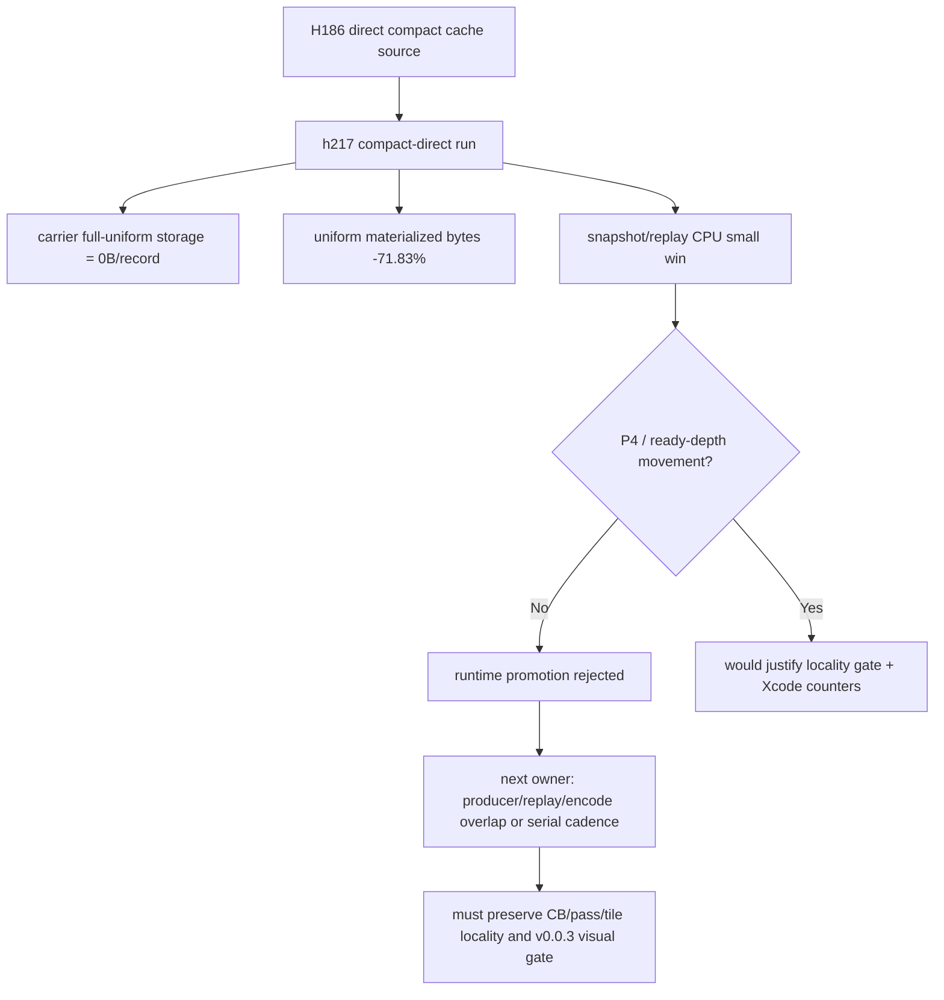

# Encode Phase 187 - Direct compact uniform runtime gate

## Question

H186 split the compact uniform cache source so the opt-in compact submission
lane can avoid first building the full `CachedBaseDrawState::uniforms` payload.
Does that finally make `DXMT9_ENABLE_COMPACT_UNIFORM_SUBMISSIONS=1` a GT1
runtime/FPS candidate?

## Answer

No for average FPS, yes for the local mechanism. The h216/h217 paired
no-gputrace 120s run shows the direct compact source reaches the intended
storage path and lowers replay/snapshot CPU, but it does not change the frame
owner:

| Metric | h216 control | h217 compact-direct | Direction |
|---|---:|---:|---:|
| `sampled_avg_fps` | `16.429` | `16.545` | noise / no promotion |
| `submission_carrier_bytes_per_record` | `21,176` | `10,904` | `-48.51%` |
| `submission_carrier_uniform_storage_bytes_per_record` | `10,272` | `0` | full lane removed |
| `uniform_materialized_bytes_per_present` | `5.070MB` | `1.428MB` | `-71.83%` |
| `snapshot_cache_uniform_build_cpu_ms_per_present` | `0.467` | `0.405` | `-13.22%` |
| `snapshot_cache_batch_miss_uniform_build_cpu_ms_per_present` | `0.605` | `0.503` | `-16.80%` |
| `d3d9_snapshot_draw_submission_cpu_ms_per_present` | `3.170` | `3.028` | `-4.49%` |
| `commit_chunk_queue_draw_submission_cpu_ms_per_present` | `3.919` | `3.629` | `-7.38%` |
| `commit_chunk_replay_cpu_ms_per_present` | `8.247` | `7.902` | `-4.18%` |
| `encode_chunk_cpu_ms_per_present` | `12.955` | `13.086` | `+1.01%` |
| `completion_wait_with_enqueue_ms_per_present` | `0.000` | `0.036` | still absent |
| `completion_wait_without_enqueue_ms_per_present` | `26.201` | `25.801` | `-1.53%` |
| `encode_ready_depth_avg` | `1.000` | `1.000` | unchanged |
| `command_buffers_per_present` | `3.999` | `3.999` | unchanged |

Broad visual smoke passes for both runs: the captured GT1 firefight frames show
bloom, sparks, geometry, and HUD rather than black screen or the known
post-`v0.0.3` transparent/black-weapon failure class. They are time-based
captures, not same-frame pixel oracles, so `v0.0.3` remains the promotion gate.

## Interpretation

The direct compact source closes the compact-uniform representation thread. The
old objection that compact submissions still materialize full cached uniforms is
now gone: full carrier storage is `0B/record`, logical materialized uniform
bytes fall by about `3.64MB/present`, and snapshot/replay rows improve in the
expected direction.

That still leaves the average-FPS owner intact. Completion wait remains almost
entirely no-enqueue, ready depth stays at one, and the backend encode row does
not improve. This means the compact direct path is bounded P2/P3 cleanup, not a
P4 overlap or frame-pacing fix.

## Decision

Keep the compact direct implementation as a valid local CPU cleanup behind the
existing opt-in compact submission knob, but do not promote it as the GT1
average-FPS lever and do not spend `.gputrace` budget on this candidate.

Next work should return to the P4/serial-cadence lane: create enqueue-during-wait
or reduce `wait -> next enqueue` / `commit entry -> publish` without increasing
command buffers, render passes, tile preservation, or load/store traffic. Any
mutating candidate still needs the `v0.0.3` visual-safe gate before FPS claims.
