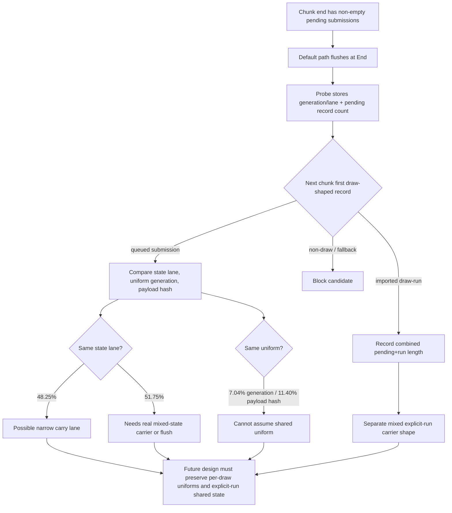

# Encode Phase 188 - Chunk-end flush carry probe

## Question

After H193 rejected the draw-run preflush mixed carrier and H196 closed the
direct compact uniform cache as a bounded local cleanup, is the remaining chunk
`End` pending-submission drain a real cross-chunk opportunity or just ordinary
safe flushing noise?

## Answer

It is a real opportunity, but it is not safe enough for a naive "keep pending
submissions open across chunks and append the next draw" implementation. The
default-off `DXMT9_PERF_CHUNK_END_FLUSH_PROBE=1` run stores only the final
`End` flush generation/lane stamp, resolves it against the next chunk's first
draw-shaped record, and does not change replay ordering.

The probe passed the standard 120s no-gputrace gate: status `pass`,
`present_encoded=1,740`, `gpu_command_buffer_errors=0`, and the visual sample
was normal rather than black-screen or the known post-`v0.0.3` weapon/geometry
failure class. The frame owner remained unchanged:
`completion_wait_without_enqueue_ms_per_present=26.898`,
`completion_wait_with_enqueue_ms_per_present=0.000`, and ready depth stayed in
the no-enqueue class.

| Metric | h218 probe |
|---|---:|
| `commit_chunk_replay_pending_flush_cpu_ms` | `2,969.652` |
| `commit_chunk_replay_pending_flush_cpu_ms_per_present` | `1.707` |
| `commit_chunk_replay_pending_flush_draw_run_cpu_ms` | `1,411.785` |
| `commit_chunk_replay_pending_flush_end_cpu_ms` | `1,393.521` |
| `commit_chunk_replay_pending_flush_end_flushes` | `32,283` |
| `commit_chunk_replay_pending_flush_end_records` | `406,005` |
| `end_flush_probe_records_per_stored_flush` | `12.576` |
| `end_flush_probe_first_submission` | `29,582` |
| `end_flush_probe_first_submission_same_state_lane_share` | `48.25%` |
| `end_flush_probe_first_submission_same_uniform_generation_share` | `7.04%` |
| `end_flush_probe_first_submission_same_uniform_payload_hash_share` | `11.40%` |
| `end_flush_probe_first_draw_run` | `2,623` |
| `end_flush_probe_first_draw_run_combined_records_per_candidate` | `13.404` |
| `end_flush_probe_blocked_non_draw + blocked_draw_fallback` | `78` |
| `end_flush_probe_resolved_or_blocked_share` | `100.00%` |

## Interpretation

The `End` half of pending flush churn is not a dead end. It accounts for about
`0.801ms/present`, almost the same size as the draw-run preflush half
(`0.811ms/present`). Nearly every stored end flush resolves immediately against
a next draw-shaped record: `29,582` first submissions, `2,623` first imported
draw-runs, and only `78` blockers.

The compatibility shape is the problem. Only `48.25%` of first-submission
candidates have the same stable state/lane, uniform generation matches only
`7.04%`, and whole uniform payload hash matches only `11.40%`. A naive
cross-chunk pending vector carry would therefore preserve some boundaries but
would also run into per-draw uniform ownership and mixed state compatibility.
That is the same class of failure H193 exposed for draw-run preflush merging:
removing one visible flush can reclassify or amplify carrier work without moving
P4/FPS.

## Decision

Keep the probe and summary block as the sizing tool, but do not implement a
plain cross-chunk pending-submission carry as the next mutation. A promotable
design would need one of these properties:

- state-compatible first-submission lane only, with per-draw uniform handles
  preserved and a no-op fallback to normal flush when the next chunk diverges;
- a true mixed end-drain carrier that preserves pending submissions and the
  following explicit run's shared state without materializing the run as
  per-record submissions;
- or a larger P4 producer/encode overlap design that avoids adding command
  buffers, render passes, tile preservation, or final-reopen/store traffic.

This is not a GPU or M1 hardware wall. It is a serialization/carrier-design wall
for the current approach. The next useful implementation should either reduce
`commit_chunk_replay_pending_flush_*` while also moving
`completion_wait_with_enqueue_ms_per_present`, or return to a stricter
locality-preserving P4 overlap contract. Do not spend `.gputrace` on this probe
alone.
