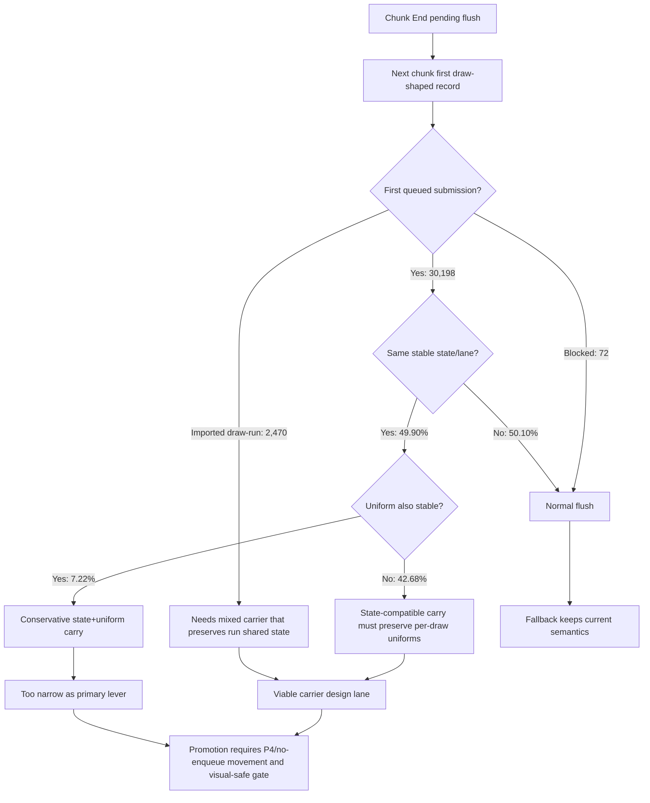

# Encode Phase 189 - Chunk-end flush uniform intersection probe

## Question

H188 proved that chunk `End` pending flushes are real cross-chunk
opportunities, but it only reported state/lane, uniform generation, and whole
uniform payload hash as separate shares. How much of the next first-submission
shape is actually both state-compatible and uniform-stable?

## Answer

The intersection is too small for a conservative "carry only when state and
uniforms are stable" design. The default-off probe adds two intersection
counters:

- `same_state_lane && same_uniform_generation`
- `same_state_lane && same_uniform_payload_hash`

The 120s no-gputrace H221 run passes the standard safety gate:
`present_encoded=1,787`, `draw_skipped_no_pipeline=0`,
`gpu_command_buffer_errors=0`, sampled average FPS `16.305`, and the same
no-enqueue P4 class as H220 (`completion_wait_without_enqueue=30.051ms/present`,
`completion_wait_with_enqueue=0.101ms/present`).

| Metric | h221 probe |
|---|---:|
| `end_flush_probe_stored` | `32,740` |
| `end_flush_probe_stored_records` | `408,432` |
| `end_flush_probe_records_per_stored_flush` | `12.475` |
| `end_flush_probe_first_submission` | `30,198` |
| `end_flush_probe_first_submission_same_state_lane` | `15,070` |
| `end_flush_probe_first_submission_same_state_lane_share` | `49.90%` |
| `end_flush_probe_first_submission_same_uniform_generation_share` | `7.22%` |
| `end_flush_probe_first_submission_same_uniform_payload_hash_share` | `11.58%` |
| `end_flush_probe_first_submission_same_state_lane_and_uniform_generation_share` | `7.22%` |
| `end_flush_probe_first_submission_same_state_lane_and_uniform_payload_hash_share` | `7.22%` |
| `end_flush_probe_first_submission_pending_records_per_candidate` | `12.782` |
| `end_flush_probe_first_draw_run` | `2,470` |
| `end_flush_probe_first_draw_run_combined_records_per_candidate` | `12.944` |
| `end_flush_probe_blocked_non_draw + blocked_draw_fallback` | `72` |
| `end_flush_probe_resolved_or_blocked_share` | `100.00%` |

## Interpretation

State-compatible first-submission candidates are common enough to matter:
`15,070 / 30,198` (`49.90%`). Uniform-stable candidates are not. The full
state-and-uniform intersection is only `2,181 / 30,198` (`7.22%`), whether the
uniform predicate uses generation or whole payload hash in this run.

That rejects the narrow safe design that carries pending submissions only when
the next draw has both the same state lane and the same uniform payload. It
would leave about `92.78%` of first-submission candidates on the old end-flush
path.

The useful design space is narrower and more explicit:

- carry state-compatible pending submissions while preserving per-draw uniform
  ownership for every carried record;
- carry an imported draw-run as a shared-state span instead of materializing it
  into per-record submissions;
- or skip this carrier family and pursue a P4 overlap design that proves
  enqueue-during-wait without increasing command buffers, render passes, tile
  preservation, or final same-key reopens.

## Decision

Keep the H221 intersection counters and summary rows. Do not implement a
uniform-stable-only chunk-end carry. If this branch continues, the next mutation
must be a state-compatible carrier that keeps each draw's uniform payload
owned, or a mixed carrier that preserves explicit-run shared state.

This probe alone still does not justify `.gputrace`: the no-gputrace run does
not move the current frame owner. H221 remains in the same P4 class as H220
(`completion_wait_without_enqueue` is `30.051ms/present`, ready depth remains
`1.000`, and encode/replay are flat at `11.096` and `8.458ms/present`).
