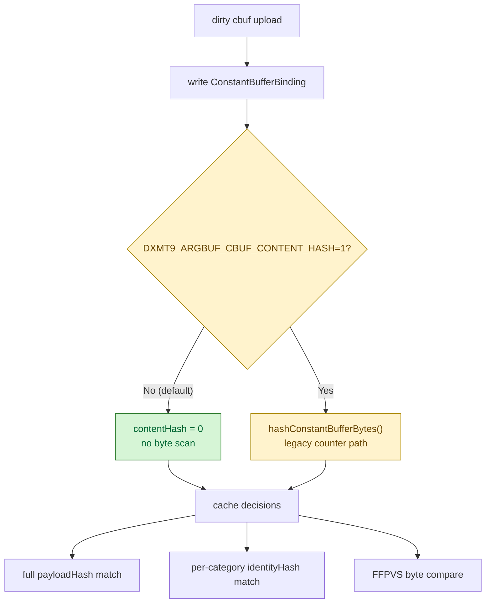
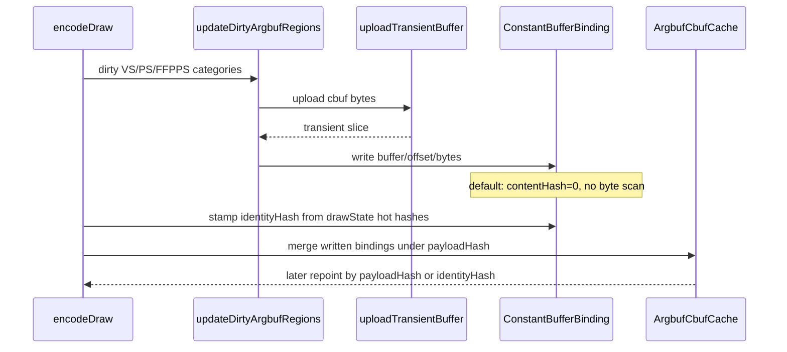

# Cbuf Content Hash Removal

**Question / hypothesis.** [[state-churn-encode-encode-phase.18]] identified
`hashConstantBufferBytes()` as the largest remaining cbuf child:
`570.070ms` total, with VS alone at `489.627ms`. Is that hash still part of a
live correctness decision, or can the runtime rely on the existing full
uniform `payloadHash` and per-category `identityHash` paths?

**Implementation.** Default argbuf cbuf uploads no longer compute
`ConstantBufferBinding::contentHash`. The field stays present but is written as
sentinel `0`, and `contentMatches()` treats zero as "not a content proof" so a
future call cannot accidentally match the sentinel. The existing cache decisions
remain unchanged:

- full reopen uses `ArgbufCbufCache::matches(payloadHash)`;
- no-dirty payload mismatch uses per-category `identityHash`;
- FFPVS uses byte comparison because viewport/pre-transform adjustment can patch
  host bytes after the general argbuf update.

A legacy/debug opt-in, `DXMT9_ARGBUF_CBUF_CONTENT_HASH=1`, restores the old byte
hash and counter path if a future diagnostic needs it.



**Method.**

```bash
bash scripts/tools/run_3dmark05_perf_probe.sh \
  --suffix cbuf-content-hash-off-r1 \
  --frame 50 \
  --no-gputrace \
  --no-encoder-breakdown \
  --timeout 180

python3 scripts/tools/compare_3dmark05_perf_counters.py \
  experiments/output/app-d3d9-3dmark05-cbuf-residual-split-r1 \
  experiments/output/app-d3d9-3dmark05-cbuf-content-hash-off-r1 \
  --before-label cbuf-residual-split-r1 \
  --after-label cbuf-content-hash-off-r1 \
  --output experiments/output/app-d3d9-3dmark05-cbuf-content-hash-off-r1/dxmt9-perf-counter-comparison-vs-cbuf-residual-split.md
```

The wrapper hit the expected top-level watchdog (`124`) after writing
postprocess artifacts. `result.json` was missing, so the summary was synthesized
from `dxmt9.log`; treat the run as CPU-counter attribution, not as a formal
result-file pass. `actual.png` exists but remains smoke-only.

**Measured result.**

| Counter | Residual split | Content hash off | Delta | Reading |
|---|---:|---:|---:|---|
| `present_encoded` | 1,740 | 1,680 | -60 | shorter watchdog-finalized run |
| `draw_calls` | 1,275,582 | 1,238,764 | -36,818 | per-present shape stable (`+0.58%` draws/present) |
| `encode_draw_argbuf_cbuf_binding_hash_cpu_ms` | 570.070 | 0.000 | -570.070 | mechanism removed |
| `encode_draw_argbuf_cbuf_binding_hash_vs_cpu_ms` | 489.627 | 0.000 | -489.627 | VS hash scan removed |
| `encode_draw_argbuf_cbuf_binding_hash_ps_cpu_ms` | 54.712 | 0.000 | -54.712 | PS hash scan removed |
| `encode_draw_argbuf_cbuf_update_cpu_ms` | 2,115.474 | 1,470.477 | -644.997 | cbuf parent drops |
| cbuf update per present | 1.216ms | 0.875ms | -0.341ms | -28.01% per-present parent |
| `encode_draw_cpu_ms` per present | 10.359ms | 10.006ms | -0.353ms | -3.40% backend encode CPU per present |
| `gpu_command_buffer_time_ms` | 5,254.973 | 5,288.516 | +33.543 | flat/noisy (`+0.64%`) |
| `completion_wait_ms` | 38,948.937 | 38,791.283 | -157.654 | flat/noisy (`-0.40%`) |

The cbuf parent win is larger than the old measured hash bucket because the
per-category parent scopes also shed part of the timer/call nesting around the
hash path. `binding_write` rose slightly (`41.288 -> 48.309ms`), but it is small
and does not change the result.



**Verdict.** Accepted CPU win. The phase.18 `hashConstantBufferBytes()` target is
removed from the default GT1 path, cutting the cbuf update parent by about
`0.341ms/present` and backend encode by about `0.353ms/present`. GPU time and
completion wait stay flat, so this is still a CPU-throughput optimization, not
a GPU/fps proof.

**Correctness note.** This change does not use a time-based `actual.png` as a
visual oracle. The stronger correctness argument is structural: no production
cache path reads `contentHash` for a decision after this change; `contentMatches`
rejects zero sentinels; and the live cache decisions are `payloadHash`,
`identityHash`, and FFPVS byte compare. If a future change reintroduces
content-based cbuf matching, it must opt into the legacy hash path or provide
same-input image proof.

**Next.** The remaining cbuf parent after hash removal is now build/upload,
cached repoint/content probe, binding writeback, and residual dispatch/timer
cost. Do not spend more work on `hashConstantBufferBytes()` unless the legacy
opt-in counter proves a non-zero path.

**Related.** [[state-churn-encode]] ·
[[state-churn-encode-encode-phase.18]] · [[baselines-visual-capture.01]].
