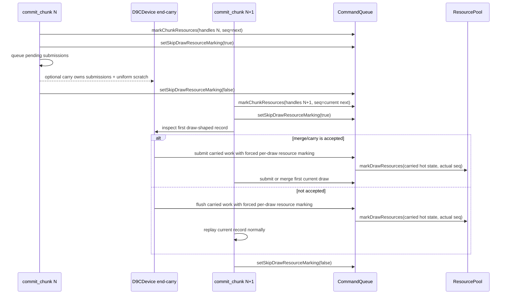

# Encode Phase 190 - Chunk-end carry feasibility audit

## Question

Can H221's state-compatible chunk-end opportunity be implemented by simply
keeping the pending submission vectors alive across `dxmt9c_device_commit_chunk`
calls?

## Answer

No. The opportunity is real, but a naive vector carry would violate current
ownership and resource-retention assumptions. The replay path keeps
`pendingDrawSubmissions`, `pendingCompactDrawSubmissions`, and
`DrawSubmissionUniformScratch` as thread-local scratch scoped by
`ScopedPendingDrawSubmissionScratchUse`. The destructor clears all three at the
end of each commit call. Compact submissions may carry
`DrawUniformCompactPayloadArenaView` spans into that scratch arena, so carrying
only the submission vector would leave dangling compact-uniform arena views.

The second constraint is resource lifetime. `dxmt9c_device_commit_chunk` bulk
marks the chunk's handle table through `CommandQueue::markChunkResources()` and
then sets `skipDrawResourceMarking=true` while replaying records. That is safe
only because draws are submitted during the same chunk and therefore share the
same `seqIdForMark()` snapshot as the bulk mark. If a pending draw from chunk N
is submitted during chunk N+1 while per-draw marking is still skipped, chunk N's
bulk mark can under-stamp the resource's actual last-use sequence.

## Required Shape

A safe end-drain carry must satisfy all of these:

| Requirement | Reason |
|---|---|
| Own carried submissions on `D9CDevice`, not thread-local scratch | Carry must survive the commit call boundary. |
| Own carried `DrawSubmissionUniformScratch` with the submissions | Compact uniform arena views cannot point to cleared scratch. |
| Keep full and compact carriers mutually exclusive | Current replay asserts only one pending lane is active. |
| Flush or merge carried work before any non-draw/non-through record in the next chunk | D3D order must remain unchanged. |
| Re-mark carried resources at actual submit time | Previous chunk bulk-mark `seqId` is not enough after deferral. |
| Disable or bypass compact carry under `DXMT_TRACE_RENDER` | Existing compact carrier is explicitly no-trace. |
| Fall back to normal end flush on failures, state divergence, or unsupported draw fallback | Correctness first; H221 says only part of the stream is compatible. |

## Decision

Do not implement a cross-chunk carry by moving the existing local vectors to
`D9CDevice` alone. That would be a storage-lifetime patch without the required
resource-lifetime fix.

The minimum viable mutation needs a small owned carry object plus an explicit
submit mode that forces resource marking for carried work even while the current
chunk is in bulk-mark/skip mode. Until that submit mode exists, keep H221 as an
opportunity sizing probe and prefer either:

- a same-call mixed carrier for draw-run boundaries, where lifetimes and bulk
  marks already align; or
- a P4 overlap design that does not defer draw submissions across chunk resource
  retention boundaries.
