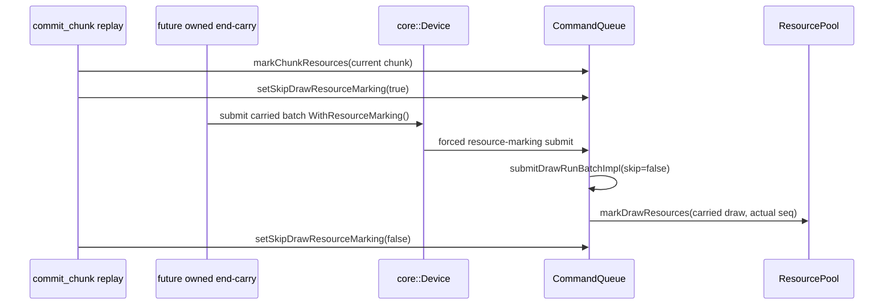

# Encode Phase 191 - Forced resource-marking submit prerequisite

## Question

Can the H221/H190 cross-chunk end-carry design get a submit path that is safe
to call while the current chunk is using bulk resource marking and ordinary
per-draw resource marking is suppressed?

## Answer

Yes, as a prerequisite only. The implementation adds explicit forced
resource-marking submit methods through the frontend, backend-device, runtime
device, and `CommandQueue` surfaces:

- `submitDrawSubmissionBatchWithResourceMarking()`
- `submitCompactDrawSubmissionBatchWithResourceMarking()`
- `submitDrawSubmissionBatchAndDrawRunCanonicalWithResourceMarking()`
- `submitCompactDrawSubmissionBatchAndDrawRunCanonicalWithResourceMarking()`

The `CommandQueue` variants call the existing batch submit implementation with
`skipDrawResourceMarking=false`, independent of the chunk replay's current
bulk-mark skip mode. This is the resource-lifetime half of H190: carried work
can be submitted at its actual sequence and have every referenced draw resource
marked at that sequence instead of relying on the previous chunk's
`markChunkResources()` stamp.

This does **not** enable cross-chunk carry by itself. It only creates the safe
queue ingress needed by a future owned carry object.

## Contract



The future carry implementation still must own submissions plus compact-uniform
scratch across `commit_chunk` calls, keep full and compact carriers exclusive,
and flush before any non-draw boundary that would make D3D order ambiguous.

## Verification

Native fake-backend coverage proves the new public seams route through the
dedicated backend methods and still preserve draw parameters:

```sh
meson test -C build-arm64-nowine dxmt9-core-device-coverage-spec --print-errorlogs
meson test -C build-arm64-nowine dxmt9-resource-hazard-spec --print-errorlogs
```

Both passed on 2026-06-20. This is not a runtime performance result and should
not be promoted as an FPS improvement or a `.gputrace` candidate.

## Decision

Keep the forced-mark submit path as the first H221 mutation prerequisite. The
next mutation can build the owned cross-chunk carry storage on top of it, but it
must still pass a 120s no-gputrace visual/P4 gate before any Xcode counter
spend.
