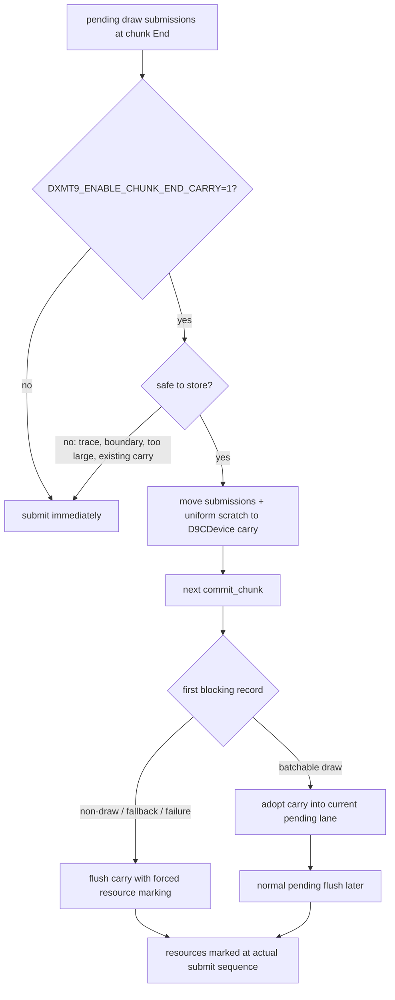

# Encode Phase 192 - Owned chunk-end carry skeleton

> **Outdated — the knob or code path this experiment measured no longer exists in `src/`.** It cannot be re-run. Kept as history; do not cite it as current evidence.

## Question

After H190/H191, can chunk `End` pending submissions be carried across
`commit_chunk` calls without borrowing commit-local vectors or relying on the
previous chunk's bulk resource marking?

## Answer

Yes as a default-off runtime experiment. `DXMT9_ENABLE_CHUNK_END_CARRY=1`
adds a `D9CDevice`-owned carry object for chunk-end pending draw submissions,
compact submissions, and compact-uniform scratch. At `flushPendingDrawSubmissions(End)`,
small draw-only drains can be stored instead of submitted. The next
draw-shaped record adopts the carried work into the current pending lane; a
non-draw, fallback, or failure boundary flushes the carry through the forced
resource-marking submit path from H191.

The carry is deliberately conservative:

- it is disabled by default;
- it stores only chunk `End` drains;
- it refuses to store after a queue-boundary record has appeared in the chunk;
- it does not run while render tracing is active;
- it caps stored records at `512`;
- it keeps full and compact carriers exclusive;
- it reattaches compact-uniform arena views only when submitting/adopting.

This is not a promotion result and not an FPS claim. It only makes the H198/H199
end-drain hypothesis runnable under the normal 120s no-gputrace gate.

## Flow



## Counters

The runtime now exposes carry movement counters in the standard 3DMark05
summary path:

- `commit_chunk_replay_end_carry_stored`
- `commit_chunk_replay_end_carry_stored_records`
- `commit_chunk_replay_end_carry_adopted`
- `commit_chunk_replay_end_carry_adopted_records`
- `commit_chunk_replay_end_carry_flushed`
- `commit_chunk_replay_end_carry_flushed_records`

These counters are the first validation gate. A useful run must show that
stored records are usually adopted into a later draw lane rather than flushed
at non-draw boundaries, and must not regress the P4/no-enqueue class or visual
alignment.

## Verification

The default-off path preserves existing deterministic coverage:

```sh
meson test -C build-arm64-nowine dxmt9-resource-hazard-spec --print-errorlogs
meson test -C build-arm64-nowine dxmt9-core-device-coverage-spec --print-errorlogs
meson test -C build-arm64-nowine dxmt9-verify-tla --print-errorlogs
python3 -m pytest tests/scripts/test_summarize_3dmark05_perf.py \
  tests/scripts/test_compare_3dmark05_perf_counters.py \
  tests/scripts/test_3dmark05_probe_scripts.py
meson test -C build-arm64-nowine dxmt9-perf-docs-source-audit --print-errorlogs
```

All passed on 2026-06-20.

Do not treat a broad `DXMT9_ENABLE_CHUNK_END_CARRY=1` unit-test run as the
right promotion gate. Some native tests intentionally end with a draw-only
chunk and no following chunk/boundary; the experimental carry can legally defer
that final draw in such an isolated harness. The correct next proof is a
supervised 3DMark05 no-gputrace A/B with `--timeout 120 --keep-frontmost`,
carry counters, P4 counters, and the `v0.0.3` visual gate.

## Decision

Keep the carry default-off and unpromoted. It answers the implementation
blocker from H190/H191, but the performance question remains open until a
runtime A/B proves that it reduces chunk-end drain cost without delaying visible
draws, worsening present cadence, or reintroducing the recent visual classes.
