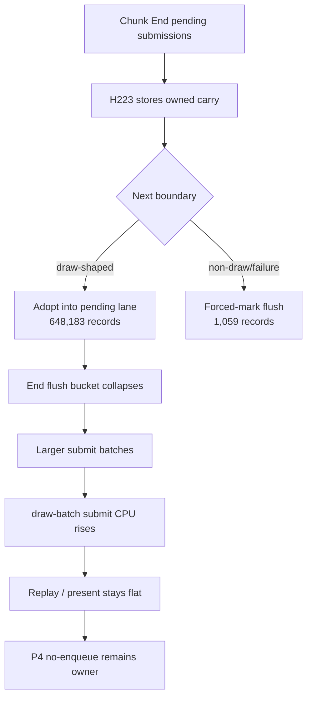

# Encode Phase 193 - Chunk-end carry runtime gate

## Question

Does the owned `DXMT9_ENABLE_CHUNK_END_CARRY=1` implementation from H201 move
the 3DMark05 GT1 replay/P4 owner when run under the standard 120s no-gputrace
foreground gate?

## Answer

No. The mechanism works, but the runtime candidate is not promotable. It
removes most local chunk-end pending flushes, and almost every stored record is
adopted into a later draw lane. The saved flush work is then largely shifted
into larger batch-submit/resource-marking work, while the frame-facing rows
remain in the same P4/no-enqueue class.

This does not justify a `.gputrace` spend. Keep the knob default-off and use
the result as a design constraint for the next state-churn or P4 overlap branch.

## Method

Both runs used the current built/staged Wine provider and the standard
supervised wrapper:

```sh
bash scripts/tools/run_3dmark05_perf_probe.sh \
  --suffix h222-end-carry-control-r1 \
  --frame 60 --no-gputrace --timeout 120 --keep-frontmost

DXMT9_ENABLE_CHUNK_END_CARRY=1 \
bash scripts/tools/run_3dmark05_perf_probe.sh \
  --suffix h223-end-carry-on-r1 \
  --frame 60 --no-gputrace --timeout 120 --keep-frontmost
```

The control timeout-finalized with complete artifacts (`returncode=143`,
`status=pass`, `present_encoded=1,740`). The candidate completed normally
(`returncode=0`, `status=pass`, `present_encoded=1,768`). Both screenshots were
usable broad visual smokes, but the HUD time differs, so pixel diff is not a
same-frame correctness proof.

## Result

| Metric | H222 control | H223 carry | Verdict |
|---|---:|---:|---|
| stored carry records | `0` | `649,242` | mechanism active |
| adopted carry records | `0` | `648,183` | `99.84%` of stored records |
| flushed carry records | `0` | `1,059` | only `0.16%` of stored records |
| pending flush CPU / present | `1.730ms` | `0.735ms` | local win |
| chunk-end flush CPU / present | `0.817ms` | `0.045ms` | target removed |
| draw-run flush CPU / present | `0.822ms` | `0.474ms` | also lower |
| before-record flush CPU / present | `0.087ms` | `0.211ms` | shifted work |
| draw-batch submit CPU / present | `1.714ms` | `1.983ms` | shifted work |
| replay CPU / present | `8.497ms` | `8.492ms` | flat |
| encode chunk CPU / present | `13.060ms` | `13.001ms` | flat/noisy |
| completion wait without enqueue / present | `26.943ms` | `26.402ms` | same class |
| completion wait with enqueue / present | `0.106ms` | `0.000ms` | no overlap |
| encode ready depth avg | `1.000` | `1.000` | no run-ahead |
| submission records per batch submit | `9.053` | `12.497` | larger batches |
| backend records per draw-run group | `1.892` | `1.964` | small batching gain |

The important split is local versus frame-facing. The local target
`commit_chunk_replay_pending_flush_end_cpu_ms` collapses from `1,421.644ms` to
`78.943ms`, but total `commit_chunk_replay_cpu_ms_per_present` moves only
`8.497 -> 8.492ms`. `commit_chunk_draw_batch_submit_cpu_ms` rises
`2,982.963 -> 3,506.812ms`, so the end-drain removal is not currently turning
into a frame-level CPU win.

P4 is unchanged: ready depth remains exactly `1.000`, enqueue-during-wait does
not appear, and the no-enqueue wait still owns about `26ms/present`.

## Interpretation



The carry implementation proves that the H197/H198 end-drain opportunity is
real and safely reachable. It also proves that this specific carrier is not a
sufficient average-FPS fix. The remaining cost is not "end flush exists"; it is
the state/uniform/resource-marking work needed when the carried records finally
enter backend batch submit, plus the larger P4 pipeline problem that keeps
producer and encoder from overlapping.

## Decision

Keep `DXMT9_ENABLE_CHUNK_END_CARRY` default-off. Do not promote it and do not
spend Xcode/gputrace on this candidate.

Next useful branches:

1. Attribute the `commit_chunk_draw_batch_submit_cpu_ms` increase under carry:
   resource marking, append width, uniform append, or compat/replay
   reclassification.
2. Combine carry with stricter N-1 materialization elision only if it avoids
   building/storing non-front state/uniform payloads before submit.
3. Return to P4 overlap work; any candidate must create
   `completion_wait_with_enqueue_ms`, raise ready depth, or reduce
   no-enqueue stage time while keeping command-buffer/pass/tile locality and
   the `v0.0.3` visual gate intact.
