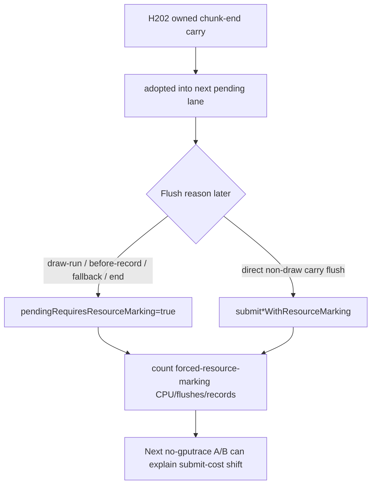

# Encode Phase 194 - Forced resource-marking flush attribution

## Question

After H202, can the next no-gputrace run distinguish "chunk-end carry removed
flush work" from "chunk-end carry shifted work into forced resource marking"?

## Answer

Yes as instrumentation, and now partly as runtime attribution. H202 already
shows the shape:

- `commit_chunk_replay_pending_flush_end_cpu_ms` falls
  `0.817 -> 0.045ms/present`;
- `commit_chunk_draw_batch_submit_cpu_ms` rises
  `1.714 -> 1.983ms/present`;
- `submit_draw_run_batch_resource_mark_cpu_ms` rises
  `0.014 -> 0.114ms/present`;
- `commit_chunk_replay_pending_flush_before_record_cpu_ms` rises
  `0.087 -> 0.211ms/present`.

The missing direct proof was whether the adopted carry was later flushing with
`pendingRequiresResourceMarking=true`. The runtime now counts that path:

- `commit_chunk_replay_pending_flush_forced_resource_marking_cpu_ms`
- `commit_chunk_replay_pending_flush_forced_resource_marking_flushes`
- `commit_chunk_replay_pending_flush_forced_resource_marking_records`

These counters are behavior-neutral. They only fire when an actual pending
submission flush uses forced per-draw resource marking: either a carried chunk
is flushed directly at a non-draw boundary, or an adopted carry later drains
through the ordinary pending-flush lambda.

The follow-up h224 run proves the counters fire and bound the shifted cost, but
it does not make chunk-end carry promotable:

| Metric | H222 control | H223 carry | H224 carry + attribution | Read |
|---|---:|---:|---:|---|
| carry stored records / present | `0` | `367.218` | `320.490` | mechanism repeats |
| carry adopted records / present | `0` | `366.619` | `320.195` | adoption still dominates |
| carry flushed records / present | `0` | `0.599` | `0.294` | direct carry flush is tiny |
| pending flush CPU / present | `1.730ms` | `0.735ms` | `0.715ms` | local end-drain win remains |
| chunk-end flush CPU / present | `0.817ms` | `0.045ms` | `0.044ms` | target remains removed |
| forced resource-marking CPU / present | n/a | n/a | `0.144ms` | new attribution |
| forced resource-marking records / present | n/a | n/a | `30.401` | not the whole carried set |
| forced resource-marking share of pending flush CPU | n/a | n/a | `20.09%` | real but partial owner |
| draw-batch submit CPU / present | `1.714ms` | `1.983ms` | `2.007ms` | submit cost still shifted |
| batch resource-mark CPU / present | `0.014ms` | `0.114ms` | `0.114ms` | reproduced |
| replay CPU / present | `8.497ms` | `8.492ms` | `8.655ms` | no frame win |
| encode chunk CPU / present | `13.060ms` | `13.001ms` | `12.882ms` | noise/local only |
| completion wait with enqueue / present | `0.106ms` | `0.000ms` | `0.016ms` | no useful overlap |
| ready depth avg | `1.000` | `1.000` | `1.000` | no run-ahead |

H224 also fails the visual gate: `actual.png` is HUD plus black scene
(`mean_luma=6.289`) while the h222/h223 screenshots around the same GT1 time
show normal scene content and muzzle/bloom effects. Treat h224's counters as
valid attribution for the carry path, but not as a visual-safe performance
candidate.

## Flow

## Next Gate

Forced resource marking is a real cost, but it owns only about one fifth of
pending-flush CPU in the measured carry run and only part of the
`draw_batch_submit` shift. The next code branch should not be another blind
chunk-end carry policy.

Reasonable follow-ups are:

1. Reduce duplicate resource marking only if a narrower counter proves it is
   still a local owner after visual-safe repetition.
2. Inspect queue lock / outer submit residual and batch-width effects for the
   rest of `commit_chunk_draw_batch_submit_cpu_ms`.
3. Return to P4 overlap work, because H224 still has ready depth `1.000` and
   almost no enqueue-during-wait.
4. Re-run any mutating candidate through the `v0.0.3` visual gate before using
   its timing or counter movement as promotion evidence.
