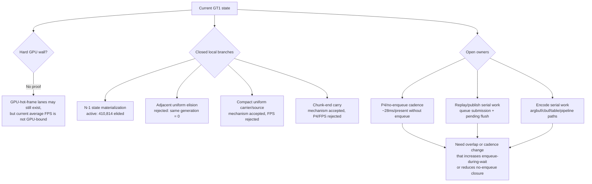

# Encode Phase 195 - Current wall review and next-owner split

## Question

Has the GT1 work hit a hard wall, or have the recent experiments only closed
the most obvious copy/carrier branches?

## Answer

It is not a proven wall. The current evidence says several local CPU branches
are now closed as average-FPS levers, while the remaining frame owner is still
P4/no-enqueue cadence plus exposed replay/encode serial work.

Latest current-head evidence:

| Metric | Current wide-window scout |
|---|---:|
| `sampled_avg_fps` | `16.457` |
| `present_encoded` | `1,803` |
| `completion_wait_without_enqueue_ms_per_present` | `28.053` |
| `completion_wait_with_enqueue_ms_per_present` | `0.050` |
| ready-depth max | `1` |
| `commit_chunk_replay_cpu_ms_per_present` | `8.655` |
| `encode_chunk_cpu_ms_per_present` | `12.882` |
| `commit_chunk_queue_draw_submission_cpu_ms_per_present` | `3.878` |
| `submit_draw_run_batch_append_cpu_ms_per_present` | `1.272` |
| `submit_draw_run_batch_append_uniform_cpu_ms_per_present` | `0.655` |
| `submit_draw_run_batch_append_state_cpu_ms_per_present` | `0.331` |

The same run shows that the F1/N-1 state-copy cleanup is already active:
`d3d9_snapshot_state_elided=410,814`, saving `4.203GiB` of state-copy width, and
`submit_draw_run_batch_compat_same_generation_lane_incompatible=0`. That closes
more same-generation deep-compare/state-materialization work as a first-order
target.

Uniform snapshot elision is not the matching next lever. The run still has
`d3d9_snapshot_uniform_elided=0` and
`d3d9_snapshot_uniform_adjacent_same_generation=0`; same-state groups frequently
share fixed payload or PS constants, but the whole `uniformGeneration` changes.
The broader compact-uniform source thread also reached its intended local form
in H196/H187, then stayed FPS-flat and P4-bound.

## Bottleneck Split

## Interpretation

The wall-like feeling comes from testing many byte-width improvements that
lower local CPU counters but leave P4 unchanged. That pattern is real, but it
does not prove no performance remains. It means the promotion gate has to be
stricter:

1. A local replay/encode cleanup must also move
   `completion_wait_without_enqueue`, `completion_wait_with_enqueue`, ready
   depth, or no-enqueue closure rows before it can be called an average-FPS
   lever.
2. A new overlap design must preserve command-buffer/render-pass/tile locality
   and must not repeat the closed-head/open-CB regressions.
3. A GPU `.gputrace` should be spent only after a candidate moves P4/locality
   gates or when the question is explicitly a GPU-hot-frame/backend-storage
   question.

## Next Gate

Reasonable next work:

- inspect queue lock / outer submit / batch-width residual under
  `commit_chunk_draw_batch_submit_cpu_ms`, because H194 only explained the
  forced resource-marking part. The first new discriminator is
  `submit_draw_run_batch_queue_lock_cpu_ms`, which times only the queue mutex
  acquisition in `submitDrawRunBatch*` before the existing append/resource/slot
  child counters run;
- keep uniform/state copy reductions as local cleanup only unless their run
  moves P4 rows;
- return to a render-pass-safe overlap carrier if the next target is average
  FPS rather than local CPU cleanup;
- keep `v0.0.3` as the visual gate, and treat any weapon/lighting artifact as
  visual-open until reproduced in a same-window capture.
