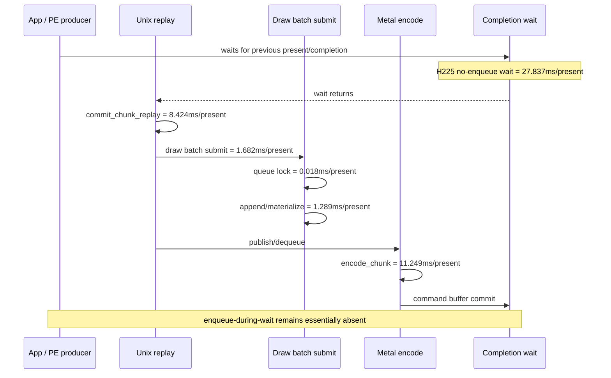
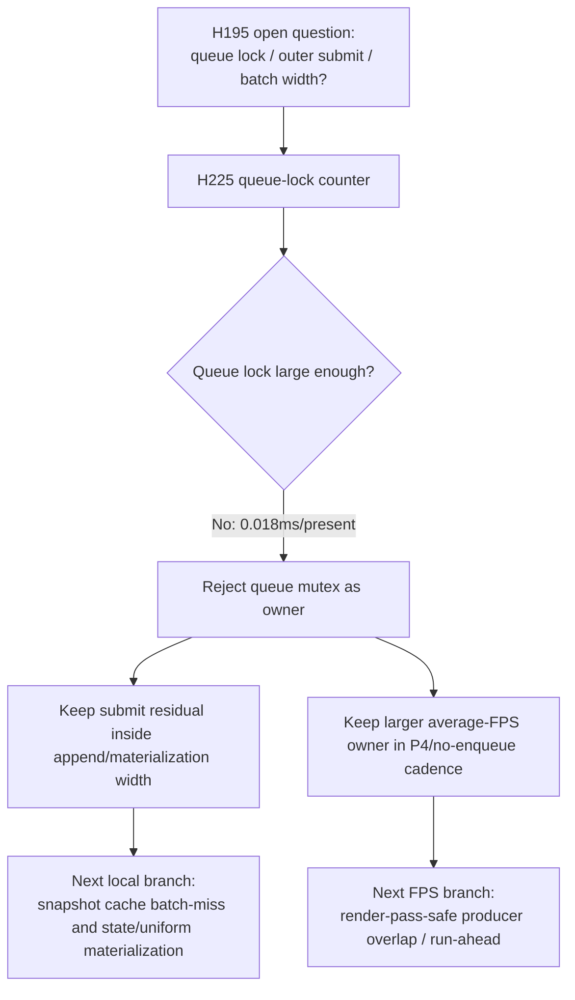

# Encode Phase 196 - Queue lock attribution runtime

## Question

Is the remaining `commit_chunk_draw_batch_submit_cpu_ms` residual caused by
queue mutex acquisition inside `submitDrawRunBatch*`, or does the owner remain
inside materialization/append/P4 cadence?

## Answer

The queue mutex is rejected as the current owner. The H225 run adds
`submit_draw_run_batch_queue_lock_cpu_ms` around only the queue lock acquisition
in `submitDrawRunBatchImpl` and `submitDrawRunBatchAndRunImpl`. The result is
`32.024ms` across the whole run, or only `0.018ms/present`.

The same run remains in the established current-head class:

| Metric | H225 value |
|---|---:|
| status | `pass` after controlled 120s timeout |
| `present_encoded` | `1,740` |
| `sampled_avg_fps` | `16.361` |
| `completion_wait_without_enqueue_ms_per_present` | `27.837` |
| `completion_wait_with_enqueue_ms_per_present` | `0.057` |
| `commit_chunk_replay_cpu_ms_per_present` | `8.424` |
| `encode_chunk_cpu_ms_per_present` | `11.249` |
| `commit_chunk_queue_draw_submission_cpu_ms_per_present` | `3.902` |
| `commit_chunk_draw_batch_submit_cpu_ms_per_present` | `1.682` |
| `submit_draw_run_batch_append_cpu_ms_per_present` | `1.289` |
| `submit_draw_run_batch_append_uniform_cpu_ms_per_present` | `0.664` |
| `submit_draw_run_batch_append_state_cpu_ms_per_present` | `0.335` |
| `submit_draw_run_batch_queue_lock_cpu_ms_per_present` | `0.018` |
| `submit_draw_run_batch_queue_lock_cpu_max_ms` | `0.895` |
| `draw_skipped_no_pipeline` | `0` |
| `gpu_command_buffer_errors` | `0` |

The queue lock is about `1.1%` of the draw-batch-submit row and about `0.2%` of
the replay row. It is not large enough to explain the exposed frame wall.

## P4 Check

The no-enqueue timeline confirms the same shape as H195/H220:

| Timeline point | p50 |
|---|---:|
| wait -> commit publish | `17.165ms` |
| wait -> encode dequeue | `17.446ms` |
| wait -> command buffer commit | `35.243ms` |
| wait -> next enqueue | `35.278ms` |

So the wall-like behavior is still not a contended queue lock. The producer does
not create useful run-ahead while the completion wait is open, and the exposed
serial work is replay/snapshot plus backend encode.

## Visual Gate

Frames `900` and `920` were inspected from the H225 trace capture window. They
show coherent machine-gun bloom, ricochet particles, bullet marks, floor/box
details, and character/weapon silhouettes. This is not a black-screen or
missing-pipeline run, and the run counters agree:
`draw_skipped_no_pipeline=0`, `gpu_command_buffer_errors=0`.

## Verdict

Next work should not optimize this mutex path for GT1 average FPS. The useful
branches are:

- reduce snapshot/cache batch-miss materialization, because
  `d3d9_snapshot_draw_submission_cpu_ms` is still `3.153ms/present` and cache
  lookup/miss rows dominate the queue-submission child;
- reduce append payload width where the counters are still non-trivial
  (`append_uniform=0.664ms/present`, `append_state=0.335ms/present`), but only
  as local CPU cleanup unless P4 rows move;
- return to P4/run-ahead only with a render-pass-safe design that keeps the
  current visual gate and actually creates enqueue-during-wait overlap.
