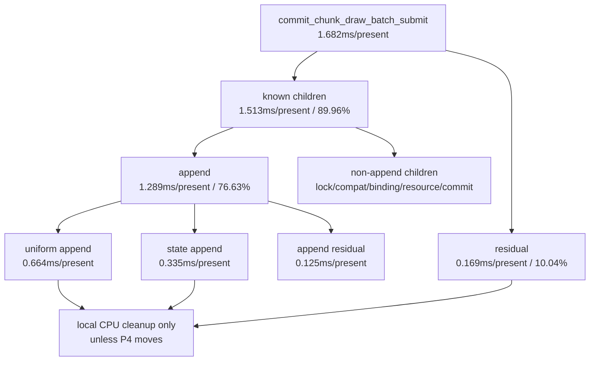

# Encode Phase 197 - Draw batch submit residual reanalysis

## Question

After [[state-churn-encode-encode-phase.196]] rejected queue mutex acquisition,
is the remaining `commit_chunk_draw_batch_submit_cpu_ms` mostly an unmeasured
outer-submit gap, or can the existing child counters already localize it?

## Method

This is a tooling-only attribution update. `summarize_3dmark05_perf.py` now
derives two parent-minus-child residuals from existing counters:

- `commit_chunk_draw_batch_submit_cpu_ms` minus the known
  `submit_draw_run_batch_*` child scopes that run inside `submitDrawRunBatch*`.
- `submit_draw_run_batch_append_cpu_ms` minus its known append child scopes
  (`reserve`, `state`, `uniform`, `payload`, `param`, `record`).

The H225 result from [[state-churn-encode-encode-phase.196]] was re-summarized
with the updated tool. No renderer behavior changed.

## Result

The outer unknown is not the dominant submit owner. The H225 submit parent is
about 90% explained by existing child scopes, and most of the parent is append:

| Metric | total ms | ms/present | share of draw-batch-submit |
|---|---:|---:|---:|
| parent | `2926.362` | `1.682` | `100.00%` |
| submit_draw_cpu | `3441.962` | `1.978` | `117.62%` |
| known_child_sum | `2632.455` | `1.513` | `89.96%` |
| known_child_residual | `293.907` | `0.169` | `10.04%` |
| queue_lock | `32.024` | `0.018` | `1.09%` |
| compat_scan | `56.759` | `0.033` | `1.94%` |
| binding_override | `27.082` | `0.016` | `0.93%` |
| binding_snapshot | `160.491` | `0.092` | `5.48%` |
| payload_bytes | `27.816` | `0.016` | `0.95%` |
| slot_prepare | `30.557` | `0.018` | `1.04%` |
| resource_mark | `25.090` | `0.014` | `0.86%` |
| append | `2242.371` | `1.289` | `76.63%` |
| chunk_commit | `30.265` | `0.017` | `1.03%` |

Inside append, the remaining picture is also mostly explained:

| Append child | total ms | ms/present | share of append |
|---|---:|---:|---:|
| append_parent | `2242.371` | `1.289` | `100.00%` |
| known_child_sum | `2024.173` | `1.163` | `90.27%` |
| known_child_residual | `218.198` | `0.125` | `9.73%` |
| reserve | `129.834` | `0.075` | `5.79%` |
| state | `583.003` | `0.335` | `26.00%` |
| uniform | `1155.041` | `0.664` | `51.51%` |
| payload | `65.250` | `0.037` | `2.91%` |
| param | `37.078` | `0.021` | `1.65%` |
| record | `53.967` | `0.031` | `2.41%` |

## Interpretation

The next local submit branch is not queue lock or a large unknown outer-submit
gap. It is append materialization width, especially uniform append and state
append. That does not automatically make it the average-FPS lever:
[[state-churn-encode-encode-phase.195]] and
[[present-pacing-current-visual-p4.136]] still show the frame-level owner is
P4/no-enqueue cadence plus exposed replay/encode serial work.

This narrows the local CPU path:

- append uniform/state reductions are still useful if they reduce replay time,
  but they need a P4 gate before promotion as an FPS fix;
- the already-tested compact-uniform source path reduced local rows but did not
  move P4, so another uniform-width change needs a different mechanism or a
  stronger parent-row win;
- no `.gputrace` spend is justified from this CPU-only reanalysis.

## Verdict

Accepted as attribution. The draw-batch-submit residual is now mostly explained:
append owns the submit row, and uniform/state append own most of append. The
next implementation choice is either a real append materialization reduction
with a P4 proof gate, or a return to the render-pass-safe overlap branch.

**Related.** [[state-churn-encode-encode-phase.195]] ·
[[state-churn-encode-encode-phase.196]] · [[present-pacing-current-visual-p4.136]].
