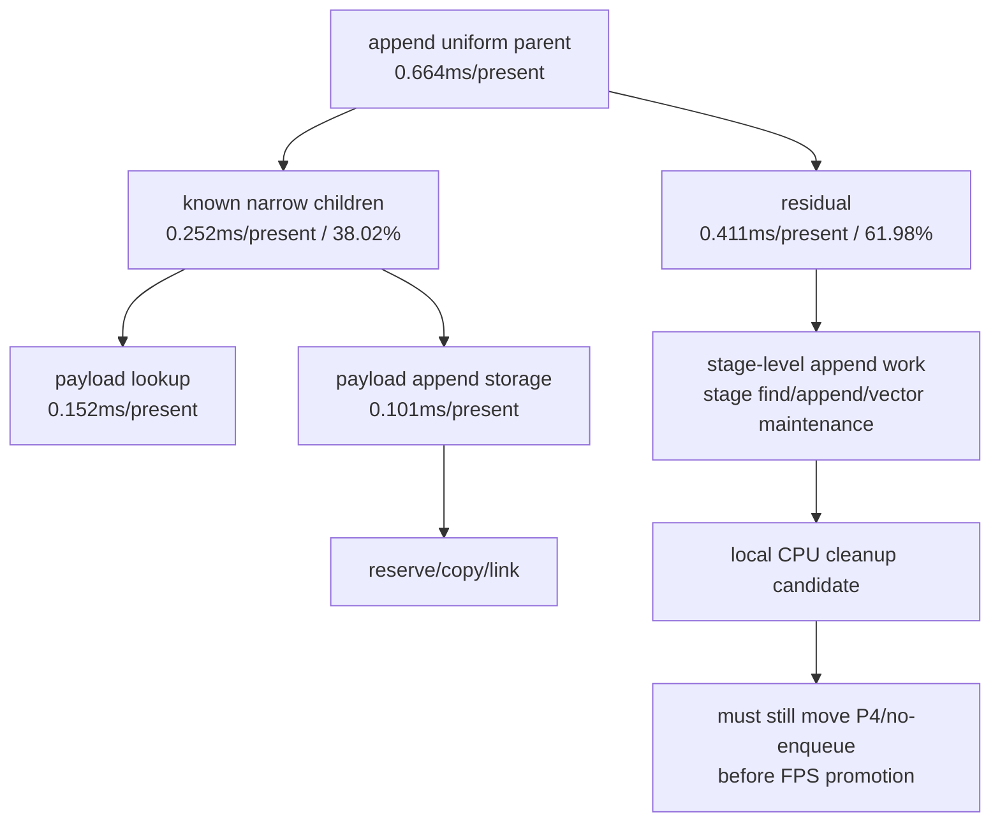

# Encode Phase 198 - Append uniform CPU residual reanalysis

## Question

[state-churn-encode-encode-phase.197](state-churn-encode-encode-phase.197.md) showed that uniform append is the largest
child inside `submit_draw_run_batch_append_cpu_ms`. Is that cost already
explained by the uniform payload lookup and payload-record append counters, or
is there still a stage-level owner hidden inside the parent?

## Method

This is a tooling-only attribution update. `summarize_3dmark05_perf.py` now adds
derived rows to the existing `Uniform Payload Derived` section:

- `uniform_append_parent_cpu_ms_per_present`
- `uniform_payload_lookup_cpu_ms_per_present`
- `uniform_payload_append_{reserve,copy,link}_cpu_ms_per_present`
- `uniform_payload_append_storage_cpu_ms_per_present`
- `uniform_append_known_cpu_share_of_parent`
- `uniform_append_cpu_residual_ms_per_present`

The known child sum is intentionally narrow:
`draw_uniform_payload_lookup_cpu_ms +
draw_uniform_payload_append_reserve_cpu_ms +
draw_uniform_payload_append_copy_cpu_ms +
draw_uniform_payload_append_link_cpu_ms`.

The H225 result from [state-churn-encode-encode-phase.196](state-churn-encode-encode-phase.196.md) and
[state-churn-encode-encode-phase.197](state-churn-encode-encode-phase.197.md) was re-summarized with the updated tool.
No renderer behavior changed.

## Result

The payload lookup and payload-record append scopes explain only `38.02%` of the
uniform append parent. The rest is now localized as a stage-level append
residual:

| Metric | ms/present |
|---|---:|
| `uniform_append_parent_cpu_ms_per_present` | `0.664` |
| `uniform_payload_lookup_cpu_ms_per_present` | `0.152` |
| `uniform_payload_lookup_bucket_cpu_ms_per_present` | `0.075` |
| `uniform_payload_append_reserve_cpu_ms_per_present` | `0.031` |
| `uniform_payload_append_copy_cpu_ms_per_present` | `0.033` |
| `uniform_payload_append_link_cpu_ms_per_present` | `0.037` |
| `uniform_payload_append_storage_cpu_ms_per_present` | `0.101` |
| `uniform_append_known_cpu_share_of_parent` | `38.02%` |
| `uniform_append_cpu_residual_ms_per_present` | `0.411` |

## Interpretation

The uniform append parent is not primarily the final payload-record copy. The
largest remaining local owner is likely stage-level work around vertex/pixel
constant payload lookup, stage append, and vector/table maintenance. That makes
"make the payload record smaller" too narrow as the next hypothesis.

The stronger next local CPU question is whether the stage-level uniform append
path can avoid repeated materialization for records whose state lane is already
known to be batch-compatible. This is adjacent to the still-open N-1
materialization-elision idea from the state-generation lane work, not another
compact-carrier byte-width variant.

This still does not prove an FPS-facing fix. H225 remains P4/no-enqueue
dominated, with ready depth at `1.000`. Any mutation against this parent must
pass the standard 120s no-gputrace gate and show movement in replay/encode/P4
rows before spending `.gputrace`.

## Verdict

Accepted as attribution. The project is not at a hard wall, but the remaining
useful local CPU work is narrower than before: reduce stage-level uniform append
materialization or implement N-1 state/uniform elision; do not chase queue lock,
broad outer-submit residuals, or payload-record append copy alone.

**Related.** [state-churn-encode-encode-phase.195](state-churn-encode-encode-phase.195.md) ·
[state-churn-encode-encode-phase.196](state-churn-encode-encode-phase.196.md) ·
[state-churn-encode-encode-phase.197](state-churn-encode-encode-phase.197.md) ·
[present-pacing-current-visual-p4.136](../present-pacing/present-pacing-current-visual-p4.136.md).
