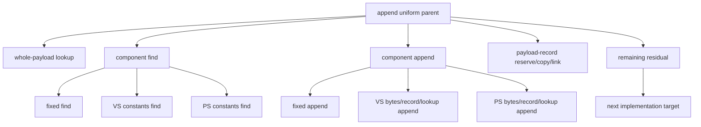

# Encode Phase 199 - Stage-level uniform append split counters

## Question

[[state-churn-encode-encode-phase.198]] leaves
`0.411ms/present` inside `submit_draw_run_batch_append_uniform_cpu_ms` after
subtracting whole-payload lookup and payload-record append storage. Which
component of `appendDrawUniformPayload()` owns that residual?

## Method

This change is instrumentation-only. The renderer behavior is unchanged.

New counters split the component work that happens after whole-payload lookup
misses:

| Counter | Scope |
|---|---|
| `draw_uniform_payload_append_fixed_find_cpu_ms` | fixed payload lookup inside payload append |
| `draw_uniform_payload_append_vertex_find_cpu_ms` | VS constants lookup inside payload append |
| `draw_uniform_payload_append_pixel_find_cpu_ms` | PS constants lookup inside payload append |
| `draw_uniform_payload_append_fixed_append_cpu_ms` | fixed payload record append |
| `draw_uniform_payload_append_vertex_append_cpu_ms` | VS constants bytes/record/lookup append |
| `draw_uniform_payload_append_pixel_append_cpu_ms` | PS constants bytes/record/lookup append |

`summarize_3dmark05_perf.py` now reports:

- `uniform_component_find_cpu_ms_per_present`
- `uniform_component_append_cpu_ms_per_present`
- per-component find/append rows
- `uniform_append_known_with_components_cpu_share_of_parent`
- `uniform_append_component_residual_ms_per_present`

Older runs without these counters deliberately show `n/a` for the new component
rows, not `0`, so H225's previous residual remains valid but unresolved.

## Next Gate

Run the standard 120s foreground no-gputrace probe on current head and inspect
the new rows. [[state-churn-encode-encode-phase.200]] performs that gate and
uses the fixed-find row as a local cleanup target. The useful branch depends on
the split:

- high `*_find_cpu_ms`: optimize lookup shape, bucket sizing, or stable handle
  reuse;
- high `*_append_cpu_ms`: optimize stage bytes/record/lookup append width;
- high remaining component residual: add a narrower scope before mutating;
- no replay/P4 movement after a mutation: keep it as local CPU cleanup only.

Do not spend `.gputrace` on this instrumentation alone. It is a CPU attribution
tool for choosing local mutations before a P4/FPS gate.

## Verification

- `meson compile -C build-arm64-nowine`
- `meson test -C build-arm64-nowine dxmt9-dod-replay-observer-spec dxmt9-core-device-com-spec --print-errorlogs`
- `python3 -m pytest tests/scripts/test_summarize_3dmark05_perf.py tests/scripts/test_compare_3dmark05_perf_counters.py`
- `git diff --check`

**Related.** [[state-churn-encode-encode-phase.197]] ·
[[state-churn-encode-encode-phase.198]] ·
[[state-churn-encode-encode-phase.200]].
