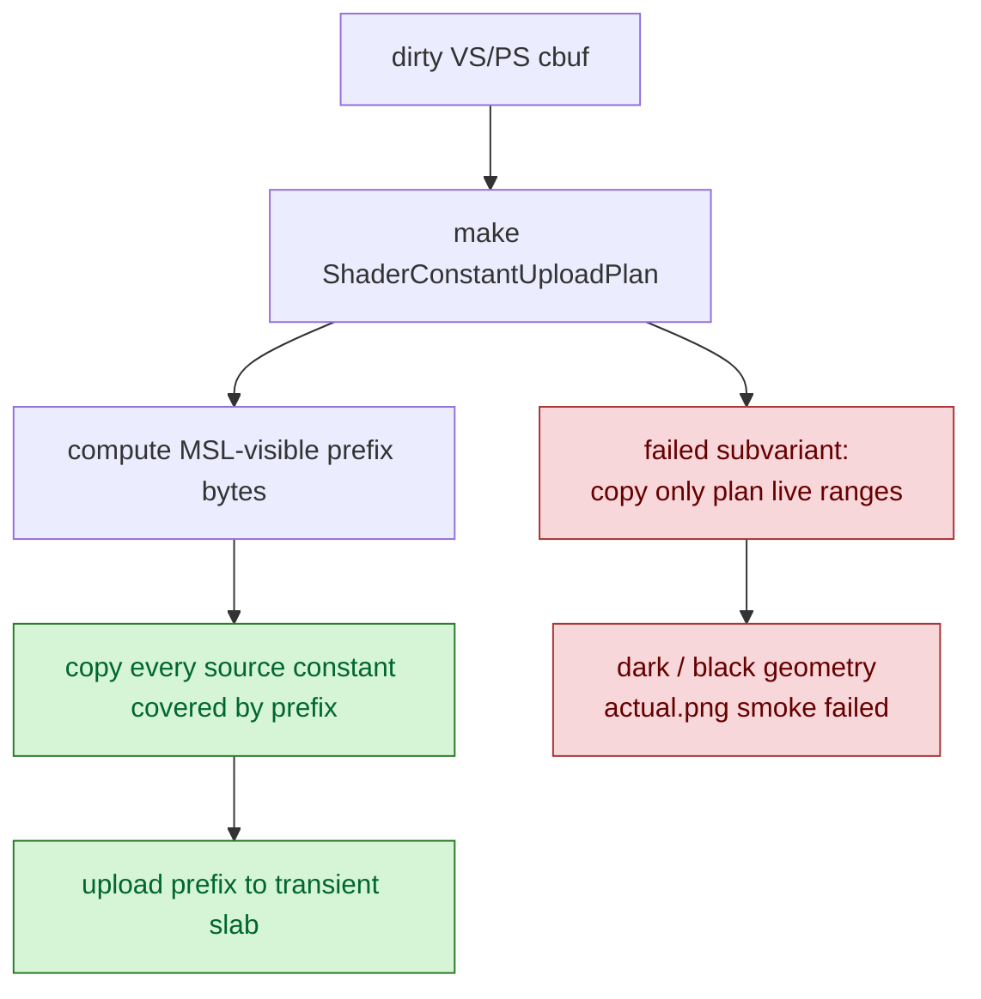
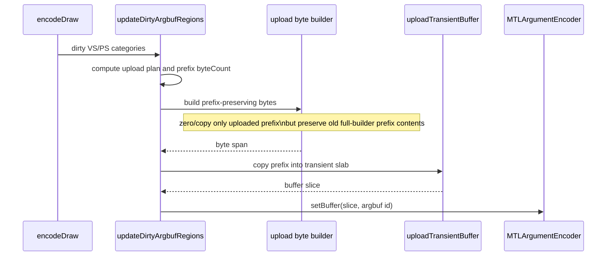

# Prefix-Preserving Cbuf Upload Builder

**Question / hypothesis.** [state-churn-encode-encode-phase.19](state-churn-encode-encode-phase.19.md) removed the
default cbuf content hash and left cbuf build as the next obvious child:
`560.810ms` total (`VS=265.526ms`, `PS=249.090ms`). The dirty upload path was
already computing `ShaderConstantUploadPlan` and uploading only a byte prefix,
but it still built full `VsConsts` / `PsConsts` first. Can the builder construct
only the uploaded bytes?

**Implementation.** Add `buildVsConstsUploadBytes()` and
`buildPsConstsUploadBytes()` as raw byte builders. They compute the upload
prefix from `vsConstantUploadBytes(plan)` / `psConstantUploadBytes(plan)`, clear
only that prefix, and copy the source constants covered by the prefix. The
argbuf dirty-cbuf path now uploads those raw bytes instead of first materializing
a full host struct.

Important semantic boundary: the accepted version preserves the exact byte
prefix that the old full-struct builder would have uploaded. If the prefix
reaches the int or bool area, all earlier float/int bytes in that prefix are
still copied from the source constants even when the usage plan does not mark
them live.



**Rejected subvariant.** The first attempt zeroed prefix bytes outside
`plan.floatCount` / `plan.intCount` / `plan.boolCount`. It reduced cbuf build
CPU, but `actual.png` became visibly too dark with black/transparent-looking
geometry. That proves the MSL-visible upload prefix must preserve the old
full-builder prefix bytes, not only the usage-count bytes. Treat shader usage
bounds as an upload-size guide, not as permission to rewrite bytes inside the
uploaded prefix.

**Method.**

```bash
bash scripts/tools/run_3dmark05_perf_probe.sh \
  --suffix cbuf-upload-prefix-preserve-r1 \
  --frame 50 \
  --no-gputrace \
  --no-encoder-breakdown \
  --timeout 180

python3 scripts/tools/compare_3dmark05_perf_counters.py \
  experiments/output/app-d3d9-3dmark05-cbuf-content-hash-off-r1 \
  experiments/output/app-d3d9-3dmark05-cbuf-upload-prefix-preserve-r1 \
  --before-label cbuf-content-hash-off-r1 \
  --after-label cbuf-upload-prefix-preserve-r1 \
  --output experiments/output/app-d3d9-3dmark05-cbuf-upload-prefix-preserve-r1/dxmt9-perf-counter-comparison-vs-cbuf-content-hash-off.md
```

The wrapper hit the expected watchdog cleanup (`124`) after writing
postprocess artifacts. Treat this as no-gputrace CPU-counter attribution plus
visual smoke, not as a formal result-file pass.

**Measured result.**

The after run produced more presents (`1680 -> 1740`), so the useful CPU reading
is per-present:

| Counter | Before | After | Delta | Reading |
|---|---:|---:|---:|---|
| `encode_draw_argbuf_cbuf_build_cpu_ms` / present | 0.333815ms | 0.175342ms | -47.47% | mechanism moved |
| VS build / present | 0.158051ms | 0.075225ms | -52.40% | full VS struct build avoided |
| PS build / present | 0.148268ms | 0.072568ms | -51.06% | full PS struct build avoided |
| `encode_draw_argbuf_cbuf_update_cpu_ms` / present | 0.875284ms | 0.679652ms | -22.35% | cbuf parent drops |
| `encode_draw_argbuf_setup_cpu_ms` / present | 1.929970ms | 1.755655ms | -9.03% | setup parent drops |
| `encode_draw_cpu_ms` / present | 10.005939ms | 9.853414ms | -1.52% | backend encode CPU drops |
| `gpu_command_buffer_time_ms` / present | 3.147926ms | 3.025899ms | -3.88% | flat/noisy no-gputrace signal |
| `completion_wait_ms` / present | 23.090049ms | 23.036679ms | -0.23% | flat/noisy |

`actual.png` returned to the normal bright robot/flare/HUD frame. Mean RGB is
close to the phase.19 baseline (`57.11,54.06,43.94` vs `57.18,54.10,43.14`);
the rejected zero-unused-prefix variant was much darker (`28.39,27.78,24.38`).



**Verdict.** Accepted CPU win. The safe prefix-preserving builder cuts dirty
cbuf build cost roughly in half per present and reduces cbuf update/setup
parents without changing the visible smoke frame. The rejected live-range-only
builder is a correctness warning: do not zero bytes that lie inside the uploaded
MSL-visible prefix.

**Next.** Remaining cbuf work is no longer build-first. The larger residuals are
cached repoint (`~0.204ms/present`), upload/setBuffer (`~0.162ms` /
`~0.071ms/present`), content probe (`~0.059ms/present`), and timer/dispatch
residual. Any further cbuf change needs the same visual smoke gate because this
phase proved apparently unused constants can still affect GT1.

**Related.** [state-churn-encode](index.md) ·
[state-churn-encode-encode-phase.19](state-churn-encode-encode-phase.19.md) · [baselines-visual-capture.01](../baselines/baselines-visual-capture.01.md).
