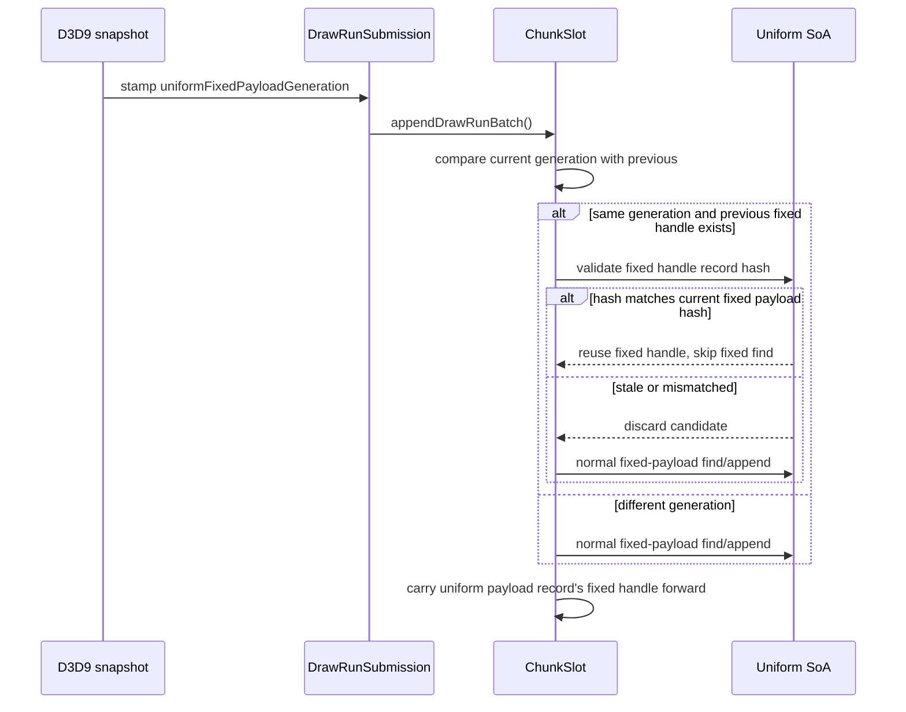
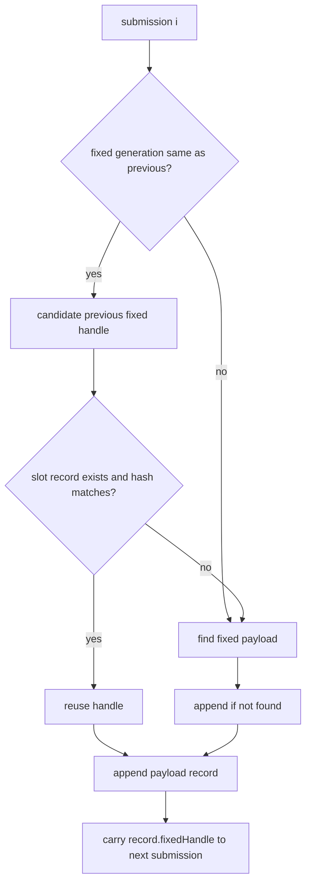

# Encode Phase 200 - Uniform fixed payload handle carry

## Question

[state-churn-encode-encode-phase.199](state-churn-encode-encode-phase.199.md) showed that the largest measured
component inside uniform append was fixed-payload find:
`0.229ms/present`. Because GT1 reports `100.00%` adjacent fixed-payload hash
equality, can the backend carry the previous slot-local fixed payload handle
when the frontend fixed-payload generation is unchanged?

## Method

The snapshot now stamps draw submissions with
`uniformFixedPayloadGeneration`, sourced from the frontend
`uniformNonConstantGeneration`. During `appendDrawRunBatch()`, the backend
carries the previous `DrawUniformFixedHandle` only when the next submission has
the same non-zero fixed-payload generation. The candidate is still validated
against the current payload's fixed hash before it skips the normal find path.





The validation run uses the standard low-overhead foreground probe:

```sh
bash scripts/tools/run_3dmark05_perf_probe.sh \
  --suffix uniform-fixed-carry-r1 \
  --frame 60 --no-gputrace --keep-frontmost --timeout 120 --frame-sampling
```

## Result

The targeted component moved in the expected direction:

| Metric | component split r1 | fixed carry r1 | Delta |
|---|---:|---:|---:|
| `uniform_component_fixed_find_cpu_ms_per_present` | `0.229` | `0.150` | `-34.5%` |
| `uniform_component_find_cpu_ms_per_present` | `0.323` | `0.257` | `-20.4%` |
| `uniform_component_vertex_find_cpu_ms_per_present` | `0.047` | `0.052` | noise/up |
| `uniform_component_pixel_find_cpu_ms_per_present` | `0.048` | `0.055` | noise/up |
| `uniform_append_parent_cpu_ms_per_present` | `0.882` | `0.880` | flat |
| `uniform_append_component_residual_ms_per_present` | `0.179` | `0.196` | flat/noise |
| `completion_wait_without_enqueue_ms_per_present` | `26.658` | `24.965` | still dominant |
| `sampled_avg_fps` | `16.170` | `14.261` | noisy/regressed |

Correctness guard rows stayed clean in the current run:
`draw_skipped_no_pipeline=0` and `gpu_command_buffer_errors=0`.

## Interpretation

The carry path is a valid local CPU cleanup: it removes a measurable chunk of
fixed-payload equality/search work without changing draw ordering or resource
semantics. It is also a useful answer to the "wall" question: the project is
not out of implementation levers, but the remaining easy levers are now small
and must be kept separate from average-FPS claims.

This patch does not break the current wall by itself. The uniform append parent
does not move materially, the component residual remains about
`0.2ms/present`, and the run is still P4/no-enqueue dominated. The useful next
branches are therefore:

- continue local CPU cleanup only where counters name a concrete child, such as
  VS constants append or remaining uniform component residual;
- return to the larger N-1 materialization/owned batch carrier problem only if
  it avoids per-draw owned payload/state construction without violating
  per-draw uniform correctness;
- keep average-FPS promotion gated on completion overlap, frame sampling, or
  same-cycle replay/encode stage movement.

## Verdict

Accepted as local cleanup, not as an FPS fix. Fixed-payload handle carry proves
that there is still avoidable CPU work, but it also confirms that the current
average-FPS wall is elsewhere: P4/no-enqueue serial cadence plus remaining
replay/encode materialization width.

## Verification

- `meson compile -C build-arm64-nowine`
- `meson test -C build-arm64-nowine dxmt9-dod-replay-observer-spec dxmt9-core-device-com-spec --print-errorlogs`
- `python3 -m pytest tests/scripts/test_summarize_3dmark05_perf.py tests/scripts/test_compare_3dmark05_perf_counters.py`
- `git diff --check`
- `meson compile -C build-x86_64-builtin`
- 3DMark05 GT1 no-gputrace probe: `app-d3d9-3dmark05-uniform-fixed-carry-r1`

**Related.** [state-churn-encode-encode-phase.198](state-churn-encode-encode-phase.198.md) ·
[state-churn-encode-encode-phase.199](state-churn-encode-encode-phase.199.md) · [present-pacing](../present-pacing/index.md).
