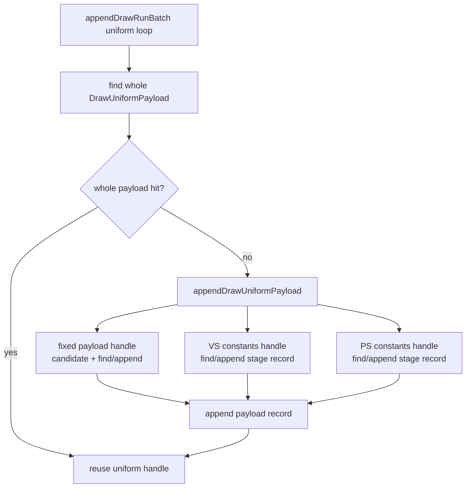
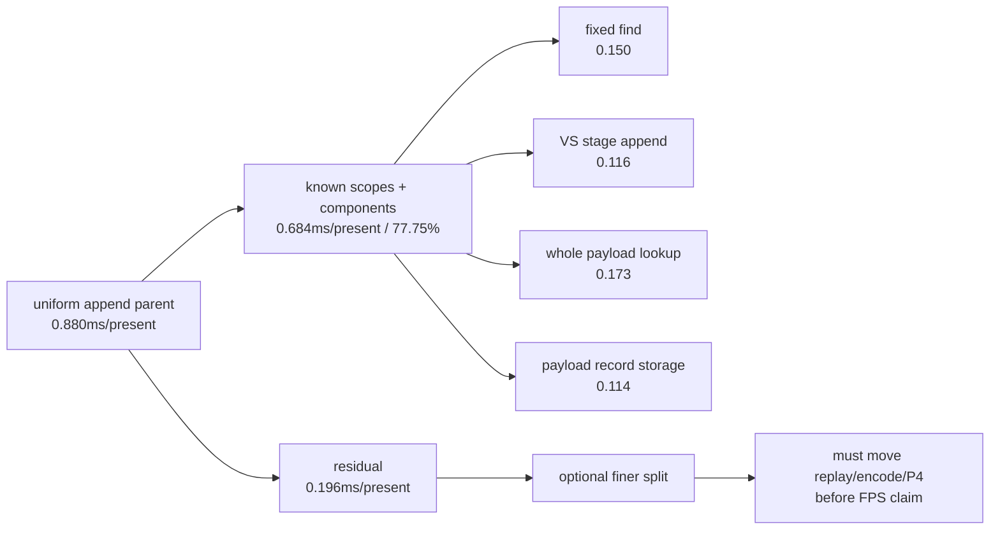

# Encode Phase 201 - Uniform append residual after fixed handle carry

## Question

After [state-churn-encode-encode-phase.200](state-churn-encode-encode-phase.200.md) removes part of the fixed-payload
find cost, is the remaining `submit_draw_run_batch_append_uniform_cpu_ms` row a
large enough next implementation target, or is it now bounded local cleanup
below the current P4/no-enqueue wall?

## Verdict

The remaining uniform append work is bounded local cleanup. It is still
measurable, but it is not a credible standalone FPS wall-breaker:

- the parent is `0.880ms/present`;
- known child scopes plus component scopes explain `77.75%` of that parent;
- the remaining component residual is `0.196ms/present`;
- the largest named component after fixed-handle carry is VS constant stage
  append at `0.116ms/present`;
- the run is still dominated by no-enqueue completion wait.

The next average-FPS branch should therefore stay on P4/no-enqueue overlap or
larger replay/encode materialization. A future uniform append patch can still
be useful, but it should be judged as a local CPU cleanup unless it moves
replay, encode, or P4 rows in a no-gputrace visual-safe run.

## Source Shape

`appendDrawRunBatch()` owns the outer uniform loop. For each submission, it
first tries whole-payload dedup, then appends or finds fixed, VS, and PS
component handles through `appendDrawUniformPayload()`.



The fixed component now has a previous-handle candidate when
`uniformFixedPayloadGeneration` is unchanged. VS/PS components already use a
last-handle fast path and the slot-local stage lookup. The current data says
VS constants are simply changing often enough that most payload appends still
create a VS stage record.

## Counter Reading

H200 validation run:
`app-d3d9-3dmark05-uniform-fixed-carry-r1`.

| Metric | Value |
|---|---:|
| `draw_uniform_payload_appends` | `794,314` |
| `draw_uniform_fixed_payload_appends` | `1,560` |
| `draw_uniform_vertex_constants_appends` | `661,640` |
| `draw_uniform_pixel_constants_appends` | `162,489` |
| `uniform_fixed_append_records_per_payload_append` | `0.002` |
| `uniform_vertex_constants_append_records_per_payload_append` | `0.833` |
| `uniform_pixel_constants_append_records_per_payload_append` | `0.205` |
| `uniform_append_parent_cpu_ms_per_present` | `0.880` |
| `uniform_payload_lookup_cpu_ms_per_present` | `0.173` |
| `uniform_payload_append_storage_cpu_ms_per_present` | `0.114` |
| `uniform_component_find_cpu_ms_per_present` | `0.257` |
| `uniform_component_append_cpu_ms_per_present` | `0.140` |
| `uniform_component_fixed_find_cpu_ms_per_present` | `0.150` |
| `uniform_component_vertex_find_cpu_ms_per_present` | `0.052` |
| `uniform_component_pixel_find_cpu_ms_per_present` | `0.055` |
| `uniform_component_vertex_append_cpu_ms_per_present` | `0.116` |
| `uniform_component_pixel_append_cpu_ms_per_present` | `0.022` |
| `uniform_append_known_with_components_cpu_share_of_parent` | `77.75%` |
| `uniform_append_component_residual_ms_per_present` | `0.196` |

Adjacent hash counters explain why only the fixed component had a strong carry
shape:

| Adjacent signal | Count | Reading |
|---|---:|---|
| `d3d9_snapshot_uniform_adjacent_previous_payload` | `672,993` | denominator |
| `same_fixed_payload_hash` | `672,993` | fixed payload is stable across all adjacent payloads |
| `same_vs_const_hash` | `114,065` | VS reuse exists but is a minority |
| `same_ps_const_hash` | `434,356` | PS reuse is common, but PS append is already small |
| `same_payload_hash` | `3,970` | full uniform reuse remains too rare |
| `same_generation` | `0` | generation-based uniform N-1 elision remains closed |

## Interpretation

The large byte row is not an unexplained wall. VS stage append is the largest
named component because the run appends VS constants for `83.3%` of uniform
payload appends. However, the normalized CPU cost is only
`0.116ms/present`; even a perfect removal would not materially affect the
current `~25-28ms/present` no-enqueue wait class.



This keeps two separate branches:

| Branch | Status |
|---|---|
| Split VS stage append into byte-copy / lookup reserve / record push / link | optional attribution only; ceiling is small |
| Carry VS/PS stage handles by hash | likely narrow; existing last-handle and lookup paths already cover adjacent reuse |
| Frontend VS constant hash/build reduction | larger local CPU than backend append, but still not the P4 owner |
| P4/no-enqueue overlap redesign | remains the average-FPS branch |

## Decision

Do not spend `.gputrace` or Xcode time on uniform append residual alone. The
next `.gputrace` should come after a candidate moves no-gputrace P4/locality
gates, or for a separate GPU-hot-frame backend-storage question.

For local CPU work, prefer either:

1. a very small follow-up split of VS stage append if implementation work needs
   another measured child; or
2. a larger replay/encode materialization change that can plausibly move
   `commit_chunk_replay_cpu_ms`, `commit_chunk_draw_batch_submit_cpu_ms`, or
   `encode_chunk_cpu_ms`.

## Verification

Source/counter audit only. No runtime was launched for this document.

Validation commands for this documentation update:

```sh
meson test -C build-arm64-nowine dxmt9-perf-docs-source-audit --print-errorlogs
git diff --check
```

**Related.** [state-churn-encode-encode-phase.198](state-churn-encode-encode-phase.198.md) ·
[state-churn-encode-encode-phase.199](state-churn-encode-encode-phase.199.md) ·
[state-churn-encode-encode-phase.200](state-churn-encode-encode-phase.200.md) · [present-pacing](../present-pacing/index.md).
