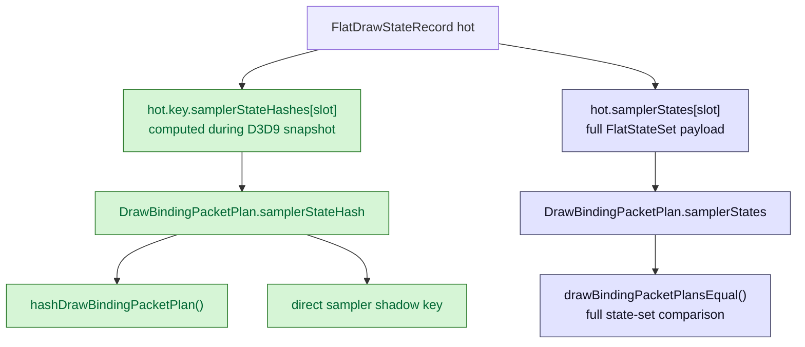
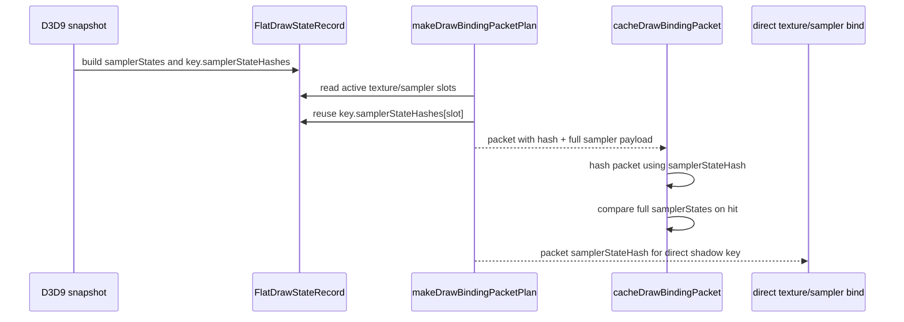

# Binding Packet Sampler Key Hash Reuse

**Question / hypothesis.** After [[state-churn-encode-encode-phase.20]], cbuf
build is no longer the largest backend encode child. `binding_packet_plan` is
still `0.666122ms/present`, and inspection shows
`makeFragmentTextureSamplerBindings()` / `makeVertexTextureSamplerBindings()`
rehash each active sampler `FlatStateSet` even though `FlatDrawStateKey` already
contains the same canonical sampler-state hash. Can the plan reuse
`hot.key.samplerStateHashes[]` without changing packet equality semantics?

**Implementation.** The fragment and vertex texture-sampler binding plan now
copies `hot.key.samplerStateHashes[stage]` into the packet's
`samplerStateHash` field. The full `samplerStates` payload is still stored in
the packet and `drawBindingPacketPlansEqual()` still compares the full
`FlatStateSet`, so cache-hit equality remains collision-resistant at the same
boundary as before. The hash reuse only removes a redundant per-draw digest
build used for packet hash mixing and sampler direct-bind keys.



**Why this is safe.** `FlatDrawStateKey::samplerStateHashes[i]` is produced from
the same source state table as `FlatDrawStateRecord::samplerStates[i].hash`, and
the native specs now assert that fragment and vertex packet bindings carry that
canonical key hash. The packet cache does not rely on the hash alone:
`drawBindingPacketPlansEqual()` still compares `stage`, `texture`, `textureLod`,
`samplerStateHash`, and the full `samplerStates` set.

**Method.**

```bash
meson test -C build-x86_64-builtin \
  dxmt9:dxmt9-shader-argbuf-binding-value-spec

bash scripts/tools/run_3dmark05_perf_probe.sh \
  --suffix binding-packet-sampler-keyhash-r1 \
  --no-gputrace \
  --no-encoder-breakdown \
  --timeout 180

python3 scripts/tools/compare_3dmark05_perf_counters.py \
  experiments/output/app-d3d9-3dmark05-cbuf-upload-prefix-preserve-r1 \
  experiments/output/app-d3d9-3dmark05-binding-packet-sampler-keyhash-r1 \
  --before-label cbuf-upload-prefix-preserve-r1 \
  --after-label binding-packet-sampler-keyhash-r1 \
  --output experiments/output/app-d3d9-3dmark05-binding-packet-sampler-keyhash-r1/dxmt9-perf-counter-comparison-vs-cbuf-upload-prefix-preserve.md

python3 scripts/tools/compare_experiment_images.py \
  --before experiments/output/app-d3d9-3dmark05-cbuf-upload-prefix-preserve-r1/actual.png \
  --after experiments/output/app-d3d9-3dmark05-binding-packet-sampler-keyhash-r1/actual.png \
  --label-before cbuf-upload-prefix-preserve-r1 \
  --label-after binding-packet-sampler-keyhash-r1 \
  --output experiments/output/app-d3d9-3dmark05-binding-packet-sampler-keyhash-r1/image-comparison-vs-cbuf-upload-prefix-preserve.md \
  --summary-output experiments/output/app-d3d9-3dmark05-binding-packet-sampler-keyhash-r1/image-comparison-vs-cbuf-upload-prefix-preserve-summary.json \
  --diff-output experiments/output/app-d3d9-3dmark05-binding-packet-sampler-keyhash-r1/image-diff-vs-cbuf-upload-prefix-preserve.png
```

The 3DMark05 wrapper hit the expected watchdog cleanup (`124`) after writing
postprocess artifacts. Treat this as no-gputrace CPU-counter attribution. The
image comparison is a visible smoke only: the baseline and candidate
`actual.png` frames are near the same scene but not the same frame/time, so no
exact similarity gate is claimed.

**Measured result.**

Both runs produced `1740` presents, so total and per-present deltas are aligned:

| Counter | Before | After | Delta | Reading |
|---|---:|---:|---:|---|
| `encode_draw_binding_packet_plan_cpu_ms` / present | 0.666122ms | 0.599724ms | -9.97% | mechanism moved |
| `encode_draw_binding_packet_cpu_ms` / present | 1.646770ms | 1.573957ms | -4.42% | parent drops |
| `encode_draw_binding_packet_cache_cpu_ms` / present | 0.475480ms | 0.468184ms | -1.53% | mostly flat |
| `encode_draw_texture_sampler_bind_cpu_ms` / present | 0.465892ms | 0.468607ms | +0.58% | flat/noisy |
| `encode_draw_stream_bind_cpu_ms` / present | 1.617812ms | 1.598923ms | -1.17% | flat/noisy |
| `encode_draw_cpu_ms` / present | 9.853414ms | 9.662653ms | -1.94% | backend encode CPU drops |
| `gpu_command_buffer_time_ms` / present | 3.025899ms | 3.003414ms | -0.74% | no-gputrace/noisy |
| `completion_wait_ms` / present | 23.036679ms | 22.945100ms | -0.40% | no-gputrace/noisy |

The packet-cache hash child slightly rose (`0.066459 -> 0.069527ms/present`)
because the packet hash still mixes every active packet field. The win is in
plan construction: the redundant sampler `FlatStateSet` digest is gone.



**Verdict.** Accepted CPU win. This is a small but safe backend encode cleanup:
`binding_packet_plan` drops by about `0.066ms/present` and total backend
`encode_draw` drops by about `0.191ms/present` in the no-gputrace run. It does
not address the GPU-side GT1 bottleneck.

**Next.** Binding packet plan is now smaller, but not gone. Remaining CPU
frontier is still D3D9 snapshot lookup/build, argbuf open/cbuf repoint/upload,
stream/index bind, pipeline lookup, and issue cost. A larger binding-packet step
would need a stronger cache identity or plan reuse keyed by draw-state plus
volatile fields; broad equality weakening is not justified because full
sampler-state equality is the safety boundary.

**Related.** [[state-churn-encode]] ·
[[state-churn-encode-encode-phase.20]] · [[baselines-visual-capture.01]].
